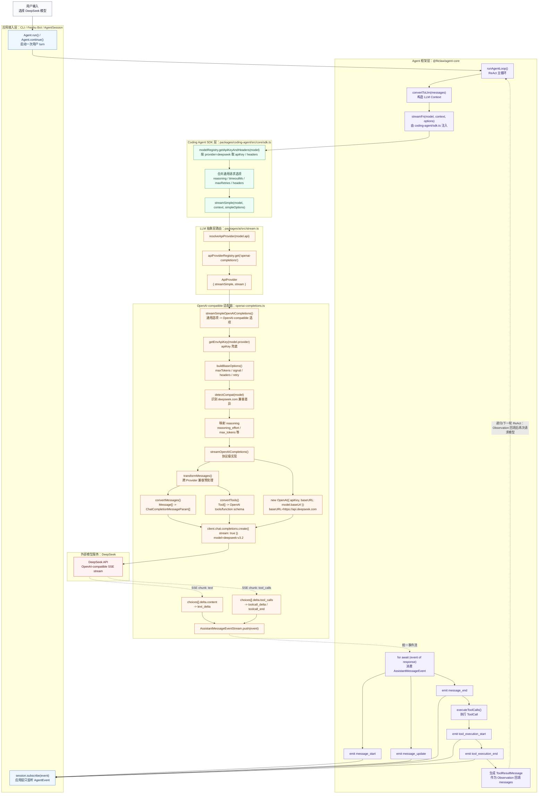

# FitClaw 技术架构 Q&A

> 基于源码与文档的详细技术问答，涵盖架构设计、实现细节与工程实践。
> **最后更新：2026-07-17**

后续 AI Agent 接手项目时，先读 [PROJECT_UNDERSTANDING.md](./PROJECT_UNDERSTANDING.md) 获取 5-10 分钟速览，再按需读本文档中的详细问答。

2026-05-08 同步：新增 `fitclaw skill sync`，用于将 `.fitclaw/skills/` 同步到 `feishu-workspace/skills/`；新增 `packages/coding-agent` eval harness，使用 faux 模型和 YAML 任务验证 Skill 数据读写与 namespace 边界，运行产物位于 ignored 的 `eval-results/`。

2026-05-08 追加：eval CLI 支持 `--suite` 与 `--task` 精准过滤；grader 增加 `tool_not_called` 和 `tool_sequence`，可验证“没有调用危险工具”和“工具调用顺序”。同时开始拆分臃肿核心文件：Provider 登录策略从 `interactive-mode.ts` 移到 `provider-login-policy.ts`，Skill block 解析从 `agent-session.ts` 移到 `skill-block.ts`。

2026-05-08 追加：eval harness 已补齐 `pass@1`、`pass@k`、`pass^k` 报告，支持 `--runs` 多轮运行；新增 10 个 Feishu 真实交互 session baseline；grader 扩展为 `final_contains_any`、`final_not_contains`、`tool_args_match`，用于降低单一措辞依赖并检查结构化工具参数。当前 eval 仍是 faux-response contract eval，不是 live model eval。

2026-07-17 同步：主飞书应用现位于 `apps/coach-bot`，产品策略位于 `packages/coach-core`，共享 runtime 位于 `packages/runtime`。本轮进一步拆分 package 管理、交互式 TUI 与 JSONL session 持久化边界；`session-manager.ts` 继续作为公开入口，格式/迁移、发现、上下文重建和树读模型分别由同目录模块负责。

---

## 一、分层架构与 ReAct 推理引擎

### Q1: `@fitclaw/ai` / `@fitclaw/agent-core` / `@fitclaw/runtime` / `@fitclaw/claw` / `@fitclaw/coach-bot` 的职责边界与依赖关系具体如何划分？

**A:**

当前依赖分层如下：

```
应用层 (@fitclaw/claw + @fitclaw/coach-bot)
  │  CLI/TUI 或飞书适配、应用编排；Coach 产品策略来自 @fitclaw/coach-core
  ↓
共享运行时 (@fitclaw/runtime)
  │  auth/model/settings、JSONL session、重试/压缩生命周期、Skill 与 data tools
  ↓
Agent 框架层 (@fitclaw/agent-core)
  │  推理循环（runLoop）、工具执行引擎、Steering/FollowUp 双队列、事件系统
  ↓
LLM 抽象层 (@fitclaw/ai)
     26 个 Provider 统一接入、流式事件协议、JSON Schema 参数校验
```

**职责边界：**

| 层 | 包名 | 核心职责 |
|----|------|----------|
| LLM 抽象层 | `@fitclaw/ai` | 统一 `Message`/`Context`/`Model` 类型定义；10 种 API 协议（`KnownApi`）/ 26 个内置 Provider（`KnownProvider`）的流式接入；`EventStream` 异步迭代流协议；工具参数 JSON Schema 校验（TypeBox）；API Key 解析（环境变量 + OAuth + ADC） |
| Agent 框架层 | `@fitclaw/agent-core` | `runLoop()` 双层 while 循环驱动推理；`executeToolCalls()` 并行/顺序工具执行引擎；`BeforeToolCall`/`AfterToolCall` 钩子；Steering（实时注入）/ FollowUp（后置任务）双队列；`Agent` 状态机（isStreaming/pendingToolCalls/errorMessage）；生命周期事件（agent_start/end、turn_start/end、message_*、tool_execution_*） |
| 共享运行时 | `@fitclaw/runtime` | auth/model/settings；`SessionManager` JSONL 树形持久化；自动重试与压缩生命周期；Skill 发现/加载、渐进式披露和 `FileSkillDataStore` namespace 持久化 |
| 产品与应用层 | `@fitclaw/coach-core` / `@fitclaw/coach-bot` / `@fitclaw/claw` | Coach 身份和长期数据策略；飞书 transport、卡片、频道会话和部署；开发 CLI 的交互式 TUI、命令与扩展系统 |

**依赖关系：** 应用依赖共享 runtime、Agent 框架和 LLM 抽象；共享包不反向依赖 CLI 或 Bot。`apps/coach-bot` 不再依赖 `@fitclaw/claw`，CLI 和 Bot 共享 `@fitclaw/runtime` 的会话、重试、压缩和 Skill 基础设施。

**层间通信机制：**
- **类型接口**：下层导出 TypeScript 接口（`Message`、`Context`、`AgentTool`、`StreamFn`），上层依赖接口而非实现
- **事件流**：`EventStream<AgentEvent, AgentMessage[]>` 是 `AsyncIterable`，上层用 `for await` 消费生命周期事件
- **依赖注入**：`Agent` 构造函数接收 `streamFn`、`convertToLlm`、`transformContext`、`getApiKey` 等函数，由上层注入具体实现
- **钩子函数**：`beforeToolCall`/`afterToolCall` 钩子允许上层拦截和修改工具调用行为

**核心文件：** `packages/ai/src/types.ts`、`packages/agent/src/agent-loop.ts`、`packages/runtime/src/session/session-manager.ts`、`packages/coding-agent/src/core/sdk.ts`、`apps/coach-bot/src/agent.ts`

---

#### Q1-1: LLM 抽象层是怎么抽象封装的？不同模型他们的字段是不同的？怎么屏蔽这种不同？会有一个统一的结构吗？

**A:**

---

**先看结论：** 这层到底在做什么？

LLM 抽象层的目标不是“把所有模型变成同一个模型”，而是把**不同 Provider 的输入/输出协议差异封装起来**。上层 Agent 只面对 FitClaw 的统一类型：

```text
上层 Agent 只认：
  Model
  Context
  Message
  Tool
  AssistantMessageEvent

Provider 适配器负责：
  FitClaw 统一 Context -> Provider 请求格式
  Provider 流式响应 -> FitClaw 统一事件
```

一句话：

> FitClaw 内部说统一语言；发给模型前翻译成 Provider 方言；模型回包后再翻译回统一事件。

**阅读主线**

这一节可以按这个顺序理解：

| 顺序 | 要解决的问题 | 对应概念 |
|------|--------------|----------|
| 1 | 不同模型返回格式不同，怎么屏蔽？ | `Message` / `ContentBlock` / `AssistantMessageEvent` |
| 2 | 一个模型怎么知道走哪个协议？ | `model.api` |
| 3 | API Key 和 `model.api` 是不是一回事？ | 不是，API Key 由 `provider` 找 |
| 4 | 小众模型怎么接入？ | 复用 OpenAI/Anthropic 等兼容协议 |
| 5 | 什么时候才要注册新 Provider？ | 完全新协议才需要 |
| 6 | `streamSimple`、`stream`、适配器函数是什么关系？ | 统一入口、简单入口、协议实现 |
| 7 | 实际转化长什么样？ | DeepSeek 复用 OpenAI 适配器 |
| 8 | 流式返回最终变成什么？ | `AssistantMessage` |

第 9-11 节是源码深读：完整旅程、模式总结、最终类比。第一次读可以先看 1-8。

**核心名词先对齐**

- `model.api` 不是 API Key。它是 FitClaw 内部用来选择“哪一种上游 API 协议”的路由键，例如 `"anthropic-messages"`、`"openai-responses"`、`"azure-openai-responses"`、`"google-generative-ai"`。
- API Key 是另一回事。`packages/coding-agent/src/core/sdk.ts` 会先通过 `modelRegistry.getApiKeyAndHeaders(model)` 取到 `apiKey` 和请求头，再把它们传给 `streamSimple(model, context, options)`。
- Provider 是预先注册好的。`packages/ai/src/stream.ts` import 了 `providers/register-builtins.ts`，该文件末尾会执行 `registerBuiltInApiProviders()`，把 `api -> { stream, streamSimple }` 放进 `apiProviderRegistry` 这个 Map。
- `streamSimple` 是上层常用入口，接收统一的 `reasoning`、`apiKey`、`headers`、超时、重试等通用参数；`stream` 是 Provider 的协议级实现，负责把统一 `Context` 变成上游 HTTP 请求，再把上游流式响应翻译回统一事件。

可以把它想成一套总机：

```text
用户选择模型
  -> 得到 Model: { id, provider, api, baseUrl, reasoning, ... }
  -> Agent 把内部消息转成 LLM Context: { systemPrompt, messages, tools }
  -> sdk.ts 用 modelRegistry.getApiKeyAndHeaders(model) 取 apiKey / headers
  -> sdk.ts 合并超时、重试、归因 headers 等通用请求参数
  -> 调用 streamSimple(model, context, { apiKey, headers, reasoning, timeoutMs, ... })
  -> packages/ai/src/stream.ts 用 model.api 查 apiProviderRegistry
  -> 找到对应 ApiProvider: { stream, streamSimple }
  -> Provider.streamSimple 先把通用选项翻译成 Provider 专属选项
  -> Provider.stream 发真实请求，把原生流式事件翻译成 AssistantMessageEvent
  -> Agent 只消费统一事件，继续 UI 展示、工具执行、历史持久化
```

这里要注意三组字段不要混在一起：

| 字段/参数 | 解决的问题 | 谁使用 |
|-----------|------------|--------|
| `model.provider` | 这个模型属于哪个账号/供应商，用来找鉴权信息 | `modelRegistry.getApiKeyAndHeaders(model)` |
| `model.api` | 这个模型说哪种协议，用来找适配器 | `resolveApiProvider(model.api)` |
| `apiKey` / `headers` | 真实请求凭证和附加请求头 | Provider SDK / HTTP 客户端 |

所以调用链不是“用 API Key 识别模型”，而是：

```text
provider 决定鉴权来源
api 决定协议适配器
id 决定上游请求里的模型名
baseUrl 决定请求打到哪里
```

举个具体模型：

```typescript
const model = {
  id: "deepseek-v3.2",
  provider: "deepseek",
  api: "openai-completions",
  baseUrl: "https://api.deepseek.com",
};
```

这表示：

- `provider: "deepseek"`：去 DeepSeek 的配置里取 API Key。
- `api: "openai-completions"`：不要写 DeepSeek 专属适配器，复用 OpenAI Chat Completions 兼容协议。
- `baseUrl`：真实请求发到 DeepSeek，而不是 OpenAI 官方地址。
- `id`：请求体里的 `model` 字段使用 `deepseek-v3.2`。

**应用层统一消费：** Provider 差异在哪里被彻底抹平？

上面讲的是“请求如何发出去”。另一半更重要：**响应回来后，应用层到底消费什么？**

FitClaw 的应用层不直接消费 OpenAI/Anthropic/Gemini 的原生事件，而是只消费 Agent 框架层抛出的统一事件。链路分两段：

```text
Provider 原生流
  -> @fitclaw/ai 适配器翻译成 AssistantMessageEvent
  -> @fitclaw/agent-core 的 runAgentLoop() 消费 AssistantMessageEvent
  -> runAgentLoop() 再抛出 AgentEvent
  -> Agent.processEvents() 更新 AgentState
  -> AgentSession / CLI / Feishu Bot / Extension 统一监听 AgentEvent
```

也就是说，应用层看到的不是：

```text
OpenAI: choices[].delta.content
Anthropic: content_block_delta
Gemini: candidates[].content.parts
```

而是统一后的：

```text
message_start
message_update
message_end
tool_execution_start
tool_execution_end
turn_end
agent_end
```

源码里 `runAgentLoop()` 对 Provider 事件的消费逻辑大致是：

```typescript
const response = await streamFunction(config.model, llmContext, {
  ...config,
  apiKey: resolvedApiKey,
  signal,
});

for await (const event of response) {
  switch (event.type) {
    case "start":
      partialMessage = event.partial;
      context.messages.push(partialMessage);
      await emit({ type: "message_start", message: { ...partialMessage } });
      break;

    case "text_delta":
    case "thinking_delta":
    case "toolcall_delta":
    case "toolcall_end":
      partialMessage = event.partial;
      context.messages[context.messages.length - 1] = partialMessage;
      await emit({
        type: "message_update",
        assistantMessageEvent: event,
        message: { ...partialMessage },
      });
      break;

    case "done":
    case "error":
      const finalMessage = await response.result();
      context.messages[context.messages.length - 1] = finalMessage;
      await emit({ type: "message_end", message: finalMessage });
      return finalMessage;
  }
}
```

这段代码的关键点：

| Provider 统一事件 | Agent 框架事件 | 应用层能做什么 |
|------------------|----------------|----------------|
| `start` | `message_start` | 创建一条正在生成的 assistant 消息 |
| `text_delta` | `message_update` | UI 追加文本；Feishu Bot 可更新消息内容 |
| `thinking_delta` | `message_update` | 如果 UI 支持，可展示/记录 reasoning 片段 |
| `toolcall_delta` | `message_update` | 累积工具调用参数，但此时通常还不执行 |
| `toolcall_end` | `message_update` | 得到完整 `ToolCall`，等待本轮 assistant 消息结束 |
| `done` | `message_end` | 得到最终 `AssistantMessage`，如果 `stopReason === "toolUse"` 就进入工具执行 |
| `error` | `message_end` / 错误状态 | 写入错误消息，结束当前 run |

工具执行也被统一成应用层事件：

```text
AssistantMessage.content 里有 ToolCall
  -> runAgentLoop() 调 executeToolCalls()
  -> emit tool_execution_start
  -> 执行具体工具，例如 data_bodybuilding_read
  -> 生成 ToolResultMessage
  -> emit tool_execution_end
  -> ToolResultMessage 回填到 messages
  -> 下一轮继续调用 streamSimple()
```

所以应用层不需要写：

```typescript
if (provider === "openai") {
  parseOpenAIChunk(chunk);
} else if (provider === "anthropic") {
  parseAnthropicEvent(event);
}
```

应用层只需要订阅统一事件：

```typescript
session.subscribe((event) => {
  switch (event.type) {
    case "message_start":
      // 创建展示中的 assistant 消息
      break;
    case "message_update":
      // 用 event.message 或 event.assistantMessageEvent 增量刷新 UI/Bot 输出
      break;
    case "tool_execution_start":
      // 展示工具执行状态
      break;
    case "tool_execution_end":
      // 展示工具结果或记录日志
      break;
    case "message_end":
      // 持久化最终 assistant message
      break;
  }
});
```

`Agent.processEvents()` 还会把这些事件同步进内部状态：

| AgentEvent | AgentState 变化 |
|------------|-----------------|
| `message_start` | 设置 `_state.streamingMessage` |
| `message_update` | 更新 `_state.streamingMessage` |
| `message_end` | 清空 `_state.streamingMessage`，把最终消息 push 到 `_state.messages` |
| `tool_execution_start` | 把 `toolCallId` 放进 `_state.pendingToolCalls` |
| `tool_execution_end` | 从 `_state.pendingToolCalls` 删除对应工具调用 |
| `agent_end` | 标记本轮运行结束 |

这就是“统一消费”的真正含义：**Provider 差异只存在于 `@fitclaw/ai` 适配器内部；从 Agent 框架层开始，应用层看到的都是同一种事件协议、同一种消息结构、同一种工具执行生命周期。**

---

##### 1. 问题背景：不同 Provider 的格式不一样

假设你直接对接不同模型，同一个"Hello"文本，返回格式天差地别：

**OpenAI 返回：**
```json
{ "choices": [{ "delta": { "content": "Hello" } }] }
```

**Anthropic 返回：**
```json
{ "type": "content_block_delta", "delta": { "text": "Hello" } }
```

**Gemini 返回：**
```json
{ "candidates": [{ "content": { "parts": [{ "text": "Hello" }] } }] }
```

如果你直接在业务代码里处理这些差异，结果就是 **if-else 地狱**——每新增一个厂商，所有消费流事件的地方都要加分支。FitClaw 要对接 26 个 Provider，如果这么做，代码根本无法维护。

---

##### 2. 核心思想：内部统一，边界翻译

> **"不让上层适配模型，而是让模型适配我"**

具体做法：定义一套"普通话"（统一类型），每个 Provider 提供一个"翻译官"（适配器），把自家的"方言"翻译成"普通话"。上层代码只认"普通话"，完全不知道底层是谁在说话。

---

##### 3. 三层抽象

###### 3.1 统一类型：立规矩

这一步不是转换数据，而是**定义一个"统一宇宙"**——所有 Provider 的输入/输出都必须符合这个世界的规则：

```typescript
// 统一消息类型（与 Provider 无关）
type Message = UserMessage | AssistantMessage | ToolResultMessage;

// 统一内容块 —— 因为 LLM 会混着输出文本、思考、工具调用，必须拆成"块"
type ContentBlock = TextContent | ThinkingContent | ToolCall;

// 统一流事件 —— 源码里的完整协议包含 start/delta/end/done/error
type AssistantMessageEvent =
  | { type: "start";        partial: AssistantMessage }
  | { type: "text_start";   contentIndex: number; partial: AssistantMessage }
  | { type: "text_delta";   contentIndex: number; delta: string; partial: AssistantMessage }
  | { type: "text_end";     contentIndex: number; content: string; partial: AssistantMessage }
  | { type: "thinking_start"; contentIndex: number; partial: AssistantMessage }
  | { type: "thinking_delta"; contentIndex: number; delta: string; partial: AssistantMessage }
  | { type: "thinking_end"; contentIndex: number; content: string; partial: AssistantMessage }
  | { type: "toolcall_start"; contentIndex: number; partial: AssistantMessage }
  | { type: "toolcall_delta"; contentIndex: number; delta: string; partial: AssistantMessage }
  | { type: "toolcall_end"; contentIndex: number; toolCall: ToolCall; partial: AssistantMessage }
  | { type: "done";   reason: "stop"|"length"|"toolUse"; message: AssistantMessage }
  | { type: "error";  reason: "error"|"aborted"; error: AssistantMessage };
```

> **`partial` 是干嘛的？** 它是“当前已经拼到一半的 assistant 消息”。比如模型一边吐文本、一边吐工具调用参数时，Provider 会持续更新同一个 `AssistantMessage.content` 数组，然后把最新快照放进 `partial`。上层 UI 不需要理解 OpenAI/Anthropic/Gemini 的原生流事件，只要看 `partial.content` 和事件类型即可。

这里的“统一结构”分三层：

| 统一结构 | 解决什么问题 |
|----------|--------------|
| `Message` | 把用户消息、助手消息、工具结果放进同一个历史数组 |
| `ContentBlock` | 把助手输出拆成文本、思考、工具调用三类块 |
| `AssistantMessageEvent` | 把各家 Provider 的流式增量统一成同一套事件 |

---

###### 3.2 Provider 适配器：翻译官

每个 Provider 只做一件事：

```typescript
stream(model, context, options) → AssistantMessageEventStream
```

把自家的"方言"翻译成"普通话"：

```
Anthropic 原生事件: { type: "content_block_delta", delta: { text: "新" } }
        │
        ▼ Provider 翻译
        │
统一事件: stream.push({ type: "text_delta", delta: "新" })
```

上层看到的是 `text_delta`，完全不知道底层是 Anthropic 还是 OpenAI。**这一层是整个系统最关键的"魔法"**。

> **为什么有 `streamSimple` + `stream` 两层？**
>
> `streamSimple` 是“面向 Agent 的简单入口”。Agent 不应该关心 Anthropic 叫 `thinking`、OpenAI 叫 `reasoning`、Gemini 可能叫 thinking level 或 token budget。所以上层只传 `SimpleStreamOptions`，例如：
>
> ```typescript
> streamSimple(model, context, {
>   reasoning: "high",
>   apiKey,
>   headers,
>   timeoutMs,
>   maxRetries,
> });
> ```
>
> 然后每个 Provider 的 `streamSimpleXxx` 做第一层翻译：把“FitClaw 通用选项”翻译成“该 Provider 的专属选项”。以 Anthropic 为例：
>
> ```typescript
> export const streamSimpleAnthropic = (model, context, options) => {
>   const apiKey = options?.apiKey || getEnvApiKey(model.provider);
>   const base = buildBaseOptions(model, options, apiKey);
>
>   if (!options?.reasoning) {
>     return streamAnthropic(model, context, {
>       ...base,
>       thinkingEnabled: false,
>     });
>   }
>
>   if (supportsAdaptiveThinking(model.id)) {
>     return streamAnthropic(model, context, {
>       ...base,
>       thinkingEnabled: true,
>       effort: mapThinkingLevelToEffort(options.reasoning, model.id),
>     });
>   }
>
>   const adjusted = adjustMaxTokensForThinking(
>     base.maxTokens || 0,
>     model.maxTokens,
>     options.reasoning,
>     options.thinkingBudgets,
>   );
>
>   return streamAnthropic(model, context, {
>     ...base,
>     maxTokens: adjusted.maxTokens,
>     thinkingEnabled: true,
>     thinkingBudgetTokens: adjusted.thinkingBudget,
>   });
> };
> ```
>
> 这段代码说明：`reasoning: "high"` 不是直接原样发给 Anthropic，而是先被映射成 `thinkingEnabled`、`effort` 或 `thinkingBudgetTokens`。
>
> `stream` 是“面向 Provider 协议的底层实现”。它假设选项已经是 Provider 专属格式，接下来负责三件事：
>
> 1. 把 FitClaw 的 `Context` 转成 Provider 请求体。
> 2. 创建 SDK/HTTP 客户端并发真实请求。
> 3. 把 Provider 原生流式事件翻译成 `AssistantMessageEvent`。
>
> 还是以 Anthropic 为例，`streamAnthropic()` 的核心工作是：
>
> ```typescript
> const params = buildAnthropicParams(model, context, options);
> const response = await client.messages
>   .create({ ...params, stream: true }, requestOptions)
>   .asResponse();
>
> stream.push({ type: "start", partial: output });
>
> for await (const event of iterateAnthropicEvents(response, options?.signal)) {
>   if (event.type === "content_block_delta") {
>     if (event.delta.type === "text_delta") {
>       stream.push({
>         type: "text_delta",
>         contentIndex: index,
>         delta: event.delta.text,
>         partial: output,
>       });
>     }
>
>     if (event.delta.type === "input_json_delta") {
>       stream.push({
>         type: "toolcall_delta",
>         contentIndex: index,
>         delta: event.delta.partial_json,
>         partial: output,
>       });
>     }
>   }
> }
> ```
>
> 所以两层关系可以压缩成一句话：
>
> ```text
> streamSimple：把“通用调用意图”变成“Provider 专属调用参数”
> stream：用这些专属参数发请求，并把 Provider 原生响应翻译回统一事件
> ```
>
> 这也是为什么新接入一个完全新协议时，通常要同时提供 `streamSimpleXxx` 和 `streamXxx`：前者负责选项翻译，后者负责协议实现。反过来，如果小众模型已经兼容 OpenAI/Anthropic 协议，就只需要配置 `model.api`、`provider`、`baseUrl`，不需要新增这两个函数。

---

###### 3.3 路由系统：按 `model.api` 找适配器

整个设计最优雅的地方就这一行：

```typescript
const provider = resolveApiProvider(model.api);  // 按字符串查 Map
```

`model.api = "anthropic-messages"` → 自动走 Anthropic 协议适配器；换成 `"openai-responses"` → 自动走 OpenAI Responses 协议适配器。**没有 if / switch，全靠 `Map<string, Provider>`**。

`model.api` 从哪里来？主要来自两处：

1. 内置模型：`packages/ai/src/models.generated.ts` 里每个模型都带 `api` 字段，例如 `claude-opus-4-7` 的 `api` 是 `"anthropic-messages"`。
2. 自定义模型：`packages/coding-agent/src/core/model-registry.ts` 会读取 `models.json` 或扩展注册的模型配置；如果是自定义 Provider，配置里也需要说明 `api` 或继承 Provider 级默认值。

Provider 是怎么注册的？`packages/ai/src/providers/register-builtins.ts` 会注册内置 API：

```typescript
registerApiProvider({ api: "xxx", stream: streamXxx, streamSimple: streamSimpleXxx });
```

注册后，`packages/ai/src/stream.ts` 的入口函数只做查表：

```typescript
export function streamSimple(model, context, options) {
  const provider = resolveApiProvider(model.api);
  return provider.streamSimple(model, context, options);
}
```

如果 `model.api` 没有注册，就会抛出：`No API provider registered for api: ...`。

##### 4. 小众模型怎么接入？

小众模型通常不需要单独写 Provider。关键看它“说哪种协议”：

| 小众模型/平台的上游协议 | `model.api` 应该填什么 | 是否需要新适配器 |
|------------------------|------------------------|------------------|
| OpenAI Chat Completions 兼容 | `"openai-completions"` | 通常不需要 |
| OpenAI Responses 兼容 | `"openai-responses"` | 通常不需要 |
| Anthropic Messages 兼容 | `"anthropic-messages"` | 通常不需要 |
| Gemini 原生协议 | `"google-generative-ai"` / `"google-vertex"` | 已有内置适配器 |
| 完全自定义协议 | 新的 `api` 名称 | 需要注册新的 `streamSimple`/Provider |

项目里很多“小众 Provider”其实就是这种做法：模型来自不同平台，但 `api` 复用已有协议适配器。例如：

```typescript
{
  id: "deepseek-v3.2",
  api: "openai-completions",
  provider: "deepseek",
  baseUrl: "https://api.deepseek.com",
  compat: {
    thinkingFormat: "deepseek",
    requiresReasoningContentOnAssistantMessages: true
  }
}
```

```typescript
{
  id: "some-groq-model",
  api: "openai-completions",
  provider: "groq",
  baseUrl: "https://api.groq.com/openai/v1"
}
```

```typescript
{
  id: "claude-opus-4-7",
  api: "anthropic-messages",
  provider: "anthropic",
  baseUrl: "https://api.anthropic.com"
}
```

这说明 `provider` 和 `api` 不是一回事：

| 字段 | 含义 | 例子 |
|------|------|------|
| `provider` | 账号/鉴权/模型归属，用来找 API Key、展示供应商 | `"deepseek"`、`"groq"`、`"openrouter"` |
| `api` | 协议路由，用来找哪个适配器处理请求 | `"openai-completions"`、`"anthropic-messages"` |
| `baseUrl` | 真实请求地址 | `"https://api.groq.com/openai/v1"` |
| `id` | 上游模型名，最终会作为请求里的 `model` 字段 | `"llama-3.3-70b-versatile"` |

所以“小众模型接入”的核心不是“给每个模型写一套代码”，而是给模型贴对协议标签：

```json
{
  "providers": {
    "my-small-provider": {
      "api": "openai-completions",
      "baseUrl": "https://example.com/openai/v1",
      "apiKey": "MY_SMALL_PROVIDER_API_KEY",
      "models": [
        {
          "id": "my-small-model",
          "name": "My Small Model",
          "reasoning": false,
          "input": ["text"],
          "cost": {
            "input": 0,
            "output": 0,
            "cacheRead": 0,
            "cacheWrite": 0
          },
          "contextWindow": 128000,
          "maxTokens": 8192
        }
      ]
    }
  }
}
```

`ModelRegistry.parseModels()` 会按这个顺序识别 `api`：

```typescript
const api = modelDef.api ?? providerConfig.api ?? builtInDefaults?.api;
```

也就是：

1. 单个模型自己写了 `api`，用模型自己的。
2. 模型没写，Provider 配置写了 `api`，用 Provider 的。
3. 如果是在覆盖内置 Provider，且前两者都没写，就继承内置 Provider 的默认 `api`。
4. 仍然没有 `api`，这个模型不会被加入可用模型列表。

如果某个小众平台只是 OpenAI-compatible，那么它最终会走这条链路：

```text
model.api = "openai-completions"
  -> streamSimple()
  -> resolveApiProvider("openai-completions")
  -> streamSimpleOpenAICompletions()
  -> streamOpenAICompletions()
  -> new OpenAI({ apiKey, baseURL: model.baseUrl })
  -> client.chat.completions.create({ model: model.id, messages, stream: true })
```

只有当上游既不是 OpenAI-compatible，也不是 Anthropic-compatible，也不是已有 Gemini/Bedrock/Mistral 协议时，才需要注册新的 Provider：

```typescript
registerApiProvider({
  api: "my-custom-api",
  stream: streamMyCustomApi,
  streamSimple: streamSimpleMyCustomApi,
});
```

或者通过扩展系统注册 `streamSimple`，但配置里必须提供 `api`，否则 `ModelRegistry.validateProviderConfig()` 会报错：`"api" is required when registering streamSimple.`

##### 5. 注册新的 Provider 是什么过程？

这里要分清两种“注册”：

| 场景 | 是否启动时已注册 | 用户要提供什么 |
|------|------------------|----------------|
| 使用内置协议，例如 OpenAI/Anthropic/Gemini/Bedrock | 是，`register-builtins.ts` 已经注册 | 只需要选模型或配置 `baseUrl`/`apiKey`/`models` |
| 接入 OpenAI-compatible 小众平台 | 协议适配器已注册 | 配 `api: "openai-completions"`、`baseUrl`、`apiKey`、模型列表 |
| 接入完全新协议 | 否 | 必须提供新的 `api` 名称和 `streamSimple` 实现 |

内置 Provider 的注册发生在模块加载时。`packages/ai/src/providers/register-builtins.ts` 最后直接调用：

```typescript
registerBuiltInApiProviders();
```

它会把内置协议放进 `apiProviderRegistry`：

```typescript
registerApiProvider({
  api: "openai-completions",
  stream: streamOpenAICompletions,
  streamSimple: streamSimpleOpenAICompletions,
});

registerApiProvider({
  api: "anthropic-messages",
  stream: streamAnthropic,
  streamSimple: streamSimpleAnthropic,
});
```

`api-registry.ts` 里本质就是一个 Map：

```typescript
const apiProviderRegistry = new Map<string, RegisteredApiProvider>();
```

注册就是往 Map 里塞一条记录：

```typescript
apiProviderRegistry.set(provider.api, {
  provider: {
    api: provider.api,
    stream: wrapStream(provider.api, provider.stream),
    streamSimple: wrapStreamSimple(provider.api, provider.streamSimple),
  },
  sourceId,
});
```

所以运行时路由非常直接：

```text
model.api
  -> apiProviderRegistry.get(model.api)
  -> provider.streamSimple(model, context, options)
```

对普通用户来说，最常见情况不是“注册新 Provider”，而是“声明一个新模型使用已有协议”。例如 OpenAI-compatible 平台只需要这样：

```json
{
  "providers": {
    "my-provider": {
      "api": "openai-completions",
      "baseUrl": "https://example.com/openai/v1",
      "apiKey": "MY_PROVIDER_API_KEY",
      "models": [
        {
          "id": "my-model",
          "name": "My Model",
          "reasoning": false,
          "input": ["text"],
          "cost": {
            "input": 0,
            "output": 0,
            "cacheRead": 0,
            "cacheWrite": 0
          },
          "contextWindow": 128000,
          "maxTokens": 8192
        }
      ]
    }
  }
}
```

这不会新增协议适配器，只是新增一个 `Model`，让它复用已经注册好的 `"openai-completions"`。

真正注册新 Provider 时，需要的是代码能力，不只是配置。扩展系统最终会调用 `ModelRegistry.registerProvider(providerName, config)`；如果 `config.streamSimple` 存在，`applyProviderConfig()` 会执行：

```typescript
registerApiProvider(
  {
    api: config.api!,
    stream: (model, context, options) =>
      streamSimple(model, context, options as SimpleStreamOptions),
    streamSimple,
  },
  `provider:${providerName}`,
);
```

因此用户/扩展至少要提供：

| 必需项 | 作用 |
|--------|------|
| `api` | 新协议的路由名，例如 `"my-custom-api"` |
| `streamSimple` | 把 FitClaw 的 `Model + Context + options` 转成上游请求，再返回 `AssistantMessageEventStream` |
| `models` | 这个 Provider 暴露哪些模型 |
| `baseUrl` | 上游服务地址 |
| `apiKey` 或 `oauth` | 鉴权方式 |

如果只是注册 `streamSimple` 但没给 `api`，源码会直接拒绝：

```typescript
if (config.streamSimple && !config.api) {
  throw new Error(`Provider ${providerName}: "api" is required when registering streamSimple.`);
}
```

如果定义了 `models`，但没有 `baseUrl` 或没有 `apiKey/oauth`，也会被拒绝。这是为了保证模型进入列表后，后续请求真的有路由、有地址、有鉴权。

##### 6. `streamSimple`、`stream`、具体适配器函数是什么关系？

可以按三层理解：

```text
@fitclaw/ai 对外统一入口
  streamSimple(model, context, options)
    -> 按 model.api 查 apiProviderRegistry
    -> provider.streamSimple(...)

Provider 的简单入口
  streamSimpleOpenAICompletions(...)
  streamSimpleAnthropic(...)
  streamSimpleGoogle(...)
    -> 把通用 options 翻译成该协议需要的 options
    -> 调用同协议的 streamXxx(...)

Provider 的协议实现
  streamOpenAICompletions(...)
  streamAnthropic(...)
  streamGoogle(...)
    -> 转换消息格式
    -> 发真实 HTTP/SDK 请求
    -> 把上游原生流事件翻译成 AssistantMessageEvent
```

所以关系不是“每个模型一个适配器函数”，而是“每种 API 协议一个适配器函数”。很多模型共享同一个适配器：

```text
deepseek 模型
groq 模型
openrouter 模型
某个自定义 OpenAI-compatible 模型
  -> model.api = "openai-completions"
  -> streamSimpleOpenAICompletions()
  -> streamOpenAICompletions()
```

而 Anthropic 协议模型走另一组：

```text
claude-opus-4-7
某个 Anthropic-compatible 代理模型
  -> model.api = "anthropic-messages"
  -> streamSimpleAnthropic()
  -> streamAnthropic()
```

`streamSimple` 和 `stream` 都是注册到同一个 Provider 记录里的两个入口：

```typescript
registerApiProvider({
  api: "openai-completions",
  stream: streamOpenAICompletions,
  streamSimple: streamSimpleOpenAICompletions,
});
```

两者职责不同：

| 名称 | 位置 | 谁调用 | 做什么 |
|------|------|--------|--------|
| `streamSimple()` | `packages/ai/src/stream.ts` | 应用层/Agent 层 | 统一入口，按 `model.api` 找 Provider |
| `provider.streamSimple()` | 注册表里的函数 | `streamSimple()` | 把通用参数翻译成协议参数 |
| `provider.stream()` | 注册表里的函数 | `stream()` 或同协议 `streamSimpleXxx()` | 执行协议级请求和事件翻译 |
| `streamOpenAICompletions()` / `streamAnthropic()` | 各 Provider 文件 | `streamSimpleXxx()` 或 `provider.stream()` | 具体适配器实现 |

以 OpenAI-compatible 小众模型为例，完整链路是：

```text
Agent.runLoop()
  -> sdk.ts 注入的 streamFn(model, context, options)
  -> modelRegistry.getApiKeyAndHeaders(model)
  -> @fitclaw/ai streamSimple(model, context, { apiKey, headers, ... })
  -> resolveApiProvider(model.api)
  -> provider.streamSimple(model, context, options)
  -> streamSimpleOpenAICompletions(model, context, options)
  -> streamOpenAICompletions(model, context, openAIOptions)
  -> new OpenAI({ apiKey, baseURL: model.baseUrl })
  -> client.chat.completions.create({ model: model.id, messages, stream: true })
  -> 输出统一 AssistantMessageEvent
```

关键点：

1. `model.id` 决定请求哪个模型。
2. `model.provider` 决定从哪里拿 API Key、headers，以及展示归属。
3. `model.api` 决定走哪个协议适配器。
4. 适配器函数通常按协议写，不按单个模型写。

##### 7. 实际例子：DeepSeek 模型复用 OpenAI 适配器

假设当前模型是一个 OpenAI-compatible 的 DeepSeek 模型：

```typescript
const model = {
  id: "deepseek-v3.2",
  provider: "deepseek",
  api: "openai-completions",
  baseUrl: "https://api.deepseek.com",
  reasoning: true,
};
```

Agent 层传进来的 FitClaw 统一上下文可能是：

```typescript
const context = {
  systemPrompt: "You are FitClaw.",
  messages: [
    {
      role: "user",
      content: "读取我的训练记录，然后给我下一次训练建议。",
      timestamp: 1760000000000,
    },
  ],
  tools: [
    {
      name: "data_bodybuilding_read",
      description: "Read bodybuilding data",
      parameters: {
        type: "object",
        properties: {
          namespace: { type: "string" },
        },
        required: ["namespace"],
      },
    },
  ],
};
```

第一步，应用层调用统一入口：

```typescript
streamSimple(model, context, {
  apiKey: "sk-...",
  reasoning: "medium",
  headers: { "X-App": "FitClaw" },
});
```

`streamSimple()` 只按 `model.api` 查表：

```typescript
const provider = resolveApiProvider(model.api);
return provider.streamSimple(model, context, options);
```

因为 `model.api === "openai-completions"`，所以实际调用的是：

```text
streamSimpleOpenAICompletions(model, context, options)
```

第二步，`streamSimpleOpenAICompletions()` 把通用参数变成 OpenAI Completions 专属参数：

```typescript
return streamOpenAICompletions(model, context, {
  apiKey: "sk-...",
  headers: { "X-App": "FitClaw" },
  reasoningEffort: "medium",
});
```

这一步还没有发请求，只是把 `reasoning: "medium"` 这种通用说法，变成 OpenAI-compatible 适配器内部使用的 `reasoningEffort`。

第三步，`streamOpenAICompletions()` 才真正做协议转换。它会调用 `buildParams()`，里面又会调用 `convertMessages()` 和 `convertTools()`。

FitClaw 统一格式：

```typescript
{
  role: "user",
  content: "读取我的训练记录，然后给我下一次训练建议。"
}
```

会变成 OpenAI Chat Completions 的消息格式：

```typescript
{
  role: "user",
  content: "读取我的训练记录，然后给我下一次训练建议。"
}
```

这条用户文本看起来没变，是因为两边刚好接近。但工具定义会明显变：

FitClaw 统一工具格式：

```typescript
{
  name: "data_bodybuilding_read",
  description: "Read bodybuilding data",
  parameters: { type: "object", properties: { namespace: { type: "string" } } }
}
```

会被 `convertTools()` 转成 OpenAI 工具格式：

```typescript
{
  type: "function",
  function: {
    name: "data_bodybuilding_read",
    description: "Read bodybuilding data",
    parameters: {
      type: "object",
      properties: {
        namespace: { type: "string" }
      },
      required: ["namespace"]
    },
    strict: false
  }
}
```

最终发给 DeepSeek 的请求参数大致是：

```typescript
{
  model: "deepseek-v3.2",
  messages: [
    { role: "system", content: "You are FitClaw." },
    { role: "user", content: "读取我的训练记录，然后给我下一次训练建议。" }
  ],
  tools: [
    {
      type: "function",
      function: {
        name: "data_bodybuilding_read",
        description: "Read bodybuilding data",
        parameters: { type: "object", properties: { namespace: { type: "string" } }, required: ["namespace"] },
        strict: false
      }
    }
  ],
  stream: true,
  reasoning_effort: "medium",
  stream_options: { include_usage: true }
}
```

客户端创建时使用的是这个模型自己的 `baseUrl`：

```typescript
new OpenAI({
  apiKey: "sk-...",
  baseURL: "https://api.deepseek.com",
  defaultHeaders: { "X-App": "FitClaw" },
});
```

所以虽然函数名叫 `streamOpenAICompletions()`，请求实际发给的是 DeepSeek。这里的 “OpenAI” 指协议格式，不是供应商一定是 OpenAI。

第四步，上游返回 OpenAI-compatible 流式片段。例如工具调用可能这样分片回来：

```typescript
{
  choices: [
    {
      delta: {
        tool_calls: [
          {
            index: 0,
            id: "call_123",
            type: "function",
            function: {
              name: "data_bodybuilding_read",
              arguments: "{\"namespace\":\"training_log\"}"
            }
          }
        ]
      }
    }
  ]
}
```

`streamOpenAICompletions()` 会把它翻译成 FitClaw 统一事件：

```typescript
{ type: "toolcall_start", contentIndex: 0, partial: output }
{ type: "toolcall_delta", contentIndex: 0, delta: "{\"namespace\":\"training_log\"}", partial: output }
{ type: "toolcall_end", contentIndex: 0, toolCall: {
  type: "toolCall",
  id: "call_123",
  name: "data_bodybuilding_read",
  arguments: { namespace: "training_log" }
}, partial: output }
```

最后 `done` 事件里的 `AssistantMessage` 长这样：

```typescript
{
  role: "assistant",
  content: [
    {
      type: "toolCall",
      id: "call_123",
      name: "data_bodybuilding_read",
      arguments: { namespace: "training_log" }
    }
  ],
  api: "openai-completions",
  provider: "deepseek",
  model: "deepseek-v3.2",
  stopReason: "toolUse",
  usage: { input: 0, output: 0, cacheRead: 0, cacheWrite: 0, totalTokens: 0, cost: { input: 0, output: 0, cacheRead: 0, cacheWrite: 0, total: 0 } },
  timestamp: 1760000000000
}
```

这就是完整转换：

```text
FitClaw 统一 Context
  -> streamSimple()
  -> 根据 model.api 找到 openai-completions Provider
  -> streamSimpleOpenAICompletions() 映射通用 options
  -> streamOpenAICompletions() 转成 OpenAI Chat Completions 请求
  -> DeepSeek 返回 OpenAI-compatible 流
  -> streamOpenAICompletions() 翻译成 AssistantMessageEvent
  -> Agent 看到统一 ToolCall，执行 data_bodybuilding_read
```

完整调用函数流程图：



如果压缩成函数调用链，就是：

```text
Agent.run()
  -> runAgentLoop()
  -> streamFn()                         // coding-agent/sdk.ts 注入鉴权、headers、重试
  -> streamSimple()
  -> resolveApiProvider(model.api)
  -> provider.streamSimple()
  -> streamSimpleOpenAICompletions()
  -> streamOpenAICompletions()
  -> new OpenAI({ baseURL: model.baseUrl })
  -> client.chat.completions.create({ stream: true })
  -> AssistantMessageEventStream
  -> runAgentLoop() 消费事件
  -> Agent.processEvents()
  -> AgentSession / CLI / Feishu Bot 统一消费 AgentEvent
```

这里最容易混淆的是两个“统一事件”层级：

| 层级 | 事件类型 | 谁消费 | 作用 |
|------|----------|--------|------|
| LLM 抽象层 | `AssistantMessageEvent` | `runAgentLoop()` | 屏蔽 Provider 流式响应差异 |
| Agent 框架层 | `AgentEvent` | `AgentSession` / CLI / Feishu Bot / Extension | 屏蔽模型与工具执行细节，给应用层统一生命周期 |

##### 8. `AssistantMessageEvent` 做了什么？统一后的信息格式是什么？

`AssistantMessageEvent` 不是最终消息本身，而是“模型正在流式输出时的事件协议”。它解决的是一个流式问题：不同厂商一边返回文本、一边返回 reasoning/thinking、一边返回工具调用参数，而且字段名和事件名都不一样。FitClaw 要把这些原生事件统一成同一种事件流。

可以把它理解成“打字过程中的事件”：

```text
start
  -> text_start
  -> text_delta: "我"
  -> text_delta: "建议"
  -> text_end
  -> toolcall_start
  -> toolcall_delta: "{\"namespace\""
  -> toolcall_delta: ":\"training_log\"}"
  -> toolcall_end
  -> done
```

这些事件不断更新同一个 `partial: AssistantMessage`。`partial` 是“当前已经拼好的助手消息快照”；`done.message` 才是最后完整的助手消息。

源码里的事件类型是：

```typescript
type AssistantMessageEvent =
  | { type: "start"; partial: AssistantMessage }
  | { type: "text_start"; contentIndex: number; partial: AssistantMessage }
  | { type: "text_delta"; contentIndex: number; delta: string; partial: AssistantMessage }
  | { type: "text_end"; contentIndex: number; content: string; partial: AssistantMessage }
  | { type: "thinking_start"; contentIndex: number; partial: AssistantMessage }
  | { type: "thinking_delta"; contentIndex: number; delta: string; partial: AssistantMessage }
  | { type: "thinking_end"; contentIndex: number; content: string; partial: AssistantMessage }
  | { type: "toolcall_start"; contentIndex: number; partial: AssistantMessage }
  | { type: "toolcall_delta"; contentIndex: number; delta: string; partial: AssistantMessage }
  | { type: "toolcall_end"; contentIndex: number; toolCall: ToolCall; partial: AssistantMessage }
  | { type: "done"; reason: "stop" | "length" | "toolUse"; message: AssistantMessage }
  | { type: "error"; reason: "aborted" | "error"; error: AssistantMessage };
```

统一后的最终消息格式是 `AssistantMessage`：

```typescript
interface AssistantMessage {
  role: "assistant";
  content: (TextContent | ThinkingContent | ToolCall)[];
  api: Api;
  provider: Provider;
  model: string;
  responseId?: string;
  usage: Usage;
  stopReason: "stop" | "length" | "toolUse" | "error" | "aborted";
  errorMessage?: string;
  timestamp: number;
}
```

其中 `content` 是最关键的统一结构。它把模型输出拆成块：

```typescript
type TextContent = {
  type: "text";
  text: string;
};

type ThinkingContent = {
  type: "thinking";
  thinking: string;
  thinkingSignature?: string;
  redacted?: boolean;
};

type ToolCall = {
  type: "toolCall";
  id: string;
  name: string;
  arguments: Record<string, any>;
};
```

一个最终消息可能长这样：

```json
{
  "role": "assistant",
  "content": [
    {
      "type": "thinking",
      "thinking": "需要先读取训练记录，再给建议。"
    },
    {
      "type": "text",
      "text": "我先看一下你的训练记录。"
    },
    {
      "type": "toolCall",
      "id": "call_123",
      "name": "data_bodybuilding_read",
      "arguments": {
        "namespace": "training_log"
      }
    }
  ],
  "api": "openai-completions",
  "provider": "deepseek",
  "model": "deepseek-v3.2",
  "usage": {
    "input": 1200,
    "output": 180,
    "cacheRead": 0,
    "cacheWrite": 0,
    "totalTokens": 1380,
    "cost": {
      "input": 0,
      "output": 0,
      "cacheRead": 0,
      "cacheWrite": 0,
      "total": 0
    }
  },
  "stopReason": "toolUse",
  "timestamp": 1760000000000
}
```

对应关系如下：

| 上游原生概念 | FitClaw 统一后 |
|--------------|----------------|
| OpenAI `delta.content` | `text_delta`，最终进入 `{ type: "text", text }` |
| Anthropic `thinking_delta` / reasoning | `thinking_delta`，最终进入 `{ type: "thinking", thinking }` |
| OpenAI `tool_calls[].function.arguments` | `toolcall_delta` / `toolcall_end`，最终进入 `{ type: "toolCall", name, arguments }` |
| Anthropic `tool_use.input` | `ToolCall.arguments` |
| Provider 的 token usage | `AssistantMessage.usage` |
| Provider 的停止原因 | `AssistantMessage.stopReason` |

所以 `AssistantMessageEvent` 的作用是“统一流式过程”，`AssistantMessage` 的作用是“统一最终结果”。上层 Agent 不需要管原始 Provider 是怎么分片的，只需要消费这些统一事件；当看到 `done.reason === "toolUse"` 时，就从 `done.message.content` 里取 `toolCall` 并执行工具。

---

##### 9. 完整转换旅程（核心链路）

从应用层一路追踪到 HTTP 请求，再回到应用层。下面用 Claude (Anthropic) 做例子：

---

**Step 1：上层调用 — 完全不知道模型是谁**

```typescript
const stream = streamFn(model, context);
for await (const event of stream) {
  // event.type 总是 "text_delta" | "toolcall_start" | "done" | "error"
  // 不管是 Anthropic 还是 OpenAI，这段代码完全一样
}
```

---

**Step 2：路由 — 按 `model.api` 字符串找到对应 Provider**

```typescript
// stream.ts
const provider = resolveApiProvider(model.api);  // "anthropic-messages" → streamAnthropic
return provider.streamSimple(model, context, options);
```

---

**Step 3：Provider 内部做三件事**

**① 输入转换（统一 → Provider 方言）**

这里容易误解：FitClaw 不是只做“Provider 方言 → 统一格式”，而是做**双向翻译**。

```text
发请求前：FitClaw 统一格式 -> Provider 方言
收到响应后：Provider 方言 -> FitClaw 统一格式
```

为什么发请求前要先转成 Provider 方言？因为真正接收请求的是 Anthropic/OpenAI/Gemini 的官方 API，它们不认识 FitClaw 内部的 `Message`、`ToolCall.arguments`、`ToolResultMessage`。FitClaw 内部可以统一，但发到外部时必须遵守对方 API 的字段规则。

也就是说：

| 阶段 | 谁是接收方 | 必须使用谁的格式 |
|------|------------|------------------|
| 发请求 | Anthropic/OpenAI/Gemini API | Provider 方言 |
| 收响应 | FitClaw 上层 Agent/UI | FitClaw 统一格式 |

所以这一步写成“统一 → Provider 方言”是对的；下一步“输出转换”才是“Provider 方言 → 统一事件”。

`streamAnthropic` 内部先调 `transformMessages()` 做跨 Provider 兼容处理，再调 `convertMessages()` 把统一 `Message[]` 转为 Anthropic 的 `MessageParam[]`：

| 统一类型 | → | Anthropic API 格式 |
|---------|---|-------------------|
| `toolCall`（`arguments`） | → | `tool_use`（`input`） |
| `toolResult`（独立 role） | → | `tool_result`（包裹在 `role: "user"` 中） |

`transformMessages` 提前处理跨 Provider 兼容问题：

| 差异点 | 转换策略 |
|--------|---------|
| OpenAI toolCallId 450+ 字符含 `|` | `normalizeToolCallId()` 哈希映射为 64 字符 |
| 非视觉模型收到图片 | 自动降级为文本占位符 `"(image omitted: ...)"` |
| 跨模型 thinking 块不兼容 | 非 redacted → 纯文本，redacted → 丢弃 |
| 孤立 toolCall（无对应 toolResult） | 自动补 `isError: true` 空结果 |

**② 发 HTTP 请求**

创建 Anthropic SDK 客户端，发起 `client.messages.create({ stream: true })`。

**③ 输出转换（Provider 方言 → 统一事件）**

逐事件翻译：

```
Anthropic content_block_start { type: "tool_use", input: {...} }
        │
        ▼ 字段映射
        │
统一事件: { type: "toolcall_start", toolCall: { name, arguments } }
                                              ↑ 统一叫 arguments，不是 input
```

---

**Step 4：回到上层**

上层 `for await` 消费到的永远是同一套事件类型，完全不感知底层 Provider 的差异。

---

###### 9.1 对比：切换到 OpenAI 哪些变了？

| 阶段 | Anthropic | OpenAI | 上层感知 |
|------|-----------|--------|---------|
| 统一入口 | `streamSimple(model, context)` | `streamSimple(model, context)` | **完全相同** |
| 路由查表 | `get("anthropic-messages")` | `get("openai-completions")` | **无感知** |
| 消息转换 | `convertMessages()` → Anthropic 格式 | `toOpenAI()` → OpenAI 格式 | **无感知** |
| thinking 参数 | `thinking: { type: "adaptive", effort }` | `reasoning_effort: "high"` | **无感知** |
| tool_use 字段名 | `type: "tool_use"`, `input` | `type: "function"`, `function.arguments` | **无感知** |
| tool_result 包装 | 包裹在 `role: "user"` 中 | 独立 `role: "tool"` | **无感知** |
| 流协议 | SSE 手动解析 | SDK 原生 stream | **无感知** |
| 输出事件 | → `AssistantMessageEvent` | → **同样的** `AssistantMessageEvent` | **完全一致** |

**所有差异被封在 Provider 的 `stream` 函数内部。**

---

###### 9.2 完整调用链路图

```
应用层 (agent-loop.ts / sdk.ts)
  │  streamFn(model, context) → for await (event)
  ▼
stream.ts — 统一入口
  │  resolveApiProvider(model.api) ← 按字符串查 Map，无 if/switch
  ▼
Provider streamSimple — 高级选项映射
  │  reasoning → effort / thinkingBudgetTokens
  ▼
Provider stream — 核心转换（3 件事）
  │  ① transformMessages + convertMessages → 统一 → Provider 格式
  │  ② new SDKClient() → client.create({ stream: true })
  │  ③ 逐事件翻译 → stream.push(AssistantMessageEvent)
  ▼
应用层 — 统一消费
  event.type = "text_delta" | "toolcall_start" | "done" | "error"
```

---

##### 10. 设计思想（面试核心）

这套设计就 3 个经典模式：

| 模式 | 体现 |
|------|------|
| **Adapter Pattern（适配器）** | 不同 API → 统一接口 |
| **Strategy Pattern（策略）** | `model.api` 决定走哪个 Provider |
| **Plugin System（插件）** | 新增 Provider = `registerApiProvider({...})` |

---

##### 11. 总结

把整个系统想成一个**翻译公司**：

```
客户（上层）说普通话
  ↓
公司按语言分配翻译（model.api → Map 查表）
  ↓
翻译把内容改写成对应语言（convertMessages）
  ↓
对方回复（Provider API）
  ↓
翻译再翻回普通话（stream.push → AssistantMessageEvent）
  ↓
客户完全不知道对方说的是哪种语言
```

**为什么这套封装能工作？两个核心决策：**

1. **`model.api` 字符串做路由键** — 一个 Map 替代所有 if/else
2. **`AssistantMessageEvent` 做统一输出协议** — 每个 Provider 内部把原生事件翻译成同一套类型，外部完全不可见

**核心文件：** `packages/ai/src/types.ts`、`packages/ai/src/stream.ts`、`packages/ai/src/api-registry.ts`、`packages/ai/src/providers/register-builtins.ts`、`packages/ai/src/providers/anthropic.ts`、`packages/ai/src/providers/transform-messages.ts`

---

#### Q1-2: `runLoop()` 双层 while 循环驱动推理——具体是一个什么样的过程？

**A:**

`runLoop()` 位于 `packages/agent/src/agent-loop.ts:155-234`，是 Agent 框架层的核心引擎。它不是一个简单的轮询，而是**"外层 FollowUp 驱动 + 内层 ToolCall 驱动"**的双层状态机。

**源码级流程（逐行中文注释）：**

```typescript
/**
 * runLoop — Agent 推理核心循环
 *
 * 这是一个 async 函数，意味着它内部会使用 await 等待异步操作（网络请求、文件读写等）。
 * await 会让出 JS 事件循环，等异步操作完成后再回到这个函数继续执行（详见下方 await 机制解释）。
 *
 * 参数说明：
 *   currentContext - 当前上下文（消息历史、系统提示词、可用工具列表）
 *   newMessages    - 本轮新增的全部消息（调用者最终获取的返回值）
 *   config         - 配置契约（模型、工具、各种钩子函数）
 *   signal         - AbortSignal，用于取消正在进行的请求
 *   emit           - 事件发射器，向上层（CLI/Bot）发送状态事件
 *   streamFn       - LLM 流式调用函数（默认是 streamSimple）
 */
async function runLoop(
  currentContext: AgentContext,
  newMessages: AgentMessage[],
  config: AgentLoopConfig,
  signal: AbortSignal | undefined,
  emit: AgentEventSink,
  streamFn?: StreamFn,
): Promise<void> {
  // ============================================================
  // 初始化阶段
  // ============================================================

  // firstTurn: 标记是否为第一轮推理。
  // 第一轮不需要 emit turn_start（因为 agent_start 已经发过了）。
  let firstTurn = true;

  // getSteeringMessages: 检查用户是否有"插入消息"（用户在 Agent 等待时新发的消息）。
  // 例如：用户看到 Agent 正在调用工具，觉得不对，在终端键入"不用了，直接告诉我答案"。
  // 此时后台队列里就有一条 steering 消息，等待被注入到上下文中。
  // await 在这里让出控制权，等待 getSteeringMessages 的 Promise 完成。
  let pendingMessages: AgentMessage[] = (await config.getSteeringMessages?.()) || [];

  // ============================================================
  // 第一层循环（外层）：FollowUp 驱动
  //
  // while(true) 是一个"永不主动退出"的循环。
  // 退出全靠内部的 break（见 Step 8）。
  // 为什么不用 while(someCondition)？因为退出条件在循环体中段才判断，
  // 用 while(true) + break 比把条件提到顶部更清晰。
  // ============================================================
  while (true) {
    // ----------------------------------------------------------
    // hasMoreToolCalls = true
    // 初始假设"LLM 会调用工具"，这样循环体至少会执行一次。
    // 如果 LLM 回复里没有 toolCall，则设回 false，内层循环结束。
    // 如果 LLM 回复里有 toolCall 且 terminate 为 false，则保持 true 继续。
    // ----------------------------------------------------------
    let hasMoreToolCalls = true;

    // ============================================================
    // 第二层循环（内层）：ToolCall + Steering 驱动
    //
    // 继续条件（满足其一即可）：
    //   1. hasMoreToolCalls === true  → LLM 上一次回复里有工具调用需要继续
    //   2. pendingMessages.length > 0 → 有提前到达的 steering 消息需要处理
    //
    // 典型的一轮内层循环：
    //   用户: "查天气"
    //     → LLM: 调用 search_weather 工具
    //     → 工具返回: {temp: 25}
    //     → LLM: "当前温度是 25°C"  ← 文本回复，没有 toolCall，内层结束
    // ============================================================
    while (hasMoreToolCalls || pendingMessages.length > 0) {
      // --------------------------------------------------------
      // turn_start 事件:
      // - 第一轮跳过（agent_start 已经通知过了）
      // - 后续每轮都发，通知上层"新的一轮推理开始了"
      // 上层（CLI/Bot）通常用这个事件更新 spinner 或时间戳。
      // --------------------------------------------------------
      if (!firstTurn) {
        // await: 等待 emit 完成（确保事件按顺序发送，不会乱序）
        await emit({ type: "turn_start" });
      } else {
        firstTurn = false;
      }

      // ==========================================================
      // Step 1: 注入 Steering 消息（用户在 Agent 运行时实时插入的消息）
      //
      // 场景：Agent 正在调用工具，用户等不及了，在终端输入"不用工具了直接回答"。
      // 这条消息会通过 getSteeringMessages 被收集到 pendingMessages 队列里。
      // 在这里被注入到 currentContext.messages（供 LLM 阅读）和
      // newMessages（供上层记录/返回）中。
      //
      // 为什么要注入而不是替换？因为上下文（之前的所有消息）必须保留，
      // 否则 LLM 会丢失历史记忆。Steering 消息是在历史之上"追加"的。
      // ==========================================================
      if (pendingMessages.length > 0) {
        for (const message of pendingMessages) {
          // emit message_start / message_end: 通知上层有新的消息到达
          // 上层（CLI）收到后会渲染这条消息到终端
          await emit({ type: "message_start", message });
          await emit({ type: "message_end", message });

          // 追加到 currentContext.messages:
          //   → 下一次调用 LLM 时，这条消息会出现在上下文里（LLM 能看到它）
          // 追加到 newMessages:
          //   → 调用者（agentLoop / agentLoopContinue）最终返回的消息列表
          currentContext.messages.push(message);
          newMessages.push(message);
        }
        // 清空待处理队列——这些消息已经被注入了
        pendingMessages = [];
      }

      // ==========================================================
      // Step 2: 调用 LLM，获取流式响应
      //
      // streamAssistantResponse 做了以下事情（详见 agent-loop.ts:240-333）：
      //   1. transformContext()   — 可选的消息转换（如对话压缩/摘要）
      //   2. convertToLlm()      — 把 AgentMessage[] 转成 Message[]
      //   3. streamFunction()    — 实际调用 LLM API（OpenAI / Anthropic / minimax）
      //   4. 通过 emit 逐条通知上层每个流式事件（text_delta、toolcall_start 等）
      //   5. 返回最终的 AssistantMessage
      //
      // await: 等待整个流式响应完成（包括所有 text_delta 和最终的 done 事件）
      // 这可能是几百毫秒到几十秒的阻塞时间
      // ==========================================================
      const message = await streamAssistantResponse(
        currentContext, config, signal, emit, streamFn
      );

      // ==========================================================
      // Step 3: 错误 / 中止检查
      //
      // stopReason 是 AssistantMessage 的一个字段：
      //   - "endTurn"  : 正常，LLM 完成了这轮回复
      //   - "error"    : 发生错误（网络故障、API 错误等）
      //   - "aborted"  : 被外部中断（用户取消、signal 触发）
      //
      // 如果出错或被取消，立即终止整个 Agent 循环，
      // 不能让错误消息继续进入后续处理流程。
      // ==========================================================
      if (message.stopReason === "error" || message.stopReason === "aborted") {
        // 通知上层：本轮结束（带回错误上下文）
        await emit({ type: "turn_end", message, toolResults: [] });
        // 通知上层：整个 Agent 结束（带上所有已产生的新消息）
        await emit({ type: "agent_end", messages: newMessages });
        return; // 直接退出 runLoop 函数
      }

      // ==========================================================
      // Step 4: 提取 LLM 回复中的 ToolCall
      //
      // AssistantMessage.content 是一个联合数组，每个元素可能是：
      //   - { type: "text", text: "..." }
      //   - { type: "toolCall", id: "call_xxx", name: "search", arguments: {...} }
      //   - { type: "thinking", text: "..." }
      //
      // 这里过滤出所有 toolCall 类型的 content block。
      // 一次 LLM 回复可以同时包含多个 toolCall（比如同时查天气和查新闻）。
      // ==========================================================
      const toolCalls = message.content.filter((c) => c.type === "toolCall");

      const toolResults: ToolResultMessage[] = [];
      // 先假设没有更多工具调用——如果没有 toolCall 则内层循环结束
      hasMoreToolCalls = false;

      if (toolCalls.length > 0) {
        // =======================================================
        // Step 5: 执行工具调用
        //
        // executeToolCalls 会根据配置决定并行还是串行执行：
        //   - parallel:   所有工具同时启动，Promise.all 等待全部完成
        //   - sequential: 逐个执行（前一个的结果可能影响后一个）
        //
        // 每个工具的完整执行流程：
        //   a. prepareToolCall()    — 查找工具、验证参数、beforeToolCall 钩子
        //   b. executePreparedToolCall() — tool.execute() 实际运行
        //   c. finalizeExecutedToolCall() — afterToolCall 钩子、结果修正
        //   d. createToolResultMessage() — 包装成 ToolResultMessage
        //
        // batch.terminate: 如果所有工具都返回 terminate: true，
        //   则设 hasMoreToolCalls = false，跳出内层循环。
        //   这防止了"工具链死循环"——某个工具可能明确表示"到此为止"。
        // =======================================================
        const executedToolBatch = await executeToolCalls(
          currentContext, message, config, signal, emit
        );
        toolResults.push(...executedToolBatch.messages);

        // !batch.terminate → 还要继续用工具
        //  batch.terminate → 工具链到此结束
        hasMoreToolCalls = !executedToolBatch.terminate;

        // 将工具执行结果追加到上下文中
        // → 下一次 LLM 调用时，LLM 会看到这些工具返回的内容
        for (const result of toolResults) {
          currentContext.messages.push(result);
          newMessages.push(result);
        }
      }

      // 通知上层：本轮结束（携带 LLM 回复和工具结果）
      await emit({ type: "turn_end", message, toolResults });

      // ==========================================================
      // Step 6: 内层循环末尾——再次检查 Steering 消息
      //
      // 在内层循环体的最后（turn_end 已发出），检查是否有新的 steering
      // 消息到达。如果有，pendingMessages.length > 0 会让内层
      // while 重新执行，在下一轮调用 LLM 之前先注入这些消息。
      //
      // 典型场景：
      //   1. LLM 回复了文本（没有 toolCall），hasMoreToolCalls = false
      //   2. 用户在这之后发了新消息 → pendingMessages 有内容
      //   3. 此时内层 while 因为 pendingMessages.length > 0 而继续
      //   4. 下一轮先注入用户新消息，再调用 LLM → Agent "无缝衔接"
      // ==========================================================
      pendingMessages = (await config.getSteeringMessages?.()) || [];
    }

    // ============================================================
    // 内层循环已退出（hasMoreToolCalls === false 且 pendingMessages === []）
    //
    // 此时：
    //   - LLM 已经给出了最终文本回复（没有工具调用）
    //   - 没有 pending 的 steering 消息
    //   - Agent 处于"可以停止"的状态
    //
    // 但是！不等于"必须停止"——还有 FollowUp 场景：
    // ============================================================

    // ============================================================
    // Step 7: 检查 FollowUp 队列
    //
    // FollowUp 和 Steering 的区别：
    //
    //   Steering 消息：
    //     - 来源：用户实时输入（终端打字）
    //     - 时机：Agent 正在推理时到达
    //     - 处理：内层循环中注入，立即处理
    //     - 来源函数：getSteeringMessages()
    //
    //   FollowUp 消息：
    //     - 来源：系统内部产生（对话压缩后的重试、Bot 定时提醒、错误重试）
    //     - 时机：Agent 停止后到达
    //     - 处理：外层循环中作为 pending 重新进入内层循环
    //     - 来源函数：getFollowUpMessages()
    //
    // 举例（FollowUp 场景）：
    //   上下文长了 → 自动压缩 → 系统生成一条"请基于压缩后的上下文继续"的消息
    //   → 放入 followUpMessages 队列 → 外层循环捕获 → 重新进入内层循环继续推理
    // ============================================================
    const followUpMessages = (await config.getFollowUpMessages?.()) || [];
    if (followUpMessages.length > 0) {
      // 把 followUp 消息当作 pending 消息设置
      // → 外层 continue → 回到 while(true) 顶部 → 重新进入内层 while
      // → 内层 while 因为 pendingMessages.length > 0 而执行
      pendingMessages = followUpMessages;
      continue; // 跳回外层循环顶部，继续推理
    }

    // ============================================================
    // Step 8: 真正结束
    //
    // 没有 toolCall、没有 steering、没有 followUp → Agent 任务完成
    // break 跳出外层 while(true)，进入最终的 agent_end
    // ============================================================
    break;
  }

  // 通知上层：Agent 整个生命周期结束
  // newMessages 包含了本轮所有新增消息（用户消息、LLM 回复、工具结果等）
  await emit({ type: "agent_end", messages: newMessages });
}
```

**状态转换图解（增强版）：**

```
                        ┌─────────────────────────────────┐
                        │        getSteeringMessages       │
                        │   ┌─────────────────────────┐    │
                        │   │ 用户在终端实时输入       │    │
                        │   │ "不用工具了，直接答"     │    │
                        │   └───────────┬─────────────┘    │
                        │               │ 随到随取          │
                        │               ▼                  │
[Agent 启动]            │        pendingMessages           │
    │                   │               │                  │
    ▼                   │               ▼                  │
┌───────────────────────────────────────────────────────┐  │
│ 外层 while(true)                                      │  │
│                                                       │  │
│  ┌─────────────────────────────────────────────────┐ │  │
│  │ 内层 while(hasMoreToolCalls || pending.length>0) │ │  │
│  │                                                  │ │  │
│  │  Step 1: 注入 pending steering 消息              │◄┼─┘
│  │  Step 2: streamAssistantResponse() → LLM 回复    │ │
│  │           │                                      │ │
│  │     ┌─────┴──────┐                               │ │
│  │     │ 有 toolCall?│                               │ │
│  │     └─────┬──────┘                               │ │
│  │      Yes  │  No                                  │ │
│  │       ▼   │   ▼                                  │ │
│  │  Step 5   │  hasMoreToolCalls = false            │ │
│  │  execute  │   → turn_end → 检查 pending          │ │
│  │  tools    │     → 无 → 退出内层                   │ │
│  │   │       │                                      │ │
│  │   ▼       │                                      │ │
│  │  terminate? ──Yes──► hasMoreToolCalls = false    │ │
│  │   │                                              │ │
│  │  No → hasMoreToolCalls = true → 继续内层         │ │
│  └─────────────────────────────────────────────────┘ │
│                       │                              │
│         内层退出后 ▼                                  │
│  ┌──────────────────────────────────────┐            │
│  │ getFollowUpMessages()                │            │
│  │   · 对话压缩重试                      │            │
│  │   · Bot 定时提醒                      │            │
│  │   · 错误自动恢复                      │            │
│  └───────────┬──────────────────────────┘            │
│              │                                       │
│    有 FollowUp? ──Yes──► pending = FollowUp          │
│       │                  ▲                           │
│      No                  │ continue ─────────────────┘
│       ▼                               (回到外层顶部)
│   break;
└───────────────────────────────────────────────────────┘
        │
        ▼
   agent_end → 返回 newMessages
```

**关键设计意图：**

- **内层循环**处理 "LLM 想调用工具" 和 "用户突然发新消息（steering）" 这两种需要继续推理的情况；
- **外层循环**处理 "当前任务已完成，但队列里还有后续任务（followUp）" 的情况，例如压缩后的自动重试、Bot 的定时提醒；
- `hasMoreToolCalls` 和 `batch.terminate` 控制是否继续内层循环——如果工具返回 `terminate: true`，则强制跳出，防止无限工具链。

**核心文件：** `packages/agent/src/agent-loop.ts:155-234`

---

##### 补充：await 机制详解

`await` 是 JavaScript/TypeScript 中用于等待异步操作完成的关键字。要理解它，需要从底层往上讲。

###### 1. JavaScript 是单线程的

JS 只有一个主线程，同一时刻只能做一件事。如果主线程被阻塞（比如等待网络响应），整个程序就卡死了——UI 无法交互、其他请求无法处理。

###### 2. 事件循环（Event Loop）

JS 的解决方案是**事件循环**：把耗时操作（网络请求、文件读写、定时器）交给浏览器/Node.js 底层线程池去处理，主线程继续运行。等底层操作完成后，把回调函数放入**微任务队列（microtask queue）**，事件循环在合适的时机取出执行。

```
┌──────────────────────────────────────────┐
│              调用栈 (Call Stack)           │
│  ┌────────────────────────────────────┐  │
│  │  foo()                             │  │
│  │  bar()   ← 当前正在执行的函数        │  │
│  │  baz()                             │  │
│  └────────────────────────────────────┘  │
│              │ 栈空时                      │
│              ▼                            │
│  ┌────────────────────────────────────┐  │
│  │       微任务队列 (Microtask Queue)    │  │
│  │  [Promise.resolve().then(cb1)]     │  │
│  │  [await 之后的代码 cb2]             │  │
│  │  [queueMicrotask(cb3)]             │  │
│  └────────────────────────────────────┘  │
│              │ 微任务队列空时              │
│              ▼                            │
│  ┌────────────────────────────────────┐  │
│  │       宏任务队列 (Macrotask Queue)   │  │
│  │  [setTimeout callback]             │  │
│  │  [I/O 完成事件]                     │  │
│  └────────────────────────────────────┘  │
└──────────────────────────────────────────┘
```

###### 3. Promise：异步操作的"占位符"

Promise 是一个状态机，有三个状态：

```
         pending（进行中）
          /          \
    resolve          reject
       /                \
  fulfilled（成功）   rejected（失败）
```

一旦状态从 `pending` 变成 `fulfilled` 或 `rejected`，就**永远不会再变**。Promise 的 `.then()` 注册的回调会在 Promise 敲定后进入微任务队列。

```typescript
// 创建一个 Promise
const promise = new Promise<string>((resolve, reject) => {
  // 这里的代码是同步执行的
  setTimeout(() => {
    resolve("done");  // 1 秒后在宏任务中 resolve
  }, 1000);
});
// 此时 promise 是 pending 状态

promise.then((value) => {
  console.log(value);  // 1 秒后输出 "done"
});
// 此时 promise.then(...) 注册了回调，主线程继续往下走
```

###### 4. await = Promise.then() 的语法糖

`await` 本质上是对 Promise 的 `.then()` 调用的语法糖：

```typescript
// 这两段代码在语义上等价（细节略有差异）：

// 版本 A：async/await
async function getData(): Promise<string> {
  const result = await fetch("https://api.example.com/data");
  // ↑ 等价于：fetch(...).then(result => { 后面代码放这里 })
  return result.text();
}

// 版本 B：Promise.then() 链
function getData(): Promise<string> {
  return fetch("https://api.example.com/data").then((result) => {
    return result.text();
  });
}
```

**`await` 做了什么（精确步骤）：**

1. 遇到 `await somePromise`
2. 如果 `somePromise` 已经 fulfilled → 直接取到值，**不停顿**，继续往下执行
3. 如果 `somePromise` 是 pending → **把当前 async 函数剩下的代码包装成一个微任务**，挂到 `somePromise.then(剩余代码)`
4. **让出主线程**（yield to event loop）——当前 async 函数暂停，调用栈清空，事件循环可以处理其他任务
5. 等 `somePromise` fulfilled 后，之前包装的微任务被放入微任务队列
6. 事件循环取出该微任务，**恢复** async 函数的执行，`await` 表达式求值为 Promise 的结果值

###### 5. 在 runLoop 中的实际体现

```typescript
// agent-loop.ts Step 2
const message = await streamAssistantResponse(currentContext, config, signal, emit, streamFn);
```

这一行的执行过程：

```
1. 调用 streamAssistantResponse()，返回一个 Promise<AssistantMessage>
2. await 检查这个 Promise 的状态
   - 此时 Promise 是 pending（LLM 请求刚发出去，还没有完整回复）
3. await 把 runLoop 函数的剩余代码包装成回调，挂到 .then() 上
4. runLoop 暂停！主线程让出给事件循环
5. 事件循环可以处理其他任务（比如渲染终端 spinner、处理用户键盘输入）
6. 底层网络层持续接收 LLM 的流式数据（SSE）
7. 每条 text_delta 到达 → emit 事件给上层 → 上层更新终端显示
8. 流结束 → Promise resolve → 之前包装的微任务进入队列
9. 事件循环取出微任务 → runLoop 恢复执行 → message 拿到完整的 AssistantMessage
10. 继续执行后续代码（检查 stopReason、提取 toolCall 等）
```

###### 6. 和普通同步代码的对比

```typescript
// 同步代码（阻塞式）
function syncLoop() {
  while (true) {
    const response = callLLM();  // 假设这是同步的
    // ↑ 调用时，整个线程卡住，UI 冻结，其他用户请求全部等待
    // 等 5 秒后 response 返回，才能处理下一个请求
    if (response.done) break;
  }
}

// async 代码（非阻塞式）
async function asyncLoop() {
  while (true) {
    const response = await callLLMAsync();  // 异步的
    // ↑ 调用时，发起请求后就立即让出主线程
    // 在等待的 5 秒内，主线程可以：
    //   - 处理其他用户的请求
    //   - 渲染终端动画（spinner）
    //   - 检测 AbortSignal（用户是否按了取消）
    //   - 接收 steering 消息
    // 等 response 到达后，事件循环让 asyncLoop 恢复执行
    if (response.done) break;
  }
}
```

###### 7. 为什么不直接用 Promise.then()？

```typescript
// Promise 链式写法（回调地狱）
function runLoop(): Promise<void> {
  return getSteeringMessages().then(pendingMessages => {
    return streamAssistantResponse(context).then(message => {
      if (message.stopReason === "error") {
        return emit("agent_end").then(() => { return; });
      }
      const toolCalls = message.content.filter(c => c.type === "toolCall");
      if (toolCalls.length > 0) {
        return executeToolCalls(context, message).then(batch => {
          // ...层层嵌套，难以阅读和维护
        });
      }
    });
  });
}

// async/await 写法（和同步代码一样直观）
async function runLoop(): Promise<void> {
  let pendingMessages = await getSteeringMessages();
  while (true) {
    const message = await streamAssistantResponse(context);
    if (message.stopReason === "error") {
      await emit("agent_end");
      return;
    }
    const toolCalls = message.content.filter(c => c.type === "toolCall");
    if (toolCalls.length > 0) {
      const batch = await executeToolCalls(context, message);
      // ...逻辑清晰，像同步代码一样可读
    }
  }
}
```

**总结：`await` 是一个"暂停并等待"操作符。它让 async 函数在执行到异步调用时主动暂停、让出主线程给事件循环处理其他任务，等异步结果返回后再自动恢复执行。这让异步代码可以写成看起来像同步代码的样子，同时保持了非阻塞的优势。**

---

#### Q1-3: 层间通信机制主要是哪几个？说明具体的实现过程，结合例子和原理。

**A:**

三层之间的通信依赖四种机制：**类型接口、事件流、依赖注入、钩子函数**。它们分别解决"编译时解耦"、"运行时数据流"、"行为定制"三类问题。

---

**机制一：类型接口（编译时解耦）**

**原理：** 下层只导出 TypeScript 类型和纯函数签名，上层 import 类型而非实现，编译后无运行时耦合。

**具体实现：**

```typescript
// @fitclaw/ai 导出统一类型（下层）
export interface Message { role: "user" | "assistant" | "toolResult"; ... }
export interface Context { systemPrompt?: string; messages: Message[]; tools?: Tool[]; }
export type StreamFunction = (model: Model, context: Context, options?: StreamOptions) => AssistantMessageEventStream;

// @fitclaw/agent-core 只依赖类型（上层）
import type { Message, Context, StreamFunction } from "@fitclaw/ai";
// 绝不 import 任何 Provider 的具体实现
```

**例子：** `agent-loop.ts` 第 240 行的 `streamAssistantResponse()` 接收的 `config.convertToLlm` 和 `streamFn` 都是上层注入的函数，但它们的类型签名由 `@fitclaw/ai` 定义。Agent 层知道"需要把 AgentMessage[] 转成 Message[]"，但完全不知道 OpenAI 和 Anthropic 的 Message 格式有何区别。

---

**机制二：事件流（运行时数据流）**

**原理：** `EventStream<AgentEvent, AgentMessage[]>` 是一个异步可迭代对象（`AsyncIterable`），下层推事件，上层用 `for await` 消费。事件是单向流，天然支持背压（backpressure）——如果上层处理慢，下层的 `push()` 会排队等待。

**具体实现：**

```typescript
// 下层（Agent 框架）产生事件
function createAgentStream(): EventStream<AgentEvent, AgentMessage[]> {
  return new EventStream(
    (event) => event.type === "agent_end",   // 终止条件
    (event) => event.type === "agent_end" ? event.messages : []
  );
}

// 上层（CLI/Bot）消费事件
for await (const event of stream) {
  switch (event.type) {
    case "message_start":     renderNewMessage(event.message); break;
    case "text_delta":        appendText(event.assistantMessageEvent.delta); break;
    case "tool_execution_start": showSpinner(event.toolName); break;
    case "tool_execution_end":   hideSpinner(event.toolName, event.result); break;
    case "compaction":        showCompactNotice(); break;
  }
}
```

**例子（Bot 场景）：** 飞书 Bot 的 `createRunner()` 订阅了 `tool_execution_start/end` 事件，当 Agent 开始执行 `data_bodybuilding_write` 时，Bot 可以在飞书线程中反馈"正在记录训练数据..."，执行完成后再更新结果摘要。这个交互完全由事件流驱动，Agent 层不感知飞书 API 的存在。

---

**机制三：依赖注入（构造函数注入）**

**原理：** `Agent` 类不硬编码任何上层实现，而是通过构造函数接收函数。这符合依赖反转原则（DIP）——高层模块定义接口，低层模块实现接口。

**具体实现：**

```typescript
// AgentLoopConfig 是上层必须提供的"契约"
interface AgentLoopConfig {
  model: Model;
  tools: AgentTool[];
  systemPrompt: string;
  convertToLlm: (messages: AgentMessage[]) => Promise<Message[]>;
  transformContext?: (messages: AgentMessage[]) => Promise<AgentMessage[]>;
  getApiKey?: (provider: Provider) => Promise<string | undefined>;
  getSteeringMessages?: () => Promise<AgentMessage[]>;
  getFollowUpMessages?: () => Promise<AgentMessage[]>;
}

// CLI 上层注入具体实现（packages/coding-agent/src/core/sdk.ts）
const agent = new Agent({
  model,
  tools,
  convertToLlm: async (msgs) => convertToLlm(msgs, config),
  transformContext: async (msgs) => runner.emitContext(msgs),  // 扩展系统介入
  getApiKey: async (provider) => auth.getKey(provider),
  getSteeringMessages: async () => sessionManager.getSteeringMessages(),
});
```

**例子：** `convertToLlm` 在 CLI 层被注入为 `convertToLlm(msgs, config)`，它会做消息格式转换和上下文压缩；而在单元测试中，可以注入一个假函数 `async (msgs) => msgs`，完全绕过真实 LLM 调用。

---

**机制四：钩子函数（拦截与扩展）**

**原理：** `beforeToolCall` / `afterToolCall` 是两个异步钩子，允许上层在工具调用前后插入自定义逻辑，而不修改 Agent 核心代码。这是**开闭原则（OCP）**的体现。

**具体实现：**

```typescript
// AgentLoopConfig 中的钩子定义
interface AgentLoopConfig {
  beforeToolCall?: (ctx: BeforeToolCallContext, signal?: AbortSignal) => Promise<{ block: true; reason: string } | void>;
  afterToolCall?: (ctx: AfterToolCallContext, signal?: AbortSignal) => Promise<Partial<AgentToolResult> | void>;
}
```

**例子（安全拦截）：**

```typescript
// 上层注入 beforeToolCall，拦截危险操作
beforeToolCall: async ({ toolCall, args }) => {
  if (toolCall.name === "bash" && args.command.includes("rm -rf /")) {
    return { block: true, reason: "Dangerous command blocked" };
  }
}
```

当 Agent 要执行 `bash` 工具时，`prepareToolCall()`（`agent-loop.ts:517-567`）先调用 `beforeToolCall`。如果钩子返回 `{ block: true }`，工具不会执行，直接生成 `isError: true` 的 `ToolResultMessage` 返回给 LLM。

**例子（结果后处理）：**

```typescript
// 上层注入 afterToolCall，修改工具结果
afterToolCall: async ({ toolCall, result, isError }) => {
  if (toolCall.name === "data_bodybuilding_read") {
    // 对敏感数据进行脱敏后再给 LLM
    return { content: sanitize(result.content) };
  }
}
```

`finalizeExecutedToolCall()`（`agent-loop.ts:606-649`）在工具执行完成后调用 `afterToolCall`，上层可以覆盖 `content`、`isError`、甚至设置 `terminate: true` 终止整个批次。

**四种机制的关系：**

| 机制 | 解决的问题 | 通信方向 | 典型场景 |
|------|-----------|---------|---------|
| 类型接口 | 编译时解耦 | 无（仅类型） | 上层 import 下层类型 |
| 事件流 | 运行时数据传递 | 下层 → 上层 | 流式渲染、工具执行反馈 |
| 依赖注入 | 行为定制 | 上层 → 下层 | 注入 API Key、消息转换器 |
| 钩子函数 | 拦截与扩展 | 上层 ↔ 下层 | 安全拦截、结果脱敏、权限控制 |

**核心文件：** `packages/agent/src/agent-loop.ts`、`packages/agent/src/types.ts`、`packages/coding-agent/src/core/sdk.ts`

---

#### Q1-4: 流式输出机制是如何实现的？使用了什么传输协议？网络中断时前端如何检测？

**A:**

> **一个比喻帮你理解：日料板前 vs 宴会厨房**
>
> 想象你去一家日料店，坐在板前（吧台）：
>
> - **传统模式像宴会厨房**：厨师在后台把所有菜做好，一次性端上来。你可能等 20 分钟干坐着，不知道厨师在忙什么；如果中间火灭了，整桌菜都得重做；菜上齐了你才发现第一道菜不对口味，但已经来不及了。
>
> - **流式输出像板前日料**：师傅就站在你面前，捏好一贯寿司立刻放到你盘子里。你每 2 秒就看到进展——"哦，金枪鱼来了"→"下一个是鳗鱼"→"差不多了"。不想吃了随时说"停"，你只需为已上的几贯买单。万一师傅中途被油锅烫了手（网络中断），你当场就知道，不用傻等。
>
> 把这个意象套到 FitClaw 上，就是下面这些机制：
>
> | 比喻 | 对应技术 |
> |------|---------|
> | 师傅边做边递 | `EventStream` 生产者-消费者队列（每生成一点内容立刻推送） |
> | 板前传送带 | **SSE** 协议（大多数厂商用的"单向传送带"）|
> | 你坐在板前看 | `for await...of` 消费流（前端一个循环吃到所有事件）|
> | 叫停出餐 | `AbortSignal` 链式取消（按 Escape 立刻切断） |
> | 发现师傅不动了 | 三层反馈：AbortSignal 中断 → Provider/Agent 错误事件 → UI 流状态停止或保持等待 |
>
> 下面展开技术细节：

**流式输出实现：**

FitClaw 采用**生产者-消费者队列 + AsyncIterable**模式实现统一流式抽象，位于 `@fitclaw/ai` 层：

1. **`EventStream<T, R>` 类**（`packages/ai/src/utils/event-stream.ts`）：
   - 内部维护 `events` 队列和 `waitingConsumers` 列表
   - `push(event)` 将事件入队，唤醒等待的消费者
   - 实现 `AsyncIterable`，上层用 `for await` 消费
   - `AssistantMessageEventStream` 扩展检测 `done`/`error` 事件自动结束迭代

2. **`AssistantMessageEvent` 统一事件协议**（`packages/ai/src/types.ts:260-272`）：

   | 事件类型 | 说明 |
   |---------|------|
   | `start` | 流开始 |
   | `text_start` / `text_delta` / `text_end` | 文本内容块 |
   | `thinking_start` / `thinking_delta` / `thinking_end` | 推理/思考块 |
   | `toolcall_start` / `toolcall_delta` / `toolcall_end` | 工具调用块 |
   | `done` | 正常完成（reason: stop/length/toolUse） |
   | `error` | 错误或中止（reason: aborted/error） |

   每个事件携带 `partial: AssistantMessage`，表示截至目前累积的完整消息状态。

**传输协议（按 Provider 分类）：**

| Provider | 传输协议 | 实现方式 |
|---------|---------|---------|
| Anthropic | **SSE** | SDK `stream: true` + 自定义 SSE parser（`iterateSseMessages`） |
| OpenAI (Completions/Responses) | **SSE** | SDK 原生流式接口 |
| OpenAI Codex | **SSE / WebSocket / auto** | 原始 `fetch()` + `response.body.getReader()` 或 WebSocket |
| Azure OpenAI | **SSE** | SDK 原生流式接口 |
| Google Gemini CLI | **SSE** | 原始 `fetch()` + `Accept: text/event-stream` |
| Google (GenAI) / Vertex | **Native SDK Stream** | `@google/genai` `generateContentStream()` |
| Amazon Bedrock | **Native SDK Stream** | AWS SDK `ConverseStreamCommand` |
| Mistral | **Native SDK Stream** | `@mistralai/mistralai` `chat.stream()` |

SSE 解析使用 `ReadableStream.getReader()` + `TextDecoder` 手动解码 chunks，按 `\n\n` 分割事件行。

**网络中断检测机制：**

1. **AbortSignal 链式传递**：
   - `StreamOptions.signal` 从应用层传递到 Provider 层
   - 用户按 Escape / `agent.abort()` → `AbortController.abort()` → 所有 Provider 的 `fetch()` / SDK 调用立即取消
   - Anthropic/OpenAI/Bedrock/Google/Mistral 均支持 `signal` 参数

2. **Provider 层重试检测**：
   - `isRetryableError()` 匹配状态码 429/500/502/503/504 和正则：
     ```
     /rate.?limit|overloaded|service.?unavailable|upstream.?connect|connection.?refused|other side closed/i
     ```
   - 指数退避重试：`baseDelayMs * 2 ** (attempt - 1)`，最大 3 次

3. **Agent 层综合重试**（`packages/coding-agent/src/core/agent-session.ts:2396-2488`）：
   - `_isRetryableError()` 覆盖更全面的网络错误模式：
     ```
     /overloaded|rate.?limit|429|500|502|503|504|network.?error|connection.?error|connection.?refused|connection.?lost|fetch failed|timed? out|timeout/i
     ```
   - 触发 `auto_retry_start` / `auto_retry_end` 事件，延迟后调用 `agent.continue()`
   - 上下文溢出（`stopReason === "error"` 且错误文本匹配 `isContextOverflow()`，或少数 Provider 成功返回但 usage 超过 contextWindow）→ compaction 压缩 + 自动重试一次

4. **前端/UI 层感知**：
   - **CLI TUI**：`AgentEvent` 流式消费，`error` 事件或 `AbortSignal` 触发后停止渲染，显示错误信息
   - **Web UI**（`StreamingMessageContainer`）：订阅 `AgentEvent`，`message_end` 或 `agent_end` 清除流式容器；如果底层没有发出结束事件，`isStreaming` 会保持为 true，UI 继续显示脉冲光标。当前 Web UI 没有单独实现“长时间无事件自动超时”逻辑
   - **Bot**：`AgentSession` 的 `errorMessage` 状态更新后，Bot 将错误信息通过飞书消息发送给用户

**核心文件：** `packages/ai/src/utils/event-stream.ts`、`packages/ai/src/stream.ts`、`packages/ai/src/types.ts`、`packages/coding-agent/src/core/agent-session.ts`

---

### Q2: LLM Provider 解耦的实现细节是什么？是否支持多 Provider 热切换或 Fallback 机制？

**A:**

**一句话结论：Provider 已经解耦，运行时可以换模型，但失败时不会自动跨厂商切换。**
它更像一个“插座面板”：Agent 只知道插到 `streamSimple()` 这个统一插口上，至于后面接的是 OpenAI、Anthropic、Gemini 还是 Bedrock，由 `model.api` 去注册表里查。

**解耦实现：**

1. **Provider 注册表**（`api-registry.ts`）：维护 `Map<string, RegisteredApiProvider>`。每个 Provider 注册两个统一入口：`stream()` 和 `streamSimple()`。
2. **API 路由**（`stream.ts`）：根据 `model.api` 调用 `getApiProvider(api)`，查不到就抛 `No API provider registered for api: ...`。
3. **懒加载**（`register-builtins.ts`）：10 种内置 API 协议的实现通过动态 `import()` 延迟加载，避免启动时一次性加载所有厂商 SDK。
4. **统一事件协议**：所有 Provider 把自家流式协议翻译成 `AssistantMessageEvent`，上层只消费 `start`、`text_delta`、`thinking_delta`、`toolcall_delta`、`done`、`error` 等统一事件。
5. **跨 Provider 消息兼容**（`transform-messages.ts`）：在历史消息换模型重放前，处理图片降级、tool call ID 标准化、thinking 块转换、孤立 tool call 补空结果等兼容问题。

**热切换支持到什么程度：**

- **CLI 支持运行时切换模型**：`/model` 或模型循环会更新 `agent.state.model`，并把 `ModelChangeEntry` 写入 JSONL。后续 turn 使用新模型。
- **`ModelRegistry` 负责模型选择**：内置模型、用户配置、认证状态都会进入 `findInitialModel()` 的选择逻辑。
- **`scopedModels` 是可循环模型列表**：主要用于 Ctrl+P/模型循环，不是失败后的自动备用链路。
- **Bot 不做运行时热切换**：`apps/coach-bot` 通过 `MOM_LLM_PROVIDER` / `MOM_LLM_MODEL` 环境变量选择模型，通常需要重启进程才生效。

**Fallback 机制：**

- **Provider 内部 fallback**：OpenRouter 兼容配置支持 `allow_fallbacks` 和 `order` 等路由参数，这是 OpenRouter 自己在上游模型之间降级。
- **Agent 级错误重试**：网络错误、限流、5xx 等会被 `AgentSession._isRetryableError()` 识别，按设置做指数退避后调用 `agent.continue()` 重试。
- **上下文溢出恢复**：context overflow 不走普通 retry，而是触发 compaction，移除失败消息后自动重试一次。
- **没有跨 Provider 自动 fallback**：当前没有“Anthropic 失败 → 自动切 OpenAI → 再重试”的框架级策略。跨厂商切换需要用户主动换模型，或交给 OpenRouter 这类 Provider 内部路由处理。

**核心文件：** `packages/ai/src/api-registry.ts`、`packages/ai/src/providers/register-builtins.ts`、`packages/ai/src/providers/transform-messages.ts`

---

### Q3: ReAct 循环中 Thought → Action → Observation 的自动编排逻辑由哪一层负责？LLM 生成 Thought 的 Prompt 模板如何设计以确保不偏离用户意图？

**A:**

**重要澄清：FitClaw 的实现不是经典 ReAct 文本模板，而是 Function Calling / tool-use loop。**
因此源码里没有让 LLM 固定输出 `Thought: ... Action: ... Observation: ...` 的 prompt 模板，也没有用正则从自然语言里解析 Action。

可以把两种机制的差别理解为：

| 机制 | 模型输出 | 框架怎么处理 | 主要风险 |
|------|----------|--------------|----------|
| 经典 ReAct | 一段带 `Thought/Action/Observation` 标记的自然语言 | 正则或 parser 从文本中提取 action | 格式漂移、解析失败、参数难校验 |
| FitClaw 当前实现 | 结构化 `toolCall` 内容块 | 直接读取 `name` 和 `arguments`，再做 JSON Schema 校验 | 工具选错或参数语义错，但结构可控 |

典型工具调用在 FitClaw 内部是这样的结构，而不是自然语言动作描述：

```json
{
  "type": "toolCall",
  "name": "data_bodybuilding_read",
  "arguments": { "namespace": "user_profile" }
}
```

**编排逻辑由 Agent 框架层 `@fitclaw/agent-core` 负责。** 核心在 `packages/agent/src/agent-loop.ts` 的 `runLoop()`：

```
外层循环（followUp 驱动）：
  LLM 没有 toolCall 且没有 steering 消息时
  → 检查 getFollowUpMessages()
  → 有则继续，无则退出

内层循环（toolCall 驱动）：
  1. 注入 pendingMessages（steering 消息）到上下文
  2. streamAssistantResponse() → LLM 返回
  3. 提取 content 中的 toolCall 内容块
  4. 有 toolCall → executeToolCalls() → 结果加入上下文 → 回到 1
  5. 无 toolCall → 退出内层循环
```

**终止条件：** `toolCalls.length === 0` 且 `followUpMessages.length === 0`。

**"Thought" 如何落到实现上：**

FitClaw 不要求模型把思考写成可解析的 `Thought:` 文本。支持推理输出的 Provider 会把底层 reasoning/thinking 能力转换成统一的 `ThinkingContent`：

- Anthropic：`ThinkingContent`（`{ type: "thinking", thinking: string }`）
- OpenAI 等 Provider：通过各自 reasoning 字段或选项映射
- 上层只检查 `block.type === "thinking"`，不关心底层协议名称
- `ThinkingLevel` 支持 `minimal/low/medium/high/xhigh`；token 型 Provider 的默认预算在 `simple-options.ts` 中定义为 minimal 1024、low 2048、medium 8192、high 16384，`xhigh` 会按 Provider 能力钳制

**如何尽量不偏离用户意图：**

1. **系统提示词约束任务边界**：`buildSystemPrompt()` 注入角色、工具列表、Skill 元数据、项目上下文。
2. **工具 Schema 约束参数形状**：`validateToolArguments()` 对工具参数做 TypeBox/JSON Schema 校验。
3. **工具结果回流给模型**：工具成功或失败都会成为 `ToolResultMessage`，下一轮 LLM 能基于真实观察继续推理。
4. **Steering 支持人工干预**：用户中途输入会进入 steering 队列，在下一次 LLM 调用前注入上下文。

所以，这个问题如果按经典 ReAct 名词回答，容易误导。更准确的说法是：FitClaw 的 "Action" 是结构化 tool call，"Observation" 是 `ToolResultMessage`，"Thought" 不是可解析模板，而是 Provider 可选的 thinking 内容块。

**核心文件：** `packages/agent/src/agent-loop.ts:152-234`、`packages/ai/src/providers/simple-options.ts`

---

### Q4: 当 Action 执行失败或 Observation 返回异常时，错误处理与重试策略是怎样的？

**A:**

FitClaw 的错误处理不是单点逻辑，而是**四层纵深防御**：Provider 层（SDK 重试）→ Agent 层（自动重试 + 压缩恢复）→ 工具层（错误透传）→ UI 层（用户感知）。每一层有独立的判断逻辑和降级策略。

---

#### 第一层：Provider 级重试（SDK 内置 + 自定义退避）

##### 白话

把 LLM API 调用想象成打电话。如果对方占线（429）或服务器挂了（5xx），你不应该立刻告诉老板"打不通"，而是等几秒再拨一次。这就是 Provider 层重试做的事——在底层自动重拨，上层完全无感知。

##### 具体实现

**SDK 原生重试（Anthropic / OpenAI / Bedrock）：**

大部分 Provider 使用各厂商的官方 SDK，SDK 自带重试机制。FitClaw 通过 `StreamOptions` 传递三个控制参数：

```typescript
// packages/ai/src/types.ts
interface StreamOptions {
  timeoutMs?: number;       // SDK 请求超时
  maxRetries?: number;      // SDK 重试次数
  maxRetryDelayMs?: number; // 服务端要求延迟的上限
}
```

以 Anthropic 为例（`packages/ai/src/providers/anthropic.ts:468-472`）：

```typescript
const requestOptions = {
  ...(options?.signal ? { signal: options.signal } : {}),
  ...(options?.timeoutMs !== undefined ? { timeout: options.timeoutMs } : {}),
  ...(options?.maxRetries !== undefined ? { maxRetries: options.maxRetries } : {}),
};
```

这些参数直接透传给 `client.messages.create()`，SDK 内部处理退避逻辑。OpenAI Completions、OpenAI Responses、Amazon Bedrock 均采用相同模式。

**自定义重试（Google Gemini CLI）：**

Gemini CLI 使用原始 `fetch()` 而非 SDK，因此自己实现了一套完整的重试引擎（`packages/ai/src/providers/google-gemini-cli.ts:398-475`）：

```typescript
const MAX_RETRIES = 3;
const BASE_DELAY_MS = 1000;
const MAX_EMPTY_STREAM_RETRIES = 2;
```

重试判定逻辑（行 226-231）：
- HTTP 状态码 429 / 500 / 502 / 503 / 504
- 错误文本匹配：`resource exhausted`、`rate limit`、`overloaded`、`service unavailable`、`other side closed`

退避策略（行 437-450）：

```typescript
// 优先使用服务端返回的精确延迟
const serverDelay = extractRetryDelay(errorText, response);
const delayMs = serverDelay ?? BASE_DELAY_MS * 2 ** attempt; // 1s, 2s, 4s

// 如果服务端延迟超过 maxRetryDelayMs（默认 60s），直接抛错，不再等待
if (maxDelayMs > 0 && serverDelay && serverDelay > maxDelayMs) {
  throw new Error(`Server requested ${delaySeconds}s retry delay (max: ${Math.ceil(maxDelayMs / 1000)}s)`);
}
```

`extractRetryDelay()`（行 116-205）从三个来源提取精确的等待时间：

| 来源 | 示例 | 解析方式 |
|------|------|---------|
| HTTP 响应头 | `Retry-After: 120`、`x-ratelimit-reset: 1714723400` | 秒数或 HTTP 日期 |
| 响应体文本 | `"Your quota will reset after 18h31m10s"`、`"Please retry in 3.4s"` | 正则提取时间单位 |
| 响应体 JSON | `"retryDelay": "34.074824224s"` | 正则提取 JSON 字段 |

403/404 错误**不延迟**，直接切换到下一个 endpoint（行 424-427）。网络错误（`fetch failed`）视为可重试，并解包 `error.cause` 链获取底层错误信息（行 462-466）。

**空流重试（行 746-789）：** 如果第一次请求返回了 HTTP 200 但没有任何内容（空流），最多额外重试 2 次，起始延迟 500ms。这是针对 Gemini 服务端偶发空响应的防御性措施。

**这些参数的来源：** 由 `AgentSession` 在创建时从 `SettingsManager` 读取（`packages/coding-agent/src/core/sdk.ts:329-341`）：

```typescript
const providerRetrySettings = settingsManager.getRetrySettings().provider ?? {};
timeoutMs: options?.timeoutMs ?? providerRetrySettings.timeoutMs,
maxRetries: options?.maxRetries ?? providerRetrySettings.maxRetries,
maxRetryDelayMs: options?.maxRetryDelayMs ?? providerRetrySettings.maxRetryDelayMs,
```

用户可在 `settings.json` 中配置：

```json
{
  "retry": {
    "enabled": true,
    "maxRetries": 3,
    "baseDelayMs": 2000,
    "provider": {
      "timeoutMs": 120000,
      "maxRetries": 3,
      "maxRetryDelayMs": 60000
    }
  }
}
```

##### 原理

为什么分两层重试（SDK 层 + Agent 层）？

- **SDK 层重试**处理的是单次 HTTP 请求的瞬时故障——网络闪断、服务端临时过载、限流。这些故障通常在几秒内自愈，SDK 内置重试即可覆盖。
- **Agent 层重试**处理的是 SDK 重试耗尽后的残留错误——以及需要修改 Agent 状态（如移除错误消息）才能重试的场景。SDK 层重试是"重拨同一个号码"，Agent 层重试是"换一个策略再试"。

---

#### 第二层：Agent 级自动重试（指数退避 + 状态回滚）

##### 白话

Provider/SDK 层已经按自身配置处理过请求级重试后，错误仍然冒上来。这时候 Agent 层接管——它不像 SDK 那样只看 HTTP 请求，而是先判断这个错误**值不值得重试**（限流值得，上下文溢出不值得），然后做**指数退避**（默认 2s → 4s → 8s），最后**回滚 Agent 状态**（删掉那条包含错误的 assistant 消息）再重试。

##### 具体实现

**入口（`packages/coding-agent/src/core/agent-session.ts:560-573`）：**

```typescript
if (event.type === "agent_end" && this._lastAssistantMessage) {
  const msg = this._lastAssistantMessage;
  // 先检查是否可重试错误
  if (this._isRetryableError(msg)) {
    const didRetry = await this._handleRetryableError(msg);
    if (didRetry) return; // 重试已发起，跳过压缩检查
  }
  this._resolveRetry();
  await this._checkCompaction(msg); // 非重试错误 → 检查是否需要压缩
}
```

**可重试判定（`_isRetryableError`，行 2396-2408）：**

这是整个重试策略的核心——一个精心调校的正则表达式，匹配 25+ 种错误模式：

```typescript
private _isRetryableError(message: AssistantMessage): boolean {
  if (message.stopReason !== "error" || !message.errorMessage) return false;

  // 上下文溢出不在此重试——交给压缩流程处理
  if (isContextOverflow(message, contextWindow)) return false;

  // 匹配：overloaded、rate limit、429、5xx、network error、
  // connection refused/lost、fetch failed、socket hang up、
  // upstream connect、timed out、terminated、retry delay...
  return /overloaded|provider.?returned.?error|rate.?limit|too many requests|429|500|502|503|504|service.?unavailable|server.?error|internal.?error|network.?error|connection.?error|connection.?refused|connection.?lost|other side closed|fetch failed|upstream.?connect|reset before headers|socket hang up|ended without|http2 request did not get a response|timed? out|timeout|terminated|retry delay/i.test(err);
}
```

明确排除的错误类型：
- **上下文溢出**：走 compaction 流程，不重试（重试只会再次溢出）
- **非 error stopReason**：`aborted`（用户主动取消）、`stop`（正常结束）、`length`（max_tokens 截断）

**指数退避执行（`_handleRetryableError`，行 2414-2488）：**

```typescript
private async _handleRetryableError(message: AssistantMessage): Promise<boolean> {
  const settings = this.settingsManager.getRetrySettings();
  if (!settings.enabled) { this._resolveRetry(); return false; }

  this._retryAttempt++;
  if (this._retryAttempt > settings.maxRetries) {
    // 超过最大重试次数 → emit auto_retry_end(success:false) → 放弃
    this._emit({ type: "auto_retry_end", success: false, attempt, finalError });
    this._retryAttempt = 0;
    this._resolveRetry();
    return false;
  }

  // 指数退避：baseDelayMs * 2^(attempt-1)，默认 2s → 4s → 8s
  const delayMs = settings.baseDelayMs * 2 ** (this._retryAttempt - 1);

  this._emit({ type: "auto_retry_start", attempt, maxAttempts, delayMs, errorMessage });

  // 关键步骤：从 Agent 状态中移除包含错误的 assistant 消息
  // 这条消息已写入 JSONL 历史，但不应出现在重试的上下文中
  const messages = this.agent.state.messages;
  if (messages.length > 0 && messages[messages.length - 1].role === "assistant") {
    this.agent.state.messages = messages.slice(0, -1);
  }

  // 可中止的 sleep
  this._retryAbortController = new AbortController();
  await sleep(delayMs, this._retryAbortController.signal);

  // 通过 setTimeout(0) 跳出事件处理器调用栈，避免重入问题
  setTimeout(() => {
    this.agent.continue().catch(() => {});
  }, 0);
  return true;
}
```

**重试期间的 Promise 追踪（行 2503-2510）：**

```typescript
private async waitForRetry(): Promise<void> {
  if (!this._retryPromise) return;
  await this._retryPromise;        // 等待重试完成或被取消
  await this.agent.waitForIdle();  // 等待 Agent 进入空闲状态
}
```

`session.prompt()` 在返回前调用 `waitForRetry()`，这意味着**用户端的 prompt() 调用会一直等待到所有重试完成**，不会在重试进行中返回一个中间状态。

**重试取消（`abortRetry`，行 2493-2497）：**

```typescript
abortRetry(): void {
  this._retryAbortController?.abort(); // 中断 sleep
  this._resolveRetry();                 // 解除 waitForRetry() 的阻塞
}
```

##### 原理

Agent 层重试和 Provider 层重试的关键区别：

| 维度 | Provider 层重试 | Agent 层重试 |
|------|---------------|------------|
| 重试对象 | 单次 HTTP 请求 | 整个 Agent turn |
| 状态感知 | 无状态，只是重发请求 | 回滚 Agent 消息状态 |
| 退避策略 | SDK 内置 / Gemini 自定义 | 固定指数 2s/4s/8s |
| 可中止性 | 通过 AbortSignal | 通过 AbortController |
| 用户感知 | 透明 | 通过 auto_retry_start/end 事件通知 UI |

为什么状态回滚是关键？如果不删除那条 `stopReason: "error"` 的 assistant 消息，重试时 LLM 会在上下文中看到"上一次我出错了"，这可能影响它的推理质量。回滚让重试对 LLM 完全透明。

---

#### 第三层：工具执行失败处理（准备 → 执行 → 收尾 三阶段）

##### 白话

LLM 决定调用工具后，框架分三步执行：准备参数（prepare）→ 真正执行（execute）→ 收尾检查（finalize）。任何一步失败都不会让整个 Agent 崩溃——错误被包装成 `isError: true` 的工具结果，返回给 LLM，让 LLM 自己决定下一步怎么办。

##### 具体实现

整个流程位于 `packages/agent/src/agent-loop.ts:517-668`。

**阶段 1：`prepareToolCall()`（行 517-567）——参数准备与校验**

```typescript
async function prepareToolCall(...): Promise<PreparedToolCall | ImmediateToolCallOutcome> {
  // 1. 工具不存在 → 立即返回错误
  const tool = currentContext.tools?.find((t) => t.name === toolCall.name);
  if (!tool) {
    return { kind: "immediate", result: createErrorToolResult(`Tool ${toolCall.name} not found`), isError: true };
  }

  try {
    // 2. 参数类型转换 + JSON Schema 校验
    const preparedToolCall = prepareToolCallArguments(tool, toolCall);
    const validatedArgs = validateToolArguments(tool, preparedToolCall);

    // 3. beforeToolCall 钩子 — 上层可以 block 工具调用
    if (config.beforeToolCall) {
      const beforeResult = await config.beforeToolCall({...}, signal);
      if (beforeResult?.block) {
        return { kind: "immediate", result: createErrorToolResult(beforeResult.reason || "blocked"), isError: true };
      }
    }
    return { kind: "prepared", toolCall, tool, args: validatedArgs };
  } catch (error) {
    // 校验失败（类型不匹配、缺少必填字段等）
    return { kind: "immediate", result: createErrorToolResult(error.message), isError: true };
  }
}
```

`validateToolArguments()`（`packages/ai/src/utils/validation.ts`）的校验流程：
1. 克隆参数 → TypeBox `Value.Convert` 类型转换
2. 对非 TypeBox schema → JSON Schema 强制转换（`allOf`/`anyOf`/`oneOf` 递归处理、基本类型强制转换）
3. 使用编译后的 validator 校验（`WeakMap` 缓存编译结果，避免重复编译）
4. 返回格式化的校验错误（包含 JSON Path，如 `/namespace: expected string`）

**阶段 2：`executePreparedToolCall()`（行 569-604）——实际执行**

```typescript
async function executePreparedToolCall(...): Promise<ExecutedToolCallOutcome> {
  try {
    const result = await prepared.tool.execute(
      prepared.toolCall.id, prepared.args, signal,
      (partialResult) => {
        // 支持流式 partial result（如长时间运行的 bash 命令）
        updateEvents.push(emit({ type: "tool_execution_update", partialResult }));
      },
    );
    return { result, isError: false };
  } catch (error) {
    // 工具执行抛异常 → 捕获，不传播，包装为错误结果
    return { result: createErrorToolResult(error.message), isError: true };
  }
}
```

**阶段 3：`finalizeExecutedToolCall()`（行 606-649）——后处理**

```typescript
async function finalizeExecutedToolCall(...): Promise<FinalizedToolCallOutcome> {
  let result = executed.result;
  let isError = executed.isError;

  if (config.afterToolCall) {
    try {
      const afterResult = await config.afterToolCall({...}, signal);
      if (afterResult) {
        result = {
          content: afterResult.content ?? result.content,
          details: afterResult.details ?? result.details,
          terminate: afterResult.terminate ?? result.terminate, // 可强制终止批次
        };
        isError = afterResult.isError ?? isError;
      }
    } catch (error) {
      // afterToolCall 钩子自身抛异常 → 替换为错误结果
      result = createErrorToolResult(error.message);
      isError = true;
    }
  }
  return { toolCall, result, isError };
}
```

**`isError` 标志如何传递到 LLM：**

错误结果会被标记为 `isError: true` 的 `ToolResultMessage`。各 Provider 在转换消息时正确传递这个标志：

| Provider | 传递方式 |
|----------|---------|
| Anthropic | `tool_result` 的 `is_error: true` 字段（`anthropic.ts` 行 1064） |
| Bedrock | `ToolResultStatus.ERROR` 枚举（`amazon-bedrock.ts` 行 732） |
| OpenAI | 通过文本前缀标记 |

LLM 看到 `isError: true` 后，通常会换一种方式重试——修改参数、换一个工具、或者告知用户当前无法完成。

**工具执行失败不自动重试。** 这不是 bug，而是刻意的设计选择：LLM 比框架更智能，它看到错误信息后可以创造性决策（换参数、换工具、拆分步骤、向用户求助），远比框架的"原样重试"有效。

##### 原理

三阶段设计实现了**关注点分离**：

| 阶段 | 职责 | 失败策略 |
|------|------|---------|
| prepare | 参数校验 + 安全拦截 | 返回 `isError` 给 LLM |
| execute | 实际运行工具 | 捕获异常，包装为 `isError` |
| finalize | 后处理 + 结果修正 | 钩子失败覆盖原结果 |

`beforeToolCall` 和 `afterToolCall` 钩子是框架的**依赖注入点**——上层（CLI/Bot）可以在不修改 Agent 核心代码的情况下注入安全策略、结果脱敏、权限控制等逻辑。这符合开闭原则（OCP）。

---

#### 第四层：上下文溢出检测与压缩恢复

##### 白话

工具执行结果太长、对话历史太多——LLM 的 context window 被撑爆了。这种情况重试没有意义（只会再次溢出），必须先"压缩"（把历史消息总结成摘要），再重试。

##### 具体实现

**溢出检测（`packages/ai/src/utils/overflow.ts:28-48`）：**

17 个正则模式覆盖所有主流 Provider 的溢出错误格式：

```typescript
const OVERFLOW_PATTERNS = [
  /prompt is too long/i,                    // Anthropic
  /request_too_large/i,                     // Anthropic HTTP 413
  /input is too long for requested model/i, // Amazon Bedrock
  /exceeds the context window/i,            // OpenAI
  /input token count.*exceeds the maximum/i,// Google Gemini
  /maximum prompt length is \d+/i,          // xAI Grok
  /maximum context length is \d+ tokens/i,  // OpenRouter
  // ... 共 17 个
];

// 排除误判：限流错误有时也包含 "Too many tokens" 字样
const NON_OVERFLOW_PATTERNS = [
  /^(Throttling error|Service unavailable):/i,
  /rate limit/i,
  /too many requests/i,
];
```

**静默溢出检测（行 122-129）：** 某些 Provider（如 z.ai）溢出时不报错，而是静默截断。通过比较 `usage.input + usage.cacheRead > contextWindow` 来检测。

**压缩恢复流程（`agent-session.ts:1748-1826`）：**

```typescript
private async _checkCompaction(assistantMessage): Promise<void> {
  // Case 1: 上下文溢出 → 移除错误消息 → 压缩 → 自动重试（仅一次）
  if (sameModel && isContextOverflow(assistantMessage, contextWindow)) {
    if (this._overflowRecoveryAttempted) {
      // 已经尝试过一次压缩+重试，仍然溢出 → 放弃
      this._emit({ type: "compaction_end", errorMessage: "Context overflow recovery failed..." });
      return;
    }
    this._overflowRecoveryAttempted = true;
    // 从 Agent 状态移除溢出错误消息
    this.agent.state.messages = messages.slice(0, -1);
    await this._runAutoCompaction("overflow", true); // willRetry=true
    return;
  }

  // Case 2: 接近阈值（contextWindow - reserveTokens）→ 压缩但不自动重试
  if (shouldCompact(contextTokens, contextWindow, settings)) {
    await this._runAutoCompaction("threshold", false); // willRetry=false
  }
}
```

**触发阈值计算：**

```
触发条件: contextTokens > contextWindow - reserveTokens(16,384)
实际百分比因模型而异:
  Claude Opus 4.6 (200K): 183,616 tokens → 91.8%
  GPT-4o (128K):          111,616 tokens → 87.2%
```

`reserveTokens = 16,384` 是为 LLM 压缩摘要生成 + 后续对话预留的空间。可通过 `settings.json` 的 `compaction.reserveTokens` 调整。

##### 原理

溢出恢复**最多一次**的硬限制是防御性的：如果压缩后仍然溢出，说明上下文中有无法压缩的超大内容（如 base64 图片、巨大的工具输出），再次压缩不会改善。此时告知用户是更负责任的行为。

---

#### 工具输出截断（防止上下文溢出）

每个工具的输出在发送给 LLM 之前都会经过截断处理（`packages/coding-agent/src/core/tools/truncate.ts`）：

| 参数 | 默认值 | 说明 |
|------|--------|------|
| `DEFAULT_MAX_LINES` | 2000 | 最大行数 |
| `DEFAULT_MAX_BYTES` | 50KB (51,200) | 最大字节数 |
| `GREP_MAX_LINE_LENGTH` | 500 | grep 每行最大字符数 |

**两种截断策略：**

| 策略 | 函数 | 适用场景 | 行为 |
|------|------|---------|------|
| 头部截断 | `truncateHead()` | read 工具（读文件看开头） | 保留前 N 行/字节，绝不返回半行。如果第一行就超过字节限制 → 返回空内容 + `firstLineExceedsLimit: true` |
| 尾部截断 | `truncateTail()` | bash 工具（看错误和最终输出） | 保留后 N 行/字节。边界情况：最后一行超长时从尾部截取部分内容（正确处理 UTF-8 多字节字符边界） |

**两个限制是"谁先到谁赢"的关系**——行数限制和字节限制独立检查，任一触发即截断。

---

#### 完整错误传播链路

```
Provider HTTP 错误
  │ SDK/Provider 内置或配置的请求级重试
  │ Gemini: 自定义 fetch 重试 (3次, 指数退避 1s→2s→4s)
  │ 失败 → push({ type: "error", reason: "error", error: message })
  ▼
AssistantMessageEventStream
  │ 终止条件: event.type === "done" || event.type === "error"
  │ result() → 返回包含 stopReason="error" + errorMessage 的 AssistantMessage
  ▼
agent-loop: streamAssistantResponse()
  │ 返回 AssistantMessage (stopReason="error")
  ▼
agent-loop: runLoop() 内层
  │ if stopReason === "error" || "aborted" → emit turn_end + agent_end → return(退出循环)
  ▼
agent-session: _handleAgentEvent("agent_end")
  │ → _isRetryableError() 判断是否可重试
  │   ├─ YES → _handleRetryableError() → 指数退避 sleep → agent.continue()
  │   └─ NO  → _resolveRetry() → _checkCompaction()
  │              ├─ 溢出 → _runAutoCompaction("overflow", willRetry=true)
  │              ├─ 接近阈值 → _runAutoCompaction("threshold", willRetry=false)
  │              └─ 正常 → 结束
  ▼
UI 层 (CLI TUI / Bot)
  │ 订阅事件: auto_retry_start/end, compaction_start/end
  │ 显示: 重试倒计时 / 压缩进度 / 最终错误信息
```

---

#### 汇总

| 层次 | 重试对象 | 重试次数 | 退避策略 | 可中止 | 失败后行为 |
|------|---------|---------|---------|--------|-----------|
| SDK（Anthropic/OpenAI） | HTTP 请求 | SDK 默认 | SDK 内置 | 通过 signal | 抛异常 → Agent 层接管 |
| Google Gemini CLI | HTTP fetch | 3 次 | 1s→2s→4s（或服务端指定延迟） | 通过 signal | 抛异常 → Agent 层接管 |
| Agent 层 | 整个 turn | 默认 3 次 | 2s→4s→8s | `abortRetry()` | 超过上限 → emit 失败事件 |
| 工具执行 | 单个工具 | **不重试** | N/A | 通过 signal | `isError: true` 返回给 LLM |
| 上下文溢出 | 压缩 + 重试 | **1 次** | N/A | 通过 signal | 仍失败 → 告知用户 |
| 空流（Gemini） | 重新 fetch | 2 次 | 500ms→1s | 通过 signal | 抛异常 |

**核心文件：** `packages/agent/src/agent-loop.ts:517-668`、`packages/coding-agent/src/core/agent-session.ts:2396-2510`、`packages/ai/src/providers/google-gemini-cli.ts:100-475`、`packages/ai/src/utils/overflow.ts`、`packages/coding-agent/src/core/tools/truncate.ts`、`packages/ai/src/utils/event-stream.ts`

---

### Q5: 多轮推理循环中如何防止无限循环或推理死锁？是否设置了最大轮次、超时机制或循环检测？

**A:**

**当前防无限循环机制：**

1. **自然终止**：当 LLM 不再返回 `toolCall` 且没有 followUp 消息时，循环自然退出
2. **`terminate` 钩子**：`afterToolCall` 可返回 `{ terminate: true }`，当批次内所有工具都标记 terminate 时，`shouldTerminateToolBatch()` 返回 true，强制退出
3. **`abort()` 机制**：用户可通过 `agent.abort()` 主动中止，设置 `AbortSignal`
4. **超时**：bash 工具支持 `timeout` 参数（默认无限制），LLM 调用支持 `timeoutMs` 配置
5. **上下文溢出保护**：Provider 返回 context overflow 错误时，`isContextOverflow()` 识别后触发一次压缩 + 重试；普通阈值压缩则由 `contextTokens > contextWindow - reserveTokens` 触发

**没有的机制：**
- **没有最大轮次限制**：没有硬编码的 "最多 N 轮工具调用" 限制
- **没有循环检测**：没有检测 "同一工具+同一参数反复调用" 的逻辑
- **没有全局超时**：没有 "整个推理过程最多 N 秒" 的限制

**实际风险缓解：**
- LLM 的 contextWindow 是天然上限——每次工具调用结果都占用 token，最终会触发阈值压缩或 context overflow 处理
- 用户可以随时按 Escape/abort 中止
- Bot 层有 `runner.abort()` 机制，新消息到达时可中止当前推理

**潜在改进方向：**
- 添加最大工具调用轮次配置（如 `maxToolRounds: 50`）
- 添加重复调用检测（同一工具+相同参数连续 N 次 → 警告或停止）
- 添加全局推理超时（如 `maxReasoningTimeMs: 300000`）

**结论：当前系统靠自然终止、abort、工具级超时和上下文压缩兜底，不靠硬性轮次上限。** 这能覆盖多数真实使用场景，但不能严格证明不会出现长时间重复工具调用；如果面向高并发 Bot 或生产托管，应补最大轮次和重复调用检测。

---

## 二、Skill 系统与上下文成本优化

### Q6: 为什么 FitClaw 要通过 Skills 实现运动教练功能？直接调用 LLM 不行吗？这样设计岂不是多此一举？

**A:**

**白话：** LLM 是推理引擎，但不是领域专家。Skill 的本质是把"数据锚定、状态持久化、工具执行"从 LLM 的"推理与表达"中分离出来——让 LLM 做它擅长的决策，让 Skill 保证数据和执行是正确的。

**具体场景：四个 LLM 单打独斗解决不了的问题——**

| 问题 | 纯 LLM 方案 | + Skill 方案 |
|------|------------|-------------|
| **知识幻觉** | LLM 能说杠铃卧推"怎么做"，但握距、轨迹、代偿模式、伤病替代动作等精确数据会编造 | bodybuilding Skill 内嵌 `free-exercise-db`（800+ 动作 JSON + 图片），Python 脚本做确定性查询，返回可溯源数据 |
| **无状态记忆** | 每次调用"失忆"，不知道用户上周练了什么、用了多重、哪里受过伤 | `data:` frontmatter 声明 namespace（如 `training_log`、`user_profile`），框架自动注册读写工具，数据落盘为 JSON 文件 |
| **职责耦合** | 推理 + 数据 + 执行全混在 prompt 里，一个聊天机器人"瞎编训练计划" | LLM 负责"判断与表达"（该记录什么、该推荐什么），Skill 负责"数据与执行"（记录到哪里、怎么查），各司其职 |
| **扩展僵化** | 每加一个运动领域要改 prompt、改代码、协调状态管理 | 新建 `swimming-coach/SKILL.md` + references，零改动核心 Agent 代码，CLI 和飞书 Bot 同时可用 |

**具体例子：一次典型的 Skill 调用链路——**

```
用户消息 → LLM (推理: 这个用户需要什么?)
  → 调用 data_bodybuilding_read({ namespace: "user_profile" })  ← Skill 提供持久化
  → 调用 scripts/query_exercises.py              ← Skill 提供数据查询
  → LLM (推理: 结合返回数据生成个性化计划)
  → 调用 data_bodybuilding_write({ namespace: "training_plan", data: plan }) ← Skill 提供写入
```

这和 RAG + Tool Calling 是一样的道理：LLM 做推理中枢，外部系统提供数据和执行能力。

**但这不是唯一方案：实现一种运动能力，至少有五种路线——**

面试时不要把答案说成“只能用 Skill”。更准确的说法是：运动功能可以用多种方式实现，Skill 是当前项目在扩展性、成本、可靠性之间选出的折中方案。

| 方案 | 怎么做 | 优点 | 问题 | FitClaw 为什么没选作主方案 |
|------|--------|------|------|----------------------------|
| **纯 LLM Prompt** | 把健身规则、动作知识、训练原则直接写进 system prompt | 实现最快，不需要工具和文件结构 | 幻觉严重；上下文膨胀；不能稳定记忆用户训练状态；运动知识不可审计 | 只适合 demo，不适合长期私教场景 |
| **硬编码业务模块** | 在应用层写 `fitnessMode`、`buildTrainingPlan()`、`queryExercise()` 等 TypeScript 逻辑 | 确定性强，类型和测试好做 | 核心代码膨胀；每加一个运动都要改框架；CLI/Bot/未来 Web 都要适配 | 项目早期 Model A 接近这个方向，后来删除了硬编码 fitness-coach 和 11 个 AgentTool |
| **普通 Tool Calling** | 只注册一批工具，比如 `search_exercise`、`save_training_log`，让 LLM 调工具 | 执行确定、参数可校验 | 工具只告诉 LLM“能做什么”，缺少领域操作手册；复杂运动方法论仍要塞进 prompt | 工具是必要的，但单独工具不足以承载完整领域能力 |
| **RAG / 向量库** | 把训练知识切片入库，根据用户问题检索相关内容 | 适合大规模非结构化知识库 | 需要 embedding、索引、召回调参；对“应该调用什么工具、数据写哪里”帮助有限；会引入额外服务 | 当前知识规模不大，本地 references + LLM 按需 read 更简单 |
| **专用微服务 / 规则引擎** | 单独做健身推荐服务，Agent 只调用 API | 稳定、可测试、适合强业务规则 | 开发成本高；领域迭代慢；LLM 灵活性下降；对新运动类型复用差 | 适合成熟商业化阶段，不适合当前快速扩展多个运动能力 |
| **Skill（当前方案）** | 每个运动能力一个 `SKILL.md` + references + scripts + data namespace | 自包含、可迁移、按需加载、核心 Agent 零改动、可同时提供说明/知识/脚本/持久化 | 依赖 LLM 正确选择和阅读 Skill；强业务规则仍需脚本或工具兜底 | 在当前规模下综合收益最高 |

所以 FitClaw 不是“为了运动功能必须用 Skill”，而是把运动能力拆成四类资产后，发现 Skill 刚好能同时承载：

| 资产类型 | 放在哪里 | 为什么不直接放 LLM 里 |
|----------|----------|------------------------|
| 领域说明 | `SKILL.md` | 不需要每轮都进 prompt，按需 read |
| 领域知识 | `references/*.md` | 可分层读取，避免一次性塞满上下文 |
| 确定性查询 | `scripts/query_exercises.py` + `free-exercise-db/` | 动作库查询应该确定、可复现、可调试 |
| 用户状态 | `data:` namespace + `data_bodybuilding_read/write` | 训练日志、PR、体测数据不能只靠对话摘要 |

**为什么最终落到 Skill，而不是“LLM + 几个工具”或“RAG”？**

关键原因有四个：

1. **Skill 是“能力包”，不是单个工具。** 一个运动能力不只是一个函数调用，它包括什么时候使用、怎么问用户、读哪些知识、查哪些数据、写哪些状态、遇到风险怎么处理。普通 tool schema 很难表达完整操作流程。

2. **Skill 支持 progressive disclosure。** 系统提示词只放 `name + description + data tools`，LLM 判断相关后才 read `SKILL.md`，需要更深知识时再 read `references/`。这比把全部健身知识塞进 prompt 更省 token，也比上 RAG 更轻。

3. **Skill 把扩展边界从“改框架代码”变成“加一个目录”。** 新增游泳、跑步、康复训练时，理想路径是新增 `swimming-coach/SKILL.md` 或 `running-coach/SKILL.md`，而不是在 `agent-core` 里加 if/else、工具注册、状态管理和 prompt 拼接分支。

4. **Skill 能同时绑定数据命名空间。** `data:` frontmatter 让框架自动注册 `data_bodybuilding_read/write`，并限制只能读写声明过的 namespace。RAG 解决“查知识”，但不解决“把用户训练状态写到哪里、怎么隔离、怎么恢复”。

更准确的架构判断是：

```text
LLM：负责意图理解、计划生成、自然语言表达
Tool：负责一次确定性动作，例如查动作库、读写 JSON
RAG / references：负责领域知识补充
Skill：把说明、知识、工具、数据 namespace 组织成一个可发现、可加载、可迁移的能力包
```

因此，Skill 不是替代 LLM，也不是替代 Tool。它是把 LLM、工具、知识库和长期状态组织起来的上层封装。

**如果 Skill 里没有相关知识，最后不还是 LLM 在回答吗？那还算可溯源吗？**

这里要区分两类信息：

| 信息类型 | 来源 | 可溯源性 | 应该怎么展示 |
|----------|------|----------|--------------|
| Skill / 工具返回的信息 | `SKILL.md`、`references/`、`scripts/query_exercises.py`、动作库 JSON、data namespace | 可追踪到文件、工具调用和 session 事件 | 可以说“根据本地动作库/训练记录/某 Skill reference” |
| LLM 自身补充的信息 | 模型参数里的通用知识和推理 | 不能追踪到项目内的具体文件 | 必须标成“通用建议 / 未由本地 Skill 数据验证” |

所以，更严谨的说法不是“用了 Skill 之后所有回答都天然可溯源”，而是：

```text
Skill 能覆盖的部分：可溯源、可复现、可测试
Skill 没覆盖的部分：只能作为 LLM 通用建议，不能冒充项目知识源
```

举个例子：

```text
用户问：卧推主要练哪里？
  -> LLM 调用 bodybuilding Skill 查询 bench press
  -> query_exercises.py 返回动作 JSON：primaryMuscles = ["chest"]
  -> 回答可以说：根据本地动作库，卧推主要刺激胸部

用户问：某个非常冷门训练法是否适合某种康复阶段？
  -> Skill references 里没有
  -> LLM 可以给出一般性解释
  -> 但回答应该带边界：本地 Skill 没有该训练法的权威条目，下面是模型基于通用知识的建议，不能替代专业诊断
```

用户端怎么知道答案来自 Skill 还是 LLM？当前项目在 Agent 内部已经有可观测链路：`ToolCall`、`ToolResultMessage`、`tool_execution_start/end`、JSONL session 节点和 eval grader 都能看到是否调用了 `data_bodybuilding_read/write`、`bash`、`query_exercises.py` 等工具。但这更多是开发者可观测，不等于用户端天然可见。

如果要做成产品级体验，应该增加一层显式 provenance：

```text
每段回答或每个结论附带 source_type:
  - skill_reference: 来自 SKILL.md / references
  - exercise_db: 来自动作库查询脚本
  - user_memory: 来自 data namespace
  - llm_general: 来自模型通用知识，未被本地资料验证
```

前端或飞书 Bot 可以把它展示成简短来源标签：

```text
来源：本地动作库 + 你的训练记录
补充说明：以下康复建议为模型通用建议，未由本地 Skill 知识库验证
```

这样用户看到的不只是“回答得像不像”，而是知道哪些内容来自项目内的确定性数据，哪些只是 LLM 的开放域推理。

**冷门知识上，LLM 适应性更好，为什么还要坚持 Skill？**

LLM 的优势是开放域覆盖广，尤其适合解释概念、生成表达、处理没有被 Skill 收录的问题。Skill 的优势是边界清楚、结果稳定、能被测试。二者不是谁替代谁，而是分工不同：

| 场景 | 更适合谁 | 原因 |
|------|----------|------|
| 查动作、肌群、器械、训练记录 | Skill / Tool | 项目有结构化数据，必须确定 |
| 根据用户状态生成计划 | LLM + Skill | Skill 提供事实，LLM 做组合和表达 |
| 冷门训练概念解释 | LLM | Skill 可能没覆盖，LLM 开放域知识更灵活 |
| 医疗、康复、高风险动作建议 | Skill / 外部权威资料 / 人工确认 | 不能只靠 LLM 猜 |

所以面试回答里可以这样讲：FitClaw 不是禁止 LLM 使用自身知识，而是把**权威事实路径**优先交给 Skill。Skill 覆盖不到时，LLM 可以回答，但必须降级为“未验证通用建议”，不能写进长期记忆作为事实，也不能伪装成动作库结果。

**能不能让 Skill 学习 LLM 的回答，自动进化？**

可以做，但不能让 LLM 的回答直接进入 Skill。因为 LLM 输出本身不是来源，它只是候选内容。如果把它直接写入 `SKILL.md` 或 references，会出现三个风险：

1. **幻觉固化**：一次编造会变成长期知识，下次再被 Skill 当成权威来源。
2. **自我引用污染**：系统未来引用的是“模型以前说过的话”，不是可验证资料。
3. **审计困难**：无法回答“这条训练原则来自哪本书、哪篇论文、哪个数据库、哪个人工确认”。

更合理的 Skill 进化流程是：

```text
1. 发现知识缺口
   用户问题命中 Skill，但 Skill / references / 数据库没有覆盖

2. 记录 candidate
   保存 user_query、LLM_answer、tool_trace、missing_topic、created_at
   注意：candidate 不是正式知识

3. 审查来源
   人工或外部检索补充权威来源，例如论文、教材、官方动作库、教练审核记录

4. 结构化入库
   通过 PR 修改 references、alias map、动作库或 SKILL.md 操作规则

5. 验证
   增加 eval case / deterministic grader，确保新知识会被正确调用，不会污染其他 Skill

6. 发布
   只有通过审查和测试后，candidate 才能变成 Skill 的正式知识
```

也就是说，LLM 可以帮助 Skill 进化，但角色是“发现缺口 + 草拟候选知识”，不是“自动成为事实来源”。真正进入 Skill 的知识必须经过来源验证、结构化存储和回归测试。

对应到 FitClaw，可以设计一个后续能力：

```text
knowledge_gap_log.jsonl
{
  "skill": "bodybuilding",
  "userQuery": "某冷门训练法是否适合肩峰撞击恢复期？",
  "llmAnswer": "...",
  "toolTrace": ["read SKILL.md", "query_exercises.py ..."],
  "missingReason": "no_reference_entry",
  "status": "needs_review"
}
```

然后由人工审核或离线任务把它转成：

```text
references/rehab-training.md
references/exercise-aliases.md
eval/tasks/bodybuilding-rehab.yml
```

这才符合“可进化”与“可溯源”同时成立。

**原理：关注点分离——**

这套设计背后是三个工程原则：

1. **确定性数据外挂**：LLM 的知识是概率性的（训练时见过的可能记住，没见过的会幻觉），运动数据（动作要领、肌肉群、器械要求）必须是确定性的。把数据放在 LLM 外部，通过工具调用获取，保证每次返回相同输入得到相同输出。

2. **状态外置**：LLM 是无状态的（每个请求独立），但私教需要持续跟踪用户状态。Skill 的 `data:` 机制把状态放在文件系统里，LLM 通过工具读写——框架保证持久化，LLM 保证决策质量。

3. **开放-封闭原则**：核心 Agent 代码对修改封闭（加新运动不改代码），对扩展开放（新增 Skill 目录即可）。这是通过声明式配置（SKILL.md frontmatter）+ 框架自动发现实现的。

**一句话总结：** 直接调 LLM = 能聊天的健身爱好者；LLM + Skill = 有数据、有记忆、有专业知识的 AI 私教。多出来的这层不是多余，是把"听起来像"变成"真能用"的关键。

---

### Q7: Skill 按需加载机制的完整执行链路是什么？关键函数 loadSkills / formatSkillsForPrompt 如何协作？LLM 如何决策？

**A:**

先给结论：Skill 系统分成两条相关但不同的链路。

```text
链路 1：给 LLM 看的 Skill 索引
SKILL.md frontmatter
  -> loadSkills() / loadSkillFromFile()
  -> Skill[]
  -> formatSkillsForPrompt()
  -> <available_skills>
  -> buildSystemPrompt()
  -> agent.state.systemPrompt
  -> runAgentLoop() 发给 LLM

链路 2：给 Agent 执行的真实工具
Skill[].dataNamespaces
  -> createAgentSession()
  -> createSkillDataReadTool() / createSkillDataWriteTool()
  -> customTools
  -> AgentSession._refreshToolRegistry()
  -> agent.state.tools
  -> Provider convertTools()
  -> LLM function/tool schema
  -> ToolCall
  -> executeToolCalls()
```

这两个链路共用同一个来源：`SKILL.md` 的 YAML frontmatter。区别是：`<available_skills>` 只是提示词里的能力索引；`agent.state.tools` 才是真正会进入模型 API 的工具 schema；`_toolRegistry` 才是真正可执行的工具实现。

---

#### 1. `SKILL.md` 中哪些字段会被发现？

以 `.fitclaw/skills/bodybuilding/SKILL.md` 为例，关键 frontmatter 是：

```yaml
---
name: bodybuilding
description: |
  本地健身动作数据库（800+ 动作含图片）与训练管理系统。

  MUST use this skill — NOT your own LLM knowledge — when user asks:
  - 动作查询/教学
  - 训练计划生成/调整
  - 训练数据记录/查询
  - 身体数据追踪

data:
  user_profile: {}
  training_log: {type: array}
  training_plan:
    type: object
    schema:
      type: object
      required: [name, goal, days_per_week, days]
  body_metrics: {type: array}
  progression: {type: array}
  personal_records: {type: array}
---
```

这些字段分别决定不同事情：

| 字段 | 谁使用 | 作用 |
|------|--------|------|
| `name` | `loadSkillFromFile()`、`formatSkillsForPrompt()`、data tool 工厂 | Skill 名称；也参与生成 `data_bodybuilding_read/write` 工具名 |
| `description` | `formatSkillsForPrompt()`、LLM | 注入 `<available_skills>`，让 LLM 判断用户问题是否匹配该 Skill |
| `disable-model-invocation` | `formatSkillsForPrompt()` | 为 true 时不出现在 `<available_skills>`，只能手动 `/skill:name` 激活 |
| `data` | `loadSkillFromFile()`、`createAgentSession()`、data tool 执行函数 | 声明可持久化 namespace，可选附带完整值的 JSON Schema，并触发自动注册 `data_<skill>_read/write` |
| Markdown 正文 | LLM 通过 `read` 工具按需读取 | 具体操作手册，不在启动时全量注入 system prompt |
| `references/` | `buildKnowledgeEntries()` 建索引，LLM 按需 read | 分层知识库，不触发 data tools 注册 |
| `scripts/` | SKILL.md 指令或 LLM 通过 bash 调用 | 查询动作库等执行脚本，不触发 data tools 自动注册 |
| `scripts/tools.ts` | `loadSkillFromFile()` 只检测是否存在，设置 `hasTools/toolsPath` | 自定义工具扩展入口；和当前 Model B 的 data tools 不是一回事 |

所以，data tools 的注册条件非常明确：**某个 Skill 的 `SKILL.md` frontmatter 里存在合法的 `data:` 声明**。不是因为有 `references/`，不是因为有 `scripts/query_exercises.py`，也不是因为 LLM 读到了 SKILL.md 正文。

---

#### 2. `loadSkills()` 做了什么？

`loadSkills()` 负责发现和解析 Skill，产物是结构化 `Skill[]`，不是 system prompt，也不是工具对象。

```text
loadSkills()
  -> loadSkillsFromDirInternal()
  -> loadSkillFromFile()
  -> Skill[]
```

`loadSkillFromFile()` 的关键逻辑是：

```typescript
const rawContent = readFileSync(filePath, "utf-8");
const { frontmatter } = parseFrontmatter<SkillFrontmatter>(rawContent);
const skillDir = dirname(filePath);
const parentDirName = basename(skillDir);

const name = frontmatter.name || parentDirName;

if (!frontmatter.description || frontmatter.description.trim() === "") {
  return { skill: null, diagnostics };
}

const toolsPath = join(skillDir, "scripts", "tools.ts");
const hasTools = existsSync(toolsPath);
const knowledgeEntries = buildKnowledgeEntries(skillDir);
```

然后它解析 `data:`：

```typescript
let dataNamespaces: Map<string, SkillDataDeclaration> | undefined;
if (frontmatter.data && typeof frontmatter.data === "object") {
  dataNamespaces = new Map();
  for (const [key, decl] of Object.entries(frontmatter.data)) {
    if (!/^[a-z][a-z0-9_]*$/.test(key)) {
      continue;
    }
    if (!decl || typeof decl !== "object") continue;
    const type = decl.type === "array" ? "array" : "object";
    if (decl.schema === undefined) {
      dataNamespaces.set(key, { type });
      continue;
    }
    if (!IsSchema(decl.schema)) continue;
    Schema.Compile(decl.schema);
    dataNamespaces.set(key, { type, schema: decl.schema });
  }
}
```

最终返回的 `Skill` 对象包含：

```typescript
{
  name,
  description: frontmatter.description,
  filePath,
  baseDir: skillDir,
  disableModelInvocation: frontmatter["disable-model-invocation"] === true,
  hasTools,
  toolsPath: hasTools ? toolsPath : undefined,
  knowledgeEntries: knowledgeEntries.length > 0 ? knowledgeEntries : undefined,
  dataNamespaces: dataNamespaces && dataNamespaces.size > 0 ? dataNamespaces : undefined,
}
```

这里的重点是：`loadSkillFromFile()` 会读完整文件字符串来解析 frontmatter，但它不会把 Markdown 正文注入上下文。正文要等 LLM 认为该 Skill 匹配任务后，再通过 `read` 工具读取。

---

#### 3. `<available_skills>` 是怎么生成的？

`<available_skills>` 由 `formatSkillsForPrompt(skills)` 生成。它把 `Skill[]` 渲染成 LLM 可读的 XML 文本。

```typescript
export function formatSkillsForPrompt(skills: Skill[]): string {
  const visibleSkills = skills.filter((s) => !s.disableModelInvocation);

  const lines = [
    "The following skills provide specialized instructions for specific tasks.",
    "Use the read tool to load a skill's file when the task matches its description.",
    "",
    "<available_skills>",
  ];

  for (const skill of visibleSkills) {
    lines.push("  <skill>");
    lines.push(`    <name>${escapeXml(skill.name)}</name>`);
    lines.push(`    <description>${escapeXml(skill.description)}</description>`);
    lines.push(`    <location>${escapeXml(skill.filePath)}</location>`);

    if (skill.dataNamespaces && skill.dataNamespaces.size > 0) {
      lines.push("    <data_tools>");
      lines.push(`      <read>data_${escapeXml(skill.name)}_read</read>`);
      lines.push(`      <write>data_${escapeXml(skill.name)}_write</write>`);
      lines.push("      <namespaces>");
      for (const [namespace, declaration] of skill.dataNamespaces) {
        const schemaAttribute = declaration.schema === undefined ? "" : ' schema="true"';
        lines.push(
          `        <namespace name="${escapeXml(namespace)}" type="${escapeXml(declaration.type ?? "object")}"${schemaAttribute} />`,
        );
      }
      lines.push("      </namespaces>");
      lines.push("    </data_tools>");
    }

    lines.push("  </skill>");
  }

  lines.push("</available_skills>");
  return lines.join("\n");
}
```

所以这段 XML 的来源是确定的：

```xml
<skill>
  <name>bodybuilding</name>
  <description>...</description>
  <location>.fitclaw/skills/bodybuilding/SKILL.md</location>
  <data_tools>
    <read>data_bodybuilding_read</read>
    <write>data_bodybuilding_write</write>
    <namespaces>
      <namespace name="user_profile" type="object" />
      <namespace name="training_log" type="array" />
    </namespaces>
  </data_tools>
</skill>
```

| XML 字段 | 来源 |
|----------|------|
| `<name>` | `skill.name`，来自 frontmatter `name`，没有则用目录名 |
| `<description>` | `skill.description`，来自 frontmatter `description` |
| `<location>` | `skill.filePath`，即 `SKILL.md` 路径 |
| `<read>` | `formatSkillsForPrompt()` 按 `data_${skill.name}_read` 拼出 |
| `<write>` | `formatSkillsForPrompt()` 按 `data_${skill.name}_write` 拼出 |
| `<namespace>` | `skill.dataNamespaces`，来自 frontmatter `data:` |
| `type` | `data.<namespace>.type`；未显式声明 array 时默认为 object |
| `schema="true"` | 该 namespace 声明了有效 JSON Schema；写工具会在落盘前校验完整值 |

`<available_skills>` 最后由 `buildSystemPrompt()` 拼进 system prompt：

```typescript
if (skills.length > 0) {
  prompt += formatSkillsForPrompt(skills);
}
```

`AgentSession._rebuildSystemPrompt()` 会把 resource loader 中的 skills 传进去：

```typescript
this._baseSystemPromptOptions = {
  cwd: this._cwd,
  tools: toolNames,
  skills: this._resourceLoader.getSkills().skills,
  customPrompt: loaderSystemPrompt,
  appendSystemPrompt,
  agentsFiles: this._resourceLoader.getAgentsFiles().agentsFiles,
};

return buildSystemPrompt(this._baseSystemPromptOptions);
```

最终进入：

```typescript
this.agent.state.systemPrompt = this._baseSystemPrompt;
```

---

#### 4. data tools 是怎么自动注册的？

这里最容易混淆的是：**`<available_skills>` 里的 `<data_tools>` 不是注册来源，它只是展示结果。真正触发注册的是 `SKILL.md` 顶部 YAML frontmatter 里的 `data:` 字段。**

以 `.fitclaw/skills/bodybuilding/SKILL.md` 为例，顶部 frontmatter 有这一段：

```yaml
---
name: bodybuilding
description: |
  本地健身动作数据库（800+ 动作含图片）与训练管理系统。
data:
  user_profile: {}
  training_log: {type: array}
  training_plan:
    type: object
    schema:
      type: object
      required: [name, goal, days_per_week, days]
  body_metrics: {type: array}
  progression: {type: array}
  personal_records: {type: array}
---
```

如果你在 system prompt 里看到：

```xml
<data_tools>
  <read>data_bodybuilding_read</read>
  <write>data_bodybuilding_write</write>
  <namespaces>
    <namespace name="user_profile" type="object" />
    <namespace name="training_log" type="array" />
  </namespaces>
</data_tools>
```

这段 XML 是 `formatSkillsForPrompt()` 根据已经解析好的 `Skill.dataNamespaces` 渲染出来的。它的作用是告诉 LLM “这些工具可用、这些 namespace 可写”，不是让框架根据 XML 再去注册工具。

完整因果链是：

```text
SKILL.md YAML frontmatter 里写 data:
  -> loadSkillFromFile() 解析 frontmatter.data
  -> 生成 skill.dataNamespaces: Map<string, SkillDataDeclaration>
  -> createAgentSession() 遍历 resourceLoader.getSkills().skills
  -> 发现 skill.dataNamespaces 非空
  -> 初始化 sport-data/<skill>/<namespace>.json
  -> createSkillDataReadTool() / createSkillDataWriteTool()
  -> 加入 customTools
  -> AgentSession._refreshToolRegistry()
  -> agent.state.tools
  -> Provider convertTools()
  -> LLM API 请求里的 function/tool schema
```

所以它不是“LLM 读到 Skill 后决定注册”，也不是“系统 prompt 里出现 `<data_tools>` 后注册”。注册发生在模型调用之前，由 Agent runtime 根据 `Skill[]` 的结构化字段完成。

触发条件是：

```text
resourceLoader.getSkills().skills 中某个 skill 满足：
skill.dataNamespaces && skill.dataNamespaces.size > 0
```

也就是：这个 Skill 的 `SKILL.md` frontmatter 中声明了合法 `data:` 字段，并且 `loadSkillFromFile()` 成功把它解析成了 `Skill.dataNamespaces`。

解析代码在 `packages/runtime/src/skills.ts`：

```typescript
export interface SkillFrontmatter {
  name?: string;
  description?: string;
  "disable-model-invocation"?: boolean;
  data?: Record<string, SkillDataDeclaration>;
}

const { frontmatter } = parseFrontmatter<SkillFrontmatter>(rawContent);

let dataNamespaces: Map<string, SkillDataDeclaration> | undefined;
if (frontmatter.data && typeof frontmatter.data === "object") {
  dataNamespaces = new Map();
  for (const [key, decl] of Object.entries(frontmatter.data)) {
    if (!/^[a-z][a-z0-9_]*$/.test(key)) {
      continue;
    }
    if (decl && typeof decl === "object") {
      const type = (decl as any).type === "array" ? "array" : "object";
      dataNamespaces.set(key, { type });
    }
  }
}
```

注册代码在 `packages/coding-agent/src/core/sdk.ts`：

```typescript
let customTools = options.customTools;

const sportDataDir = join(sessionManager.getSessionDir(), "sport-data");
process.env.FITCLAW_DATA_DIR = sportDataDir;

for (const skill of resourceLoader.getSkills().skills) {
  if (skill.dataNamespaces && skill.dataNamespaces.size > 0) {
    const skillStore = new FileSkillDataStore(sessionManager.getSessionDir());

    for (const [key, decl] of skill.dataNamespaces) {
      const ns = `${skill.name}/${key}`;
      if ((await skillStore.load(ns)) === null) {
        await skillStore.save(ns, decl.type === "array" ? [] : {});
      }
    }

    customTools = [
      ...(customTools ?? []),
      createToolDefinitionFromAgentTool(
        createSkillDataReadTool(skillStore, skill.name, skill.dataNamespaces),
      ),
      createToolDefinitionFromAgentTool(
        createSkillDataWriteTool(skillStore, skill.name, skill.dataNamespaces),
      ),
    ];
  }
}
```

这里做了三件事：

1. 为每个声明了 `data:` 的 Skill 创建 `FileSkillDataStore`。
2. 初始化每个 namespace 的 JSON 文件：`array` 初始化为 `[]`，`object` 初始化为 `{}`。
3. 自动生成两个工具：`data_<skill>_read` 和 `data_<skill>_write`，并加入 `customTools`。

对 bodybuilding 来说，注册结果是：

```text
skill.name = bodybuilding
skill.dataNamespaces = {
  user_profile: object,
  training_log: array,
  training_plan: object,
  body_metrics: array,
  progression: array,
  personal_records: array
}

自动注册：
  data_bodybuilding_read
  data_bodybuilding_write
```

这就是 data tools “怎么被发现”的准确答案：

```text
不是 LLM 发现后注册
不是读取 SKILL.md 正文后注册
不是扫描 scripts/ 后注册
不是 <available_skills> 里的 XML 触发注册
而是 loadSkillFromFile() 先把 YAML data: 解析为 skill.dataNamespaces，
然后 createAgentSession() 遍历已解析的 Skill[]，发现 dataNamespaces 非空后注册
```

可以把它理解为两条单向链路：

| 链路 | 输入 | 输出 | 作用 |
|------|------|------|------|
| 注册链路 | `SKILL.md` YAML `data:` | `customTools` 里的 `data_bodybuilding_read/write` | 让工具真的可被执行 |
| 提示链路 | `Skill.dataNamespaces` | `<available_skills><data_tools>...</data_tools>` | 让 LLM 知道这些工具和 namespace 存在 |

因此，如果某个 Skill 的 YAML frontmatter 里没有 `data:`，就不会自动注册 `data_<skill>_read/write`。它最多仍然可以作为普通 Skill 出现在 `<available_skills>` 里，但不会有持久化 data tools。

---

#### 5. data tool 的结构是什么？

`createSkillDataReadTool()` 生成读取工具：

```typescript
export function createSkillDataReadTool(
  store: FileSkillDataStore,
  skillName: string,
  dataNamespaces: Map<string, SkillDataDeclaration>,
): AgentTool<typeof dataReadSchema> {
  return {
    name: `data_${skillName}_read`,
    label: `Read ${skillName} Data`,
    description: `Read persisted JSON data for the ${skillName} skill. Returns the data for the given namespace, or null if it doesn't exist yet.`,
    parameters: Type.Object({
      namespace: Type.String({ description: "Data namespace to read (e.g. 'user_profile')" }),
    }),
    async execute(_toolCallId, params) {
      // 校验 namespace 格式
      // 校验 namespace 是否声明在 SKILL.md data: 中
      // 调 store.load(`${skillName}/${namespace}`)
    },
  };
}
```

`createSkillDataWriteTool()` 生成写入工具：

```typescript
export function createSkillDataWriteTool(
  store: FileSkillDataStore,
  skillName: string,
  dataNamespaces: Map<string, SkillDataDeclaration>,
): AgentTool<typeof dataWriteSchema> {
  return {
    name: `data_${skillName}_write`,
    label: `Write ${skillName} Data`,
    description: `Persist JSON data for the ${skillName} skill. Declared namespaces: ${listDeclaredNamespaces(dataNamespaces)}. Use mode="replace" to overwrite (default for object namespaces) or mode="append" to add to an array (default for array namespaces).`,
    parameters: Type.Object({
      namespace: Type.String(),
      data: Type.Any(),
      mode: Type.Optional(Type.String()),
    }),
    async execute(_toolCallId, params) {
      // 校验 namespace 格式
      // 校验 namespace 是否声明在 SKILL.md data: 中
      // array namespace 默认 append
      // object namespace 默认 replace
      // 调 store.save(`${skillName}/${namespace}`, data)
    },
  };
}
```

工具执行时还有两层保护：

| 校验 | 作用 |
|------|------|
| `validateNamespaceKey()` | namespace 必须匹配 `/^[a-z][a-z0-9_]*$/`，防止路径穿越和奇怪字符 |
| `dataNamespaces.has(key)` | namespace 必须声明在该 Skill 的 `data:` 中，LLM 不能临时发明数据域 |

因此，如果 LLM 调用：

```json
{
  "namespace": "workout_history",
  "data": {}
}
```

工具会返回错误，因为 `workout_history` 没在 bodybuilding 的 `data:` 中声明。

---

#### 6. 注册后的工具如何进入 LLM 请求？

自动生成的 data tools 先作为 `customTools` 传给 `AgentSession`，然后在 `_refreshToolRegistry()` 中和内置工具、扩展工具合并：

```typescript
const toolRegistry = new Map(wrappedBuiltInTools.map((tool) => [tool.name, tool]));
for (const tool of wrappedExtensionTools as AgentTool[]) {
  toolRegistry.set(tool.name, tool);
}
this._toolRegistry = toolRegistry;
```

随后 `setActiveToolsByName()` 把启用的工具放进 Agent 状态：

```typescript
const tool = this._toolRegistry.get(name);
if (tool) tools.push(tool);
this.agent.state.tools = tools;
```

`runAgentLoop()` 构造 LLM context：

```typescript
const llmContext: Context = {
  systemPrompt: context.systemPrompt,
  messages: llmMessages,
  tools: context.tools,
};
```

Provider 适配器再把统一 `Tool[]` 转成具体模型 API 的工具协议。以 OpenAI-compatible 为例：

```typescript
params.tools = convertTools(context.tools, compat);
```

所以 LLM 看到工具有两种方式：

| 入口 | 形式 | 作用 |
|------|------|------|
| `systemPrompt` 里的 `<available_skills>` | XML 文本 | 告诉 LLM 哪个 Skill 适合什么任务，以及 data tool 名称和 namespace 清单 |
| API 请求里的 `tools` 字段 | 结构化 function/tool schema | 真正允许模型输出 `ToolCall(name, arguments)` |

这就是为什么只写 `<data_tools>` 不够：如果工具没有进入 `context.tools`，模型即使在 prompt 中看到工具名，也无法通过 function calling 正常调用。反过来，如果工具进入 `context.tools` 但 prompt 没说明 namespace，模型更容易传错参数。

---

#### 7. LLM 如何选择 Skill？

这里没有 `selectSkill()`，没有关键词 if-else，也没有向量检索。LLM 读 system prompt 中的 `<available_skills>`，根据 `description` 自己判断。

```text
用户消息："记录一下今天卧推 60kg 5x5，RPE 8"
  ↓
LLM 阅读 <available_skills>
  ↓
bodybuilding.description 命中：训练数据记录/查询、身体数据追踪
  ↓
LLM 知道 bodybuilding 的 SKILL.md 路径
  ↓
LLM 调 read(".fitclaw/skills/bodybuilding/SKILL.md")
  ↓
LLM 读到正文里的数据持久化规则和 namespace 说明
  ↓
LLM 调 data_bodybuilding_write({ namespace: "training_log", data: ..., mode: "append" })
```

注意：LLM 是否先 read `SKILL.md`，取决于模型决策。`<available_skills>` 已经暴露了 data tools 和 namespace，因此模型理论上可以直接调用 data tool。但项目的 Skill 描述明确要求先读 `SKILL.md`，这样能获得更完整的操作规则和数据格式约束。

---

#### 8. Agent 如何执行 ToolCall？

模型返回统一后的 `ToolCall`：

```json
{
  "type": "toolCall",
  "id": "call_123",
  "name": "data_bodybuilding_write",
  "arguments": {
    "namespace": "training_log",
    "data": {
      "exercise": "bench press",
      "weightKg": 60,
      "sets": 5,
      "reps": 5,
      "rpe": 8
    },
    "mode": "append"
  }
}
```

`executeToolCalls()` 不再做语义判断，只做确定性执行：

```typescript
const tool = currentContext.tools?.find((t) => t.name === toolCall.name);
if (!tool) {
  return createErrorToolResult(`Tool ${toolCall.name} not found`);
}

const validatedArgs = validateToolArguments(tool, toolCall);
const result = await tool.execute(toolCall.id, validatedArgs, signal, onUpdate);
```

执行成功后，工具结果会变成 `ToolResultMessage` 回填给 LLM，作为下一轮推理的 observation：

```text
AssistantMessage(toolCall)
  -> executeToolCalls()
  -> tool_execution_start
  -> data_bodybuilding_write.execute()
  -> FileSkillDataStore.save("bodybuilding/training_log", nextData)
  -> tool_execution_end
  -> ToolResultMessage
  -> 下一轮 LLM 继续推理
```

---

#### 9. 为什么不用原生 `read/write/bash` 直接操作用户数据？

| 方案 | 问题 |
|------|------|
| 让 LLM 用 `write` 直接写 JSON | 需要知道真实路径，容易写错文件，也没有 namespace 白名单 |
| 让 LLM 用 `bash` 调脚本写 JSON | 参数不结构化，错误恢复差，安全边界更弱 |
| 把训练状态放进 system prompt | token 成本高，且不是权威数据源 |
| 只依赖 compaction 摘要 | 摘要会丢细节，不适合 PR、重量、组数、RPE 这类事实 |
| 使用 `data_<skill>_read/write` | 工具名稳定、参数可校验、namespace 有白名单、路径由框架控制、事件可观测 |

所以 namespace 和 data tools 的本质是：**把长期运动状态做成 LLM 可调用、Agent 可校验、存储可隔离的结构化接口**。

---

#### 10. 完整总结

```text
1. Skill 作者在 SKILL.md frontmatter 声明 name / description / data
2. loadSkills() 扫描目录，loadSkillFromFile() 解析 frontmatter
3. data: 被解析成 skill.dataNamespaces
4. formatSkillsForPrompt() 把 Skill[] 渲染成 <available_skills>
5. buildSystemPrompt() 把 <available_skills> 拼进 system prompt
6. createAgentSession() 根据 skill.dataNamespaces 自动注册 data_<skill>_read/write
7. AgentSession 把工具放进 _toolRegistry 和 agent.state.tools
8. runAgentLoop() 同时把 systemPrompt 和 tools 发给 LLM
9. LLM 根据 description / SKILL.md / tools schema 选择 ToolCall
10. Agent 按工具名查表、校验参数、执行 tool.execute()，结果回填为 ToolResultMessage
```

核心文件：

| 文件 | 作用 |
|------|------|
| `packages/runtime/src/skills.ts` | `loadSkills()`、`loadSkillFromFile()`、`formatSkillsForPrompt()` |
| `packages/coding-agent/src/core/system-prompt.ts` | `buildSystemPrompt()` 注入 `<available_skills>` |
| `packages/coding-agent/src/core/sdk.ts` | `createAgentSession()` 自动注册 Skill data tools |
| `packages/runtime/src/data-tools.ts` | `createSkillDataReadTool()`、`createSkillDataWriteTool()` |
| `packages/coding-agent/src/core/agent-session.ts` | `_refreshToolRegistry()`、`setActiveToolsByName()` |
| `packages/agent/src/agent-loop.ts` | `runAgentLoop()`、`executeToolCalls()` |

---

### Q8: 分层知识库的结构设计是怎样的？知识库与 Skills 之间是引用关系还是内嵌关系？

**A:**

**一句话结论：知识库是 Skill 目录的物理组成部分（内嵌关系），不是通过路径/URL 引用的独立系统。框架通过自动扫描 `references/` 子目录构建索引，LLM 按需读取具体文件。**

---

#### 一、为什么需要分层

核心矛盾：**LLM 需要足够的领域知识才能做好健身私教，但每条知识都占用 context window（即 token）。**

如果把 9 份 reference 文件（~7,000 tokens）全部塞进 system prompt，那么每次对话——即便是"你好"——都要为这些知识付费。而大多数对话根本不需要查阅"渐进超负荷原理"或"伤痛预防指南"。

分层的解决思路是：**先让 LLM 看到"目录"（索引），需要时再去读"正文"（具体文件）。**

---

#### 二、四层结构详解

以 bodybuilding Skill 为例，完整目录树：

```
.fitclaw/skills/bodybuilding/
├── SKILL.md                    # Layer 1+2: 元数据 + 完整指令
├── references/                 # Layer 3: 渐进式知识库
│   ├── user-onboarding.md      #   新用户信息收集流程
│   ├── plan-design.md          #   训练计划设计方法论
│   ├── progression.md          #   渐进超负荷与进阶策略
│   ├── exercise_technique.md   #   动作技术要点
│   ├── exercise-db-schema.md   #   动作数据库字段说明
│   ├── nutrition.md            #   营养基础
│   ├── recovery.md             #   恢复与休息
│   ├── safety.md               #   安全与伤病预防
│   └── training_methods.md     #   训练方法论
├── scripts/                    # Layer 4: 可执行脚本
│   └── query_exercises.py      #   动作数据库查询引擎
└── free-exercise-db/           #   静态数据资产（873 个动作 + 图片）
    ├── exercises/
    ├── dist/exercises.json
    └── images/
```

| 层级 | 位置 | 加载时机 | 加载方式 | Token 开销 (bodybuilding) |
|------|------|----------|----------|--------------------------|
| **Layer 1 元数据** | SKILL.md frontmatter (`name` + `description`) | 框架启动时解析，始终注入 system prompt | 框架自动 | ~100 |
| **Layer 2 指令** | SKILL.md 正文 | Skill 被激活时 | LLM 调用 `read` 工具 | ~3,200 |
| **Layer 3 知识** | `references/*.md` | LLM 判断需要领域知识时 | LLM 按需 `read` | ~7,000（合计，实际按单文件读取） |
| **Layer 4 脚本** | `scripts/*` | LLM 需要查询/计算时 | LLM 通过 `bash` 执行 | 脚本代码本身不进 context；stdout 作为工具结果进入上下文并受截断控制 |

**关键设计：Layer 1 始终可见，Layer 2-4 按需触发。** 这让一次简单问候只消耗 ~100 tokens 的 Skill 开销，而不是 ~10,200 tokens。

---

#### 三、动作数据库是怎么实现的？为什么这么实现？

bodybuilding Skill 里的“数据库”不是 MySQL/Redis，也不是向量库，而是一个随 Skill 一起发布的本地静态数据集：

```text
.fitclaw/skills/bodybuilding/free-exercise-db/
  ├── dist/exercises.json       # 优先读取的合并 JSON，约 1000 KB
  └── exercises/                # 873 个动作目录，包含动作 JSON 与示范图片

.fitclaw/skills/bodybuilding/scripts/
  ├── setup_db.py               # 检查数据库是否存在、验证数量与格式
  └── query_exercises.py        # 查询入口：按肌群、器械、难度、动作名、ID 过滤
```

`query_exercises.py` 的实现逻辑很直接：

```text
1. 根据脚本所在位置定位 Skill 目录
2. 拼出 free-exercise-db 路径
3. 优先读取 dist/exercises.json
4. 如果合并文件不存在，再回退扫描 exercises/ 目录
5. 把所有动作加载成 List[Dict]
6. 按 muscle / equipment / level / force / mechanic / category / name / id 做内存过滤
7. 输出 table / json / ids / detail
```

实际命令示例：

```bash
python .fitclaw/skills/bodybuilding/scripts/setup_db.py --info
python .fitclaw/skills/bodybuilding/scripts/query_exercises.py --muscle chest --equipment dumbbell
python .fitclaw/skills/bodybuilding/scripts/query_exercises.py --id "Incline_Dumbbell_Press" --detailed
```

为什么当前没有上数据库服务：

| 方案 | 怎么实现 | 为什么当前没选 |
|------|----------|----------------|
| **本地 JSON + Python 脚本（当前）** | 数据随 Skill 发布，脚本本地读取并过滤 | 873 条数据、约 1MB 合并 JSON，线性扫描足够；部署简单；离线可用；Skill 复制即迁移 |
| **MySQL / PostgreSQL** | 建表、导入动作、按字段建索引，通过服务或 CLI 查询 | 当前查询量和数据量不需要；会引入数据库部署、迁移、连接池和 schema 维护成本 |
| **SQLite** | 把动作数据预构建为单文件数据库，脚本用 SQL 查询 | 是合理演进方向，但当前 JSON 已满足性能和可维护性；先上 SQLite 会增加构建和迁移流程 |
| **Redis** | 把动作按肌群/器械做缓存或倒排索引 | Redis 更适合高频缓存和共享状态，不适合做权威静态知识源；还会增加服务依赖 |
| **RAG / 向量库** | 对动作说明做 embedding，语义召回动作 | 适合模糊语义搜索，但动作筛选主要是结构化条件过滤；用向量库反而不如字段过滤可控 |
| **直接让 LLM 回答** | 不查数据，由模型凭训练知识生成动作 | 不可验证，容易编造动作字段、器械、肌群和步骤；无法保证返回的是项目内 873 条动作库中的内容 |

这里的核心取舍是：**动作库是只读、结构化、小规模、离线数据**。它不需要事务，不需要复杂 JOIN，也不需要高并发写入。把它做成本地 JSON + 脚本，反而能让 Skill 保持自包含：用户安装或同步 bodybuilding Skill 后，数据库、查询脚本、说明文档一起可用。

这个设计也和 Skill progressive disclosure 一致：完整动作库不进入 prompt，只有用户真的要查动作时，LLM 才通过 bash 调脚本，脚本把少量查询结果返回给上下文。

未来什么时候应该换方案：

| 触发条件 | 更合适的方案 |
|----------|--------------|
| 动作扩展到 10000+，组合筛选明显变慢 | SQLite 或预构建索引 |
| 多实例 Bot 需要共享同一份可变动作库 | PostgreSQL |
| 需要后台运营动态编辑动作、审核版本 | PostgreSQL + 管理后台 |
| 需要“类似这个动作”的语义召回 | JSON/SQL 结构化过滤 + 向量索引混合检索 |
| 图片体积膨胀，Docker 镜像过大 | 对象存储或 CDN |

所以面试里不要只说“因为简单”。更准确的回答是：**当前数据特征决定了本地静态数据集是收益最高的方案；数据库不是不能用，而是在出现共享、动态更新、复杂查询和规模瓶颈前，引入数据库服务的成本大于收益。**

---

#### 四、内嵌关系 vs 引用关系的选择

**当前设计是内嵌关系**——`references/*.md` 物理存储在 Skill 目录内部。这不是偶然，而是有意为之：

| 维度 | 内嵌（当前设计） | 引用（如指向外部 URL 或共享路径） |
|------|------------------|----------------------------------|
| **可移植性** | 复制整个 Skill 目录即完成迁移，知识库自动跟随 | 需要同时迁移外部依赖，路径可能失效 |
| **版本一致性** | SKILL.md 和 references/ 天然同步（同一目录，同一 git 提交） | 引用的外部文档可能独立更新，产生版本漂移 |
| **离线可用** | 全部本地文件，无网络依赖 | 外部 URL 可能不可达 |
| **去重能力** | 相同知识可能在不同 Skill 中重复存储 | 可共享一份知识源，避免冗余 |
| **跨 Skill 共享** | 不支持——游泳教练 Skill 无法直接引用健美 Skill 的知识 | 可以建立跨 Skill 的知识图谱 |

**内嵌的代价是可能冗余**（如"营养基础"未来可能同时适用于健美和游泳），但在当前规模下（bodybuilding 这类运动 Skill 只有少量 reference，且单个 Skill 自包含收益更高），这个代价远小于引入引用系统带来的复杂度。内嵌也符合 Agent Skills 规范的设计哲学——每个 Skill 是自包含的完整单元。

---

#### 五、框架如何发现与索引知识库

这是 `skills.ts` 中 `buildKnowledgeEntries()` 的完整工作流：

```
1. loadSkillFromFile() 解析 SKILL.md
   ↓
2. 检查 {skillDir}/references/ 目录是否存在
   ↓
3. 遍历 references/ 下所有 .md 文件（按文件名排序）
   ↓
4. 对每个 .md 文件：
   a. 读取全文
   b. 按双换行（\n\n）分割，取第一段
   c. 去掉开头的 Markdown 标题行（# 开头）
   d. 截断到 200 字符
   e. 以此作为该知识条目的 description
   ↓
5. 构建 KnowledgeEntryMeta[]，挂载到 Skill 对象
```

代码实现（`skills.ts:307-331`）：

```typescript
function buildKnowledgeEntries(skillDir: string): KnowledgeEntryMeta[] {
  const refsDir = join(skillDir, "references");
  if (!existsSync(refsDir)) return [];

  const entries = readdirSync(refsDir, { withFileTypes: true });
  const mdFiles = entries
    .filter((e) => e.isFile() && e.name.endsWith(".md"))
    .sort((a, b) => a.name.localeCompare(b.name));

  return mdFiles.map((e) => {
    const raw = readFileSync(join(refsDir, e.name), "utf-8");
    const firstPara = raw.split(/\n\n|\r\n\r\n/)[0]
      ?.replace(/^#.*\n?/, "").trim() ?? "";
    return {
      filename: e.name,
      description: firstPara.length > 200
        ? `${firstPara.slice(0, 197)}...`
        : firstPara,
    };
  });
}
```

**注意**：当前知识索引（`knowledgeEntries`）构建后被挂载到 `Skill` 对象上，但 `formatSkillsForPrompt()` 并未将知识索引注入 system prompt。它注入的是 Skill 级索引：`name`、`description`、`location`，以及声明了 `data:` 时的数据工具和 namespace 清单。这意味着 Layer 3 的 references 目录仍然不会直接暴露给 LLM。LLM 是通过读取 SKILL.md 正文中列出的 references 文件清单才知道有哪些领域知识文件可用的。这是一种"二级索引"模式：system prompt 是 Skill 的目录，SKILL.md 正文是 references 的目录。

---

#### 六、数据流全链路

以用户问"如何设计增肌训练计划"为例：

```
1. 框架启动
   skills.ts:loadSkills()
     → 扫描 .fitclaw/skills/bodybuilding/
     → 找到 SKILL.md
     → parseFrontmatter() → name="bodybuilding", description="..."
     → buildKnowledgeEntries() → 索引 9 份 references
     → formatSkillsForPrompt() → 注入 system prompt:
       <available_skills>
         <skill>
           <name>bodybuilding</name>
           <description>增肌健美训练完整指导...</description>
           <location>.fitclaw/skills/bodybuilding/SKILL.md</location>
           <data_tools>
             <read>data_bodybuilding_read</read>
             <write>data_bodybuilding_write</write>
             <namespaces>
               <namespace name="user_profile" type="object" />
               <namespace name="training_log" type="array" />
             </namespaces>
           </data_tools>
         </skill>
       </available_skills>

2. 用户提问："如何设计增肌训练计划？"

3. LLM 推理
   → 看到 <available_skills> 中 bodybuilding 的 description 匹配
   → 调用 read(".fitclaw/skills/bodybuilding/SKILL.md")
   → 读完整 SKILL.md → 发现 references/ 下有 training_programs.md
   → 调用 read(".fitclaw/skills/bodybuilding/references/training_programs.md")
   → 获得训练计划设计方法论
   → 调用 bash("python .../query_exercises.py --muscle chest")
   → 获得动作列表
   → 结合知识 + 动作数据 → 生成个性化训练计划
```

---

#### 七、历史演变

| 阶段 | 方案 | 问题 |
|------|------|------|
| Model A（已废弃） | 独立知识库目录 `.fitclaw/prompts/`，与 Skill 分离 | 知识库和 Skill 无关联，LLM 不知道何时用什么知识 |
| Model B（当前） | 知识库迁移到 `references/`，内嵌在 Skill 目录内 | Skill 自包含，知识随 Skill 一起加载和卸载 |

Model A 时代，`.fitclaw/prompts/` 是独立的知识存储，Skill 需要手动引用这些外部路径，耦合松散且易出错。Model B 将其废除，知识作为 Skill 的有机组成部分管理。

**核心文件：** `packages/runtime/src/skills.ts`（`buildKnowledgeEntries` + `loadSkillFromFile`，完整知识库发现与索引逻辑）

---

### Q9: 若用户查询涉及多个 Skill 的交叉信息，加载策略是串行加载、并行加载还是合并加载？

**A:**

**一句话结论：多 Skill 没有一个单独的“并行加载器”。框架只做两件事：先把所有可见 Skill 的元数据按顺序注入 prompt；之后 LLM 决定要读几个 SKILL.md。如果 LLM 在同一轮 assistant message 里同时发出多个 read/tool call，工具执行默认并发；如果它先读一个 Skill、看完结果后下一轮再读另一个，那就是模型决策形成的串行。**

先分清两层：

| 层级 | 谁决定 | 并行/串行含义 |
|------|--------|---------------|
| Skill 选择层 | LLM | LLM 看到 `<available_skills>` 后，决定读 0 个、1 个还是多个 SKILL.md |
| Tool 执行层 | Agent 框架 | 如果同一条 assistant 消息里有多个 toolCall，`executeToolCalls()` 决定这些工具并发还是串行执行 |

因此，“同时触发两个 Skill”在源码里没有一个叫 `triggerSkillsInParallel()` 的逻辑。实际表现取决于 LLM 输出的工具调用形态。

---

#### 一、当前机制：三步决策链

```
Step 1 — 框架注入元数据（启动时）
  system-prompt.ts:formatSkillsForPrompt(skills)
    → 遍历所有已加载 Skill
    → 为每个 Skill 输出 <skill> XML 块
    → 注入 system prompt（始终可见，~100 tokens/Skill）

  LLM 看到的内容示例：
    <available_skills>
      <skill>
        <name>bodybuilding</name>
        <description>增肌健美训练完整指导：训练计划、动作教学、营养、渐进超负荷...</description>
        <location>.fitclaw/skills/bodybuilding/SKILL.md</location>
      </skill>
      <skill>
        <name>swimming-coach</name>
        <description>游泳训练指导：泳姿教学、训练计划、技术改进...</description>
        <location>.fitclaw/skills/swimming-coach/SKILL.md</location>
      </skill>
    </available_skills>

Step 2 — LLM 语义匹配（接收用户消息时）
  LLM 分析用户意图 + 比对所有 Skill description
    → 匹配 bodybuilding？匹配 swimming-coach？都匹配？
    → 决策：调用哪个 read（读一个 Skill，还是一次性读多个 Skill）

Step 3 — 框架执行工具调用（agent-loop.ts）
  LLM 返回 toolCall(s) → executeToolCalls() 分发
    → 默认: executeToolCallsParallel() [并行]
    → 降级: executeToolCallsSequential() [串行]
```

---

#### 二、并行 vs 串行的框架决策逻辑

核心代码在 `packages/agent/src/agent-loop.ts:345-352`：

```typescript
function executeToolCalls(
  currentContext, assistantMessage, config, signal, emit
): Promise<ExecutedToolCallBatch> {
  const toolCalls = assistantMessage.content.filter(c => c.type === "toolCall");
  const hasSequentialToolCall = toolCalls.some(
    tc => currentContext.tools?.find(t => t.name === tc.name)?.executionMode === "sequential"
  );
  // 降级条件：全局配置要求串行 OR 任一工具标记了 sequential
  if (config.toolExecution === "sequential" || hasSequentialToolCall) {
    return executeToolCallsSequential(...);
  }
  return executeToolCallsParallel(...);
}
```

| 执行模式 | 触发条件 | 行为 |
|----------|----------|------|
| **并行（默认）** | `config.toolExecution !== "sequential"` 且无 sequential 工具 | 所有 toolCall 通过 `Promise.all` 并发执行 |
| **串行** | `config.toolExecution === "sequential"` 或工具声明了 `executionMode: "sequential"` | 按 LLM 返回顺序逐个执行（前一个完成才开始下一个） |

**对多 Skill 加载的影响**：如果 LLM 在一个 assistant message 中同时返回两个 `read` 工具调用（分别读取 bodybuilding 和 swimming-coach 的 SKILL.md），框架会按默认并发路径处理。并发执行结束后，框架会用 `Promise.all` 得到结果，再按原始 toolCall 顺序创建 `ToolResultMessage` 并回填给模型。

更准确地说有三种情况：

| LLM 输出形态                                     | 框架行为   | 实际效果                               |
| -------------------------------------------- | ------ | ---------------------------------- |
| 同一轮输出两个 `read(SKILL.md)`                     | 默认并发执行 | 两个 Skill 文件同时读取，结果按 toolCall 原顺序回填 |
| 先输出一个 `read`，下一轮看完结果后再输出另一个 `read`           | 跨轮串行   | 这是 LLM 自己选择先理解一个 Skill 再判断是否需要另一个  |
| 任一工具声明 `executionMode: "sequential"` 或全局配置串行 | 串行执行   | 按 toolCall 顺序一个个执行，适合有副作用或顺序依赖的工具  |

这个区别很重要：**并行/串行不是按 Skill 维度决定，而是按 toolCall 批次决定。** Skill 本身只是文档和资源包；真正被执行的是 `read`、`bash`、`data_<skill>_read/write` 这些工具。

---

#### 三、如果同时涉及两个 Skill，完整执行过程是什么？

以“我一周要游泳两次，同时保持增肌，帮我安排训练”为例：

```text
第 0 轮：system prompt 已包含两个 Skill 的元数据
  - bodybuilding: 增肌、动作、训练计划、训练日志
  - swimming-coach: 游泳技术、游泳训练计划

第 1 轮：LLM 判断两个 Skill 都相关
  -> toolCall #1: read(.fitclaw/skills/bodybuilding/SKILL.md)
  -> toolCall #2: read(.fitclaw/skills/swimming-coach/SKILL.md)

第 1 轮工具执行：Agent 默认并发执行两个 read
  -> 两个 ToolResultMessage 回填给 LLM

第 2 轮：LLM 阅读两个 Skill 的说明后继续决策
  -> 可能 read bodybuilding references/training_programs.md
  -> 可能 read swimming references/technique.md
  -> 可能 data_bodybuilding_read({ namespace: "training_log" })
  -> 可能 bash 查询动作库

第 3 轮：LLM 综合工具结果，生成跨项目训练安排
```

如果 LLM 第 1 轮只读了 bodybuilding，然后发现需要考虑游泳恢复，再第 2 轮读 swimming-coach，这也是合法行为；它不是框架变成串行，而是模型在推理上选择了“先读一个、再读另一个”。

---

#### 四、怎么知道 Skill 真的被调用了，而不是 LLM 自己回答？

先明确一点：**Skill 不是一个单独的 runtime 函数调用。** 自主触发 Skill 时，LLM 实际调用的是普通工具，例如：

- `read(.fitclaw/skills/bodybuilding/SKILL.md)`：读取 Skill 正文
- `bash("python .../scripts/query_exercises.py ...")`：执行 Skill 脚本
- `data_bodybuilding_read/write(...)`：读写 bodybuilding Skill 声明的 namespace

因此判断“Skill 是否被调用”，不能看最终回复里有没有提到“健身”或“bodybuilding”，而要看事件流和工具调用记录。

| 证据 | 能说明什么 | 例子 |
|------|------------|------|
| `tool_execution_start` 里出现 `read`，参数是某个 `SKILL.md` 路径 | LLM 读取了这个 Skill 的完整指令 | `read(.fitclaw/skills/bodybuilding/SKILL.md)` |
| `tool_execution_start` 里出现 `data_<skill>_read/write` | LLM 使用了该 Skill 自动注册的数据工具 | `data_bodybuilding_write({ namespace: "training_log" })` |
| `tool_execution_start` 里出现 `bash`，命令指向 Skill 的 `scripts/` | LLM 执行了该 Skill 的脚本能力 | `python .fitclaw/skills/bodybuilding/scripts/query_exercises.py --muscle chest` |
| transcript / eval report 记录了工具名和参数 | 可以离线复盘具体调用链 | `tool_called:data_bodybuilding_write`、`tool_args_match` |
| 没有任何工具事件，只有 final answer | 高概率是纯 LLM 回答，没有真正使用 Skill 资源 | 回答了训练建议但没有读取 SKILL.md、没有查动作库、没有写 namespace |

当前项目里监控这一过程主要靠三层：

1. **运行时事件流**：`agent-loop.ts` 在执行工具前后发出 `tool_execution_start/end`。`AgentSession` 会把这些事件转给上层 UI、扩展或 Bot。飞书侧可以据此展示“正在查询动作库”“正在记录训练数据”等状态。

2. **会话与 eval transcript**：eval runner 会把 AgentEvent 写入 `eval-results/transcripts/*.jsonl`。里面能看到每次 trial 的工具调用、参数、turn 数和最终回复。排查时不要只看 final answer，要先看 transcript。

3. **deterministic graders**：`graders.ts` 里有 `tool_called`、`tool_not_called`、`tool_sequence`、`tool_args_match`、`json_path_equals`。它们可以明确验证“调用的是不是预期 Skill 的工具”“有没有误调其他工具”“参数 namespace 是否正确”“写入文件是否符合预期”。

以 bodybuilding 训练记录为例，Q9 里说“两个 Skill 同时触发”只是推理层说法；真正可观测的是工具层：

```yaml
graders:
  - type: tool_called
    tool: data_bodybuilding_write
  - type: tool_not_called
    tool: bash
  - type: tool_sequence
    tools:
      - data_bodybuilding_write
  - type: json_path_equals
    file: sport-data/bodybuilding/training_log.json
    path: $[0].rpe
    equals: 8
```

这个 task 通过时，只能说明“Agent 调用了 bodybuilding 的数据写入工具，并且写入结果符合预期”；它不能说明“真实 LLM 一定会自主选择 bodybuilding Skill”，因为当前 eval 是 faux-response contract eval。真实模型是否会自主触发 Skill，需要 live model eval 或人工查看真实 transcript。

如果面试官追问“怎么证明不是调用了其他 Skill”，可以这样回答：

```text
我不靠最终回答猜，而是看 tool execution trace。

如果是 bodybuilding：
  - read 路径应该指向 .fitclaw/skills/bodybuilding/SKILL.md
  - data tool 应该是 data_bodybuilding_read/write
  - namespace 应该是 bodybuilding 声明的 user_profile/training_log/...
  - bash 命令应该指向 bodybuilding/scripts/query_exercises.py

如果调用了 swimming-coach 或其他 Skill，路径、tool name、namespace 都会不同。
如果完全没有 tool_execution_start，那就是纯 LLM 回答，没有真正落到 Skill 资源。
```

还有一个容易混淆的点：用户手动输入 `/skill:bodybuilding ...` 时，`AgentSession._expandSkillCommand()` 会把 Skill 正文展开成 `<skill name="bodybuilding" ...>` block，CLI 里会显示 `[skill] bodybuilding`。这是“用户显式调用 Skill”的可视化路径。LLM 自主触发 Skill 时，主要靠工具事件和 transcript 观测，不一定会出现这个 `[skill]` 展示块。

---

#### 五、为什么没有"合并加载"策略

这是刻意的设计选择，有三层原因：

**1. 哲学层：LLM 是决策者，框架是执行者**

整个 Model B 架构的核心分工是"框架做机械的事，LLM 做智能的事"（参见 Q5 中的框架/LLM 分工图）。合并加载需要框架理解 Skill 内容之间的语义关系——这越过了分工线。判断"bodybuilding 的营养知识和 swimming-coach 的体能训练知识是否相关"是智能决策，归 LLM。

**2. 工程层：合并加载的收益不确定**

合并加载的假设是"减少来回轮次 = 更快"，但这个假设在多 Skill 场景下不一定成立：

| 策略 | 每次 Token 开销 | 适用场景 |
|------|----------------|---------|
| 合并加载 | 固定高（所有 Skill 全文） | 大多数对话确实需要多 Skill |
| 按需加载 | 弹性低（只读用到的） | 大多数对话只需单一 Skill |

实际效果：按需加载在 80%+ 的对话中只读一个 Skill，token 效率显著更好。

**3. 安全层：避免 context 污染**

两个 Skill 的指令可能产生冲突。例如 bodybuilding SKILL.md 可能说"使用 kg 作为单位"，swimming-coach SKILL.md 可能说"使用 meters/second 描述速度"。如果框架盲目合并，LLM 可能在同一个回复中看到矛盾的指令。让 LLM 自己按需读取，它可以在上下文中维护"当前活跃 Skill"的边界。

---

#### 六、多 Skill 场景的实际行为矩阵

| 用户查询类型 | LLM 典型行为 | 框架执行 | 轮次 |
|------------|-------------|---------|------|
| 单一领域（"帮我设计胸肌训练"） | 读 bodybuilding SKILL.md | 单文件 read | 1 |
| 单一领域但跨 reference（"增肌期怎么吃"） | 读 bodybuilding SKILL.md → 读 nutrition.md | 两次串行 read（LLM 需要先看 SKILL.md 才知道有 nutrition.md） | 2 |
| 多 Skill 交叉（"游泳和举铁怎么搭配训练"） | 读 bodybuilding SKILL.md + 读 swimming-coach SKILL.md | **并行 read**（LLM 一次返回两个 toolCall） | 1 |
| 多 Skill 渐进判断（"运动后恢复怎么安排"） | 先读 bodybuilding，发现还涉及游泳后再读 swimming-coach | 跨轮串行 read | 2+ |
| 多 Skill 且有状态读写（"结合我上周举铁和游泳安排下周训练"） | 读两个 Skill + 读 `training_log` / 相关 namespace | 同一批 toolCall 可并发；后续写入通常应在模型整合后进行 | 2+ |
| 模糊边界（"运动后肌肉酸痛怎么办"） | LLM 选择一个最匹配的 Skill（通常是 bodybuilding） | 单文件 read | 1 |

---

#### 七、Skill 顺序会不会影响模型选择？

**会有一定敏感性，但不是程序强制顺序。** 当前 `<available_skills>` 是按 `loadSkills()` 得到的数组顺序格式化进 system prompt：用户级、项目级、显式路径等来源有加载优先级，同名 Skill 也会按先加载者保留。LLM 看到的 Skill 列表是有顺序的，而大模型对 prompt 中靠前、描述更强、措辞更明确的候选项通常更敏感。

顺序影响主要体现在三处：

| 位置 | 是否顺序敏感 | 原因 |
|------|--------------|------|
| `<available_skills>` 列表顺序 | 有一定影响 | LLM 会先读到靠前 Skill；描述相近时可能优先选靠前项 |
| 同一 assistant message 中 toolCall 的顺序 | 有影响 | 并发执行后，ToolResultMessage 仍按原 toolCall 顺序回填，后续 LLM 读取结果时会看到这个顺序 |
| 跨轮读取顺序 | 影响更大 | 先读到的 Skill 内容会进入上下文，可能改变 LLM 是否继续读取另一个 Skill |

举例：

```text
如果两个 Skill 描述都覆盖“恢复训练”：
  A: bodybuilding description 先出现，且写了 recovery / soreness
  B: swimming-coach description 后出现，也写了 recovery

用户问：“运动后酸痛怎么安排恢复？”
LLM 可能先选择 A。
如果 A 的 SKILL.md 已经足够回答，它可能不再读 B。
```

这不是 bug，而是 LLM 语义决策的自然结果。降低顺序敏感性的办法不是在框架里硬编码优先级，而是让 Skill 描述更互斥、更明确：

- 在 `description` 写清楚适用边界，例如“泳姿、游泳配速、游泳课表” vs “力量训练、增肌、动作库、重量进阶”。
- 对容易重叠的概念加 disambiguation，例如“恢复”在 bodybuilding 里指力量训练后的肌肉恢复，在 swimming 里指泳姿技术和有氧负荷恢复。
- 用 eval 检查关键 query 是否触发预期 Skill。
- 当 Skill 数量增加后，再考虑 tags、priority、requires/conflicts 等显式元数据。

所以答案是：**有顺序敏感性，但当前主要靠 description 质量和 eval 回归控制；框架没有对多 Skill 做强制优先级或自动合并。**

---

#### 八、当前设计的局限性

| 局限                | 影响                                                                                | 是否紧急                             |
| ----------------- | --------------------------------------------------------------------------------- | -------------------------------- |
| **无跨 Skill 知识图谱** | LLM 不知道 bodybuilding 的 nutrition.md 和未来其他运动 Skill 的营养知识有何重叠/冲突 | 低——当前 Skill 数量少，暂不需要知识图谱        |
| **无去重机制**         | 如果两个 Skill 都有 nutrition 知识，LLM 可能读了两份本质上相同的内容                                     | 低——规模小，冗余可控                      |
| **无 Skill 优先级**   | system prompt 中 Skill 按加载顺序排列，LLM 对排序敏感                                           | 中——可能影响匹配质量                      |
| **依赖 LLM 判断**     | LLM 可能漏匹配（该用但没用）或 过度匹配（不该用却读了）                                                    | 中——依赖 SKILL.md description 的撰写质量 |
| **无冲突检测**         | 两个 Skill 的指令矛盾时，LLM 可能困惑                                                          | 低——当前 Skill 领域差异大（健美 vs 游泳），不易冲突 |

---

#### 九、未来演进方向（未实现）

如果 Skill 数量增长到 10+ 个，当前"全量元数据注入 + LLM 自主决策"模式可能需要增强：

1. **Skill 分组标签**：前端根据用户消息中的关键词预先过滤候选 Skill，减少元数据注入量
2. **跨 Skill 语义索引**：为 references/ 建立轻量级向量索引，支持"哪些 Skill 涉及营养知识"这类查询
3. **Skill 依赖声明**：在 SKILL.md frontmatter 中声明 `requires: [other-skill]`，确保交叉场景下依赖关系明确
4. **冲突标记**：声明互斥的 Skill（如"用 kg 的 skill" vs "用 lb 的 skill"），让 LLM 只激活一个

这些在当前 Skill 数量较少的规模下不需要，但架构上保留了扩展空间（Skill 对象已携带 `knowledgeEntries` 和 `dataNamespaces`，可作为索引的数据源）。

---

## 三、工具封装与执行编排

### Q10: 为何让 Skill scripts 通过 bash 执行，而不是把动作查询逻辑内联进 TypeScript Agent 核心？进程间通信与异常传递如何处理？

**A:**

**一句话结论：动作库查询是 Skill 自带的外部能力，适合走 `bash → Python 脚本 → stdout`；用户训练数据持久化是框架级状态能力，适合走 `data_bodybuilding_read/write → FileSkillDataStore`。这两条链路不要混在一起。**

---

#### 一、为什么不把动作查询内联进 TypeScript Agent 核心？

bodybuilding 的动作查询逻辑在：

```text
.fitclaw/skills/bodybuilding/scripts/query_exercises.py
.fitclaw/skills/bodybuilding/free-exercise-db/
```

它不是 Agent 框架必须理解的核心逻辑，而是 bodybuilding 这个 Skill 的领域能力。把它内联进 TypeScript 核心会带来几个问题：

| 方案 | 怎么做 | 问题 |
|------|--------|------|
| 内联进 `agent-core` | 在 TypeScript 里写 `queryExercises()`，框架直接 import | Agent 核心开始知道“健身动作库”这种业务细节，三层架构被污染 |
| 写成内置 TS Tool | 在 `packages/coding-agent/src/core/tools/fitness/` 做专用工具 | 比内联好，但新增游泳、跑步、康复时仍要改 TS 代码和工具注册 |
| Skill scripts + bash（当前） | Skill 自带脚本，LLM 通过 bash 调用 | 核心框架不关心脚本语言和领域逻辑，新增能力只加 Skill 目录 |

核心取舍是：**Agent 框架只负责“工具怎么被调用、怎么校验、怎么回填结果”，不负责“某个运动领域怎么查询数据”。**

这和 Model B 的 Skill 架构一致：

```text
Agent Core:
  负责 ReAct loop / ToolCall 执行 / 事件 / 错误回填

bodybuilding Skill:
  负责动作库 / 查询脚本 / 训练知识 / 数据 namespace
```

所以 bash 不是为了“偷懒执行命令”，而是把 Skill 的可执行能力做成**语言无关的插件边界**。Skill 作者可以写 Python、Node、shell，只要最后通过 stdout/stderr/exit code 和 Agent 通信。

---

#### 二、完整调用链路是什么？

以用户问“给我找几个胸部哑铃动作”为例：

```text
用户消息
  ↓
LLM 看到 <available_skills>
  ↓
LLM 判断 bodybuilding 匹配
  ↓
LLM read(.fitclaw/skills/bodybuilding/SKILL.md)
  ↓
SKILL.md 告诉模型动作查询应使用:
  python scripts/query_exercises.py --muscle chest --equipment dumbbell
  ↓
LLM 生成 ToolCall:
  name = bash
  arguments = {
    command: "python .fitclaw/skills/bodybuilding/scripts/query_exercises.py --muscle chest --equipment dumbbell",
    timeout: 10
  }
  ↓
Provider 适配器把原生 tool call 转成 FitClaw ToolCall
  ↓
runAgentLoop() 看到 AssistantMessage.content 里有 ToolCall
  ↓
executeToolCalls()
  ↓
validateToolArguments(bashTool, toolCall)
  ↓
bashTool.execute()
  ↓
spawn shell，执行 Python 脚本
  ↓
query_exercises.py 读取 free-exercise-db/dist/exercises.json
  ↓
Python 脚本把查询结果写到 stdout
  ↓
bash tool 收集 stdout/stderr/exit code
  ↓
生成 ToolResultMessage 回填给 LLM
  ↓
LLM 基于真实动作库结果组织自然语言回复
```

真实 ToolCall 大致是：

```json
{
  "type": "toolCall",
  "id": "call_123",
  "name": "bash",
  "arguments": {
    "command": "python .fitclaw/skills/bodybuilding/scripts/query_exercises.py --muscle chest --equipment dumbbell --format table",
    "timeout": 10
  }
}
```

脚本 stdout 可能是：

```text
找到 12 个动作：

| # | 名称 | 难度 | 器械 | 主要肌群 |
|---|------|------|------|----------|
| 1 | Incline Dumbbell Press | beginner | dumbbell | chest |
| 2 | Dumbbell Flyes | beginner | dumbbell | chest |
...
```

回填给模型的 `ToolResultMessage` 结构是：

```json
{
  "role": "toolResult",
  "toolCallId": "call_123",
  "toolName": "bash",
  "content": [
    {
      "type": "text",
      "text": "找到 12 个动作：\n\n| # | 名称 | 难度 | 器械 | 主要肌群 |..."
    }
  ],
  "isError": false
}
```

LLM 最终回复用户时，不是凭空说“推荐哑铃卧推”，而是基于工具返回的动作库结果再做表达。

---

#### 三、bash 工具本身是怎么实现的？

`bash` 是一个普通 AgentTool，定义在 `packages/coding-agent/src/core/tools/bash.ts`。它的参数 Schema 很小：

```typescript
const bashSchema = Type.Object({
  command: Type.String({ description: "Bash command to execute" }),
  timeout: Type.Optional(Type.Number({ description: "Timeout in seconds" })),
});
```

工具定义大致是：

```typescript
{
  name: "bash",
  description: "Execute a bash command in the current working directory...",
  parameters: bashSchema,
  async execute(_toolCallId, { command, timeout }, signal, onUpdate) {
    const resolvedCommand = commandPrefix ? `${commandPrefix}\n${command}` : command;
    validateCommand(resolvedCommand);
    const spawnContext = resolveSpawnContext(resolvedCommand, cwd, spawnHook);
    return ops.exec(spawnContext.command, spawnContext.cwd, {
      onData: handleData,
      signal,
      timeout,
      env: spawnContext.env,
    });
  },
}
```

关键点：

| 步骤 | 作用 |
|------|------|
| `validateToolArguments()` | Agent 执行工具前用 TypeBox/JSON Schema 校验参数结构 |
| `validateCommand()` | bash 工具内部拦截危险命令模式 |
| `getShellConfig()` | 选择 shell。Windows 优先找 Git Bash / PATH 里的 bash；Unix 优先 `/bin/bash`，再 fallback 到 `sh` |
| `spawn(shell, [...args, command])` | 子进程方式执行命令 |
| stdout/stderr 监听 | 两者都通过 `onData` 汇总成工具输出 |
| `onUpdate` | 长输出时可以向 UI 发 `tool_execution_update` |
| `truncateTail()` | 输出过长时只保留尾部，并把完整输出写到临时文件 |
| `timeout` / `AbortSignal` | 超时或用户取消时杀掉进程树 |

这里的“bash”不是同步阻塞主线程。它是子进程执行，Agent 主进程只负责收集输出、处理取消和生成工具结果。

---

#### 四、进程间通信如何发生？

这里没有 RPC，也没有 socket。通信方式很朴素：

```text
Agent / bash tool
  -> 启动子进程
  -> 子进程 stdout / stderr 输出文本
  -> bash tool 收集输出
  -> 包装成 ToolResultMessage
  -> 下一轮 LLM 读取 ToolResultMessage
```

对动作查询来说：

```text
query_exercises.py 输入:
  CLI 参数，例如 --muscle chest --equipment dumbbell

query_exercises.py 读取:
  free-exercise-db/dist/exercises.json

query_exercises.py 输出:
  stdout: table/json/detail/ids
  stderr: Python 异常或诊断信息
  exit code: 0 表示成功，非 0 表示失败
```

不同链路的通信方式如下：

| 场景 | 通信方式 | 说明 |
|------|----------|------|
| 动作查询 | CLI 参数 + stdout/stderr/exit code | `query_exercises.py` 只需要读静态 JSON，结果输出给 bash |
| 用户训练数据读写 | AgentTool 直接调用 | `data_bodybuilding_read/write` 调 `FileSkillDataStore`，不经过 bash |
| 脚本/外部系统读写用户数据 | stdin/stdout + 环境变量 | `fitclaw-data` 通过 `FITCLAW_DATA_DIR` 找数据目录 |
| UI 展示 | AgentEvent | `tool_execution_start/update/end` 通知 CLI/Bot 展示执行状态 |

这就是为什么前面说“两条工具链不能混”：

```text
动作库查询:
  bash -> Python -> stdout -> ToolResultMessage

用户长期状态:
  data_bodybuilding_write -> FileSkillDataStore -> JSON 文件
```

动作库是只读静态资产，适合脚本查询；用户状态是长期可变数据，适合专用 data tool 做白名单、模式和路径约束。

---

#### 五、异常如何传递给 LLM？

异常不是直接抛给用户，也不是吞掉。链路是：

```text
脚本失败 / 命令失败 / 超时 / 被取消
  ↓
bash tool reject(Error)
  ↓
executePreparedToolCall() catch error
  ↓
createErrorToolResult(error.message)
  ↓
ToolResultMessage(isError=true)
  ↓
LLM 下一轮看到错误，决定重试、修正参数或向用户解释
```

几类错误的处理方式：

| 错误类型 | 发生位置 | 结果 |
|----------|----------|------|
| 参数格式错误 | `validateToolArguments()` | 直接生成错误 ToolResult，不执行 bash |
| 危险命令 | `validateCommand()` | 抛 `SECURITY_BLOCKED`，不启动子进程 |
| 数据库不存在 | `query_exercises.py --check-db` 或查询前检查 | 脚本输出错误，exit code 非 0 |
| 命令 exit code 非 0 | bash tool 收到非零退出码 | 输出追加 `Command exited with code X`，作为 error result |
| 超时 | `timeout` 到期 | kill process tree，返回 `Command timed out after X seconds` |
| 用户取消 | `AbortSignal` | kill process tree，返回 `Command aborted` |
| 输出过长 | bash tool 截断 | ToolResult 只给尾部内容，完整输出写到临时文件 |

注意：在 `bash.ts` 里，非零 exit code 会 `reject(new Error(outputText))`。然后 `agent-loop.ts` 的 `executePreparedToolCall()` 捕获这个异常，把它转成：

```json
{
  "role": "toolResult",
  "toolName": "bash",
  "content": [
    {
      "type": "text",
      "text": "...错误输出...\n\nCommand exited with code 1"
    }
  ],
  "isError": true
}
```

这对 ReAct 很关键：工具失败本身也是 Observation。模型可以基于失败信息修正下一步，例如把错误的 muscle 名从 `pecs` 改成数据库支持的 `chest`。

---

#### 六、为什么 data tools 不也走 bash？

因为动作查询和用户数据写入的风险不同。

动作查询是只读查询：

```text
输入: muscle/equipment/id
输出: 动作列表
副作用: 无
```

用户数据写入是状态变更：

```text
输入: namespace + data + mode
输出: 写入成功/失败
副作用: 修改长期用户状态
```

如果用户数据也让 LLM 用 bash 写 JSON，会有几个问题：

1. LLM 需要知道真实文件路径，容易写错。
2. 很难限制它只能写 `bodybuilding` 声明过的 namespace。
3. append/replace 语义要靠 prompt 约束，容易出错。
4. 参数和写入结果难以用 `tool_args_match`、`json_path_equals` 稳定评估。
5. 多实例或未来数据库迁移时，上层协议会被文件路径绑定死。

所以当前设计是：

```text
只读、领域脚本、可重算:
  走 bash scripts

可变、长期状态、有边界要求:
  走 data_<skill>_read/write
```

`fitclaw-data` CLI 是补充桥梁，不是主路径。它用于脚本或外部系统读写同一批 sport-data 文件，例如：

```bash
fitclaw-data read --namespace bodybuilding/user_profile
echo '{"exercise":"squat"}' | fitclaw-data write --namespace bodybuilding/training_log --mode append
```

但 LLM 在正常对话中记录训练日志，优先应该调用 `data_bodybuilding_write`，而不是自己拼 bash 命令写文件。

---

#### 七、这个方案的边界和生产风险

bash scripts 的优点是扩展快、语言无关、进程隔离；代价是它不是强类型 RPC。

| 风险 | 当前处理 | 未来演进 |
|------|----------|----------|
| 命令注入/危险命令 | `DANGEROUS_PATTERNS` 拦截一批高危命令 | 更细粒度的工具 allowlist，只允许执行 Skill 目录下声明的 scripts |
| 参数不结构化 | 由 LLM 拼 CLI 参数，脚本自己校验 | 把常用脚本包装成专用 AgentTool，参数用 JSON Schema |
| 输出格式不稳定 | 脚本支持 `--format json/table/detail/ids` | 面向 Agent 的调用统一使用 JSON |
| 并发写风险 | 动作查询只读，无明显风险 | 有副作用脚本必须标记 sequential 或改成专用 data tool |
| 跨平台 shell 差异 | Windows 找 Git Bash，Unix 找 `/bin/bash` 或 `sh` | Skill scripts 尽量使用 Python + 相对路径，减少 shell 特性依赖 |
| 输出过长 | 尾部截断 + fullOutputPath | 对大结果分页或增加 `--limit` |

面试里可以这样总结：

```text
我没有把动作查询写进 TypeScript 核心，是因为它属于 Skill 的领域能力。
框架只提供 bash 这个通用执行边界，Python 脚本通过 stdout/stderr/exit code 和 Agent 通信。
执行结果会被包装成 ToolResultMessage 回填给 LLM，失败也是可观测的 Observation。
但对长期用户状态，我没有走 bash，而是用 data tools，因为状态写入需要 namespace 白名单、参数校验和路径隔离。
```

**核心文件：** `packages/coding-agent/src/core/tools/bash.ts`、`packages/coding-agent/src/core/bash-executor.ts`、`packages/agent/src/agent-loop.ts`、`.fitclaw/skills/bodybuilding/scripts/query_exercises.py`、`packages/coding-agent/src/cli/fitclaw-data.ts`

---

### Q11: 800+ 动作数据库的存储方案是什么？按肌群/器械检索是基于关系型数据库查询、倒排索引还是向量检索？

**A:**

**一句话结论：存储采用纯 JSON 文件（每动作一个 JSON + 一份 1MB 合并文件），检索是 Python 内存列表推导式全量扫描——不需要关系型数据库、倒排索引或向量检索。873 个动作在内存中过滤耗时毫秒级，而 JSON 文件的部署成本为零。**

---

#### 一、数据来源

动作数据库来自开源项目 **free-exercise-db**，内嵌在 bodybuilding Skill 目录中，是 Skill 的静态数据资产——不是框架功能，不需要安装或配置。

```
.fitclaw/skills/bodybuilding/free-exercise-db/
├── dist/
│   └── exercises.json          # 合并文件 (~1MB, 873 个动作)
├── exercises/
│   ├── Barbell_Bench_Press_-_Medium_Grip/   # 动作目录（仅含图片）
│   │   ├── 0.jpg
│   │   └── 1.jpg
│   ├── Barbell_Bench_Press_-_Medium_Grip.json  # 动作数据（平级存放）
│   ├── Dumbbell_Curl/
│   │   ├── 0.jpg
│   │   └── 1.jpg
│   ├── Dumbbell_Curl.json
│   ├── ... (873 × 2 = 1,746 个条目：目录+JSON)
│   └── ...
└── images/                      # 旧版图片目录（可能为空）
```

**当前仓库实际存储是“平级双轨 + 合并文件”**：`exercises/` 下同时存在 `exercises/<id>.json` 元数据文件和 `exercises/<id>/0.jpg`、`exercises/<id>/1.jpg` 图片目录；脚本主读取路径是 `dist/exercises.json` 合并文件。

---

#### 二、动作数据 Schema

每个动作 JSON 包含 10 个字段：

```json
{
  "id": "Barbell_Bench_Press_-_Medium_Grip",
  "name": "Barbell Bench Press - Medium Grip",
  "force": "push",
  "level": "beginner",
  "mechanic": "compound",
  "equipment": "barbell",
  "primaryMuscles": ["chest"],
  "secondaryMuscles": ["shoulders", "triceps"],
  "instructions": [
    "Lie back on a flat bench. Using a medium width grip...",
    "From the starting position, breathe in and begin coming down...",
    "..."
  ],
  "category": "strength",
  "images": [
    "Barbell_Bench_Press_-_Medium_Grip/0.jpg",
    "Barbell_Bench_Press_-_Medium_Grip/1.jpg"
  ]
}
```

| 字段                 | 类型       | 说明            | 示例值                                                    |
| ------------------ | -------- | ------------- | ------------------------------------------------------ |
| `id`               | string   | 唯一标识（文件名去扩展名） | `Barbell_Bench_Press_-_Medium_Grip`                    |
| `name`             | string   | 英文名称          | `Barbell Bench Press - Medium Grip`                    |
| `force`            | enum     | 发力方向          | `push` / `pull` / `static`                             |
| `level`            | enum     | 难度等级          | `beginner` / `intermediate` / `expert`                 |
| `mechanic`         | enum     | 动作类型          | `compound`（复合）/ `isolation`（孤立）                        |
| `equipment`        | string   | 所需器械          | `barbell` / `dumbbell` / `body only` / `machine` / ... |
| `primaryMuscles`   | string[] | 主要目标肌群        | `["chest"]`                                            |
| `secondaryMuscles` | string[] | 辅助肌群          | `["shoulders", "triceps"]`                             |
| `instructions`     | string[] | 分步动作说明        | 3-8 条英文步骤                                              |
| `category`         | enum     | 训练类别          | `strength` / `cardio` / `stretching` / ...             |
| `images`           | string[] | 示范图片相对路径      | `["Barbell_Bench_Press_-_Medium_Grip/0.jpg"]`          |

---

#### 三、为什么选择 JSON 文件而不是数据库

这是刻意的工程决策，核心逻辑是"**数据规模不构成瓶颈，而引入数据库会显著增加部署复杂度**"：

| 维度 | JSON 文件（当前） | SQLite / 关系型数据库 | 倒排索引 (Elasticsearch) | 向量检索 (Pinecone/pgvector) |
|------|------------------|----------------------|------------------------|---------------------------|
| **部署成本** | 零——文件随 Skill 目录复制 | 需要安装/配置数据库引擎 | 需要独立服务进程 | 需要 Embedding 模型 + 向量服务 |
| **Docker 体积** | 无额外依赖 | +SQLite 驱动 | +ES 镜像 ~500MB | +模型文件 ~GB |
| **查询延迟** | <5ms（内存列表推导） | <1ms（B-tree 索引） | <10ms（网络往返） | <50ms（Embedding + ANN） |
| **查询类型** | 精确/子串匹配 | SQL 任意查询 | 全文搜索 | 语义相似度 |
| **数据更新** | 替换 JSON 文件 | INSERT/UPDATE | 索引文档 | 重新 Embedding |
| **离线可用** | 完全离线 | 完全离线 | 需要 ES 服务在线 | 需要 Embedding API 在线 |
| **技能可移植** | 最高——复制目录即可 | 需要导出/导入 | 需要重建索引 | 需要重建向量库 |

**核心判断**：873 个动作的元数据总量约 1MB，全部加载到 Python 内存中仅占用 ~2-3MB，列表推导式过滤耗时 <5ms。在这个规模下，任何数据库系统引入的运维成本都超过了它带来的性能收益。

补充看一次 `query_exercises.py` 的查询逻辑，就能理解为什么 JSON 文件足够：

```text
CLI 参数
  --muscle chest
  --equipment dumbbell
  --level beginner
  --format table
      ↓
argparse 解析参数
      ↓
check_db_exists()
  检查 dist/exercises.json 或 exercises/ 是否存在
      ↓
load_all_exercises()
  优先 json.load(dist/exercises.json)
  一次性加载 873 条动作记录到 Python list
      ↓
filter_exercises()
  按参数逐层过滤 list
      ↓
output_table() / output_json() / output_ids() / output_detail()
  把结果写到 stdout
      ↓
bash 工具把 stdout 包装成 ToolResultMessage
      ↓
LLM 根据工具结果组织最终回复
```

它不是数据库查询，也不是倒排索引查询，而是“加载全量 JSON → 在内存里链式过滤”。核心函数是：

```python
exercises = load_all_exercises()

filtered = filter_exercises(
    exercises,
    muscle=args.muscle,
    equipment=args.equipment,
    level=args.level,
    force=args.force,
    mechanic=args.mechanic,
    category=args.category,
    name=args.name,
    exercise_id=args.exercise_id,
)
```

`filter_exercises()` 的规则是确定性的：

| 参数 | 查询逻辑 |
|------|----------|
| `--id` | 精确匹配 `id`，匹配后直接返回 |
| `--name` | 在 `name` 字段里做英文子串匹配 |
| `--muscle` | 同时检查 `primaryMuscles` 和 `secondaryMuscles` |
| `--equipment` | 精确匹配 `equipment` |
| `--level` | 精确匹配 `level` |
| `--force` | 精确匹配 `force` |
| `--mechanic` | 精确匹配 `mechanic` |
| `--category` | 精确匹配 `category` |

如果传多个参数，它不是做 OR，而是逐层 AND 过滤。例如：

```bash
python query_exercises.py --muscle chest --equipment dumbbell --level beginner
```

实际含义是：

```text
从 873 条开始
  -> 保留 chest 相关动作
  -> 再保留 equipment == dumbbell
  -> 再保留 level == beginner
  -> 输出剩余动作
```

这里没有相关性排序，也没有“最推荐”算法。脚本只负责返回满足条件的候选集；“从候选集中选哪些动作更适合用户”是 LLM 结合用户目标、训练经验、器械限制、训练计划原则再做的推理。

---

#### 四、检索机制的完整实现

检索由 `scripts/query_exercises.py`（381 行 Python CLI）完成。LLM 不直接操作 JSON 文件，而是通过 bash 执行该脚本。

**加载路径（主路径 + 旧式目录 fallback）：**

```python
def load_all_exercises() -> List[Dict[str, Any]]:
    # 优先使用合并文件（单次 read，最快）
    dist_path = get_dist_path()  # .../dist/exercises.json
    if dist_path.exists():
        with open(dist_path, 'r', encoding='utf-8') as f:
            return json.load(f)  # 一次性加载全部 873 个动作

    # 回退到逐个读取（如果合并文件不存在）
    for exercise_dir in exercises_path.iterdir():
        if exercise_dir.is_dir():
            exercise_json = exercise_dir / "exercise.json"
            # ... 读取单个 JSON，附加 images/ 路径
```

**注意**：当前查询实际依赖 `dist/exercises.json`。原因是当前仓库数据结构为 `exercises/<id>.json` 与 `exercises/<id>/0.jpg` 平级双轨；但 `query_exercises.py` 的 fallback 扫描逻辑读取的是旧式 `exercises/<id>/exercise.json` 与 `exercises/<id>/images/*.jpg` 目录结构。也就是说，只要 `dist/exercises.json` 存在，查询正常；如果未来删除 `dist/`，需要同步修正 fallback 逻辑，让它读取当前的 `exercises/<id>.json` 平级结构，或者重新生成旧式目录结构。

**过滤逻辑（全量扫描 + 列表推导式链式过滤）：**

```python
def filter_exercises(exercises, muscle=None, equipment=None, level=None,
                     force=None, mechanic=None, category=None, name=None, id=None):
    filtered = exercises  # 从全部 873 个开始

    if id:        # 精确 ID 匹配 → 直接返回单个
        return [e for e in filtered if e["id"].lower() == id.lower()]

    if name:      # 名称子串模糊匹配
        filtered = [e for e in filtered if name.lower() in e["name"].lower()]

    if muscle:    # 肌群匹配（检查 primary + secondary 两个数组）
        filtered = [e for e in filtered
                    if muscle in [m.lower() for m in e.get("primaryMuscles", [])]
                    or muscle in [m.lower() for m in e.get("secondaryMuscles", [])]]

    if equipment: # 器械精确匹配
        filtered = [e for e in filtered if e["equipment"].lower() == equipment.lower()]

    if level:     # 难度精确匹配
        filtered = [e for e in filtered if e["level"].lower() == level.lower()]

    # force, mechanic, category 同理...
    return filtered
```

**组合查询的工作原理**：每个过滤条件是独立的列表推导式，链式应用。例如查询"胸部 + 杠铃 + 初学者 + 推类 + 复合动作"会经过 5 层过滤，每层缩小候选集。

**输出格式（4 种，由 `--format` 参数控制）：**

| 格式 | CLI 参数 | 示例输出 | 适用场景 |
|------|---------|---------|---------|
| **table**（默认） | `--format table` | Markdown 表格（# 名称 难度 器械 主要肌群） | LLM 生成用户回复 |
| **json** | `--format json` | JSON 数组 | 程序化消费 |
| **ids** | `--format ids` | 每行一个 ID | 管道给后续命令 |
| **detail** | `--detailed` | 完整动作说明 + 图片路径 | 单个动作教学 |

**辅助功能：**
- `--list-muscles`：遍历全部动作，提取去重后的肌群列表（帮助 LLM 了解可用肌群名称）
- `--list-equipment`：同上，提取可用器械列表
- `--check-db`：验证数据库完整性（检查 dist/exercises.json 或 exercises/ 目录是否存在）

---

#### 五、LLM → 数据的完整调用链路

以用户问"推荐几个哑铃练胸的动作"为例：

```
1. 用户消息到达 → LLM 匹配 bodybuilding Skill

2. LLM 读 SKILL.md → 发现 scripts/query_exercises.py 的使用说明：
   "python {skillDir}/scripts/query_exercises.py --muscle chest --equipment dumbbell"

3. LLM 调用 bash:
   bash("python .fitclaw/skills/bodybuilding/scripts/query_exercises.py
         --muscle chest --equipment dumbbell --format table")

4. Python 脚本执行:
   a. load_all_exercises() → json.load(dist/exercises.json) → 873 条记录
   b. filter: muscle=chest → 过滤 main/secondary muscles 含 "chest"
   c. filter: equipment=dumbbell → equipment == "dumbbell"
   d. output_table() → Markdown 表格

5. stdout 返回为工具结果（会进入 LLM context，受工具输出截断控制）:
   | # | 名称 | 难度 | 器械 | 主要肌群 |
   |---|------|------|------|----------|
   | 1 | Incline Dumbbell Press | beginner | dumbbell | chest |
   | 2 | Dumbbell Flyes | beginner | dumbbell | chest |
   | 3 | Decline Dumbbell Press | intermediate | dumbbell | chest |
   ...

6. LLM 读取 stdout → 结合训练知识 → 生成个性化推荐回复
```

**关键设计**：Python 脚本的内部扫描、过滤和计算过程不消耗 LLM token；只有 stdout 中返回给 Agent 的筛选结果会作为 `toolResult` 进入上下文。因此脚本应输出短表格或单个动作详情，而不是把整个动作库原样吐给 LLM。

---

#### 六、用户说“练胸”会返回所有胸部动作吗？如果说“列出所有动作”真的会全列吗？

要分清“脚本当前行为”和“Agent 最终应该怎么回复”。

**从脚本当前实现看：会。** `query_exercises.py` 没有 `--limit` 参数，也没有分页逻辑。`output_table(filtered)` 会遍历 `filtered` 的全部结果：

```python
def output_table(exercises: List[Dict[str, Any]]):
    print(f"找到 {len(exercises)} 个动作：\n")
    print("| # | 名称 | 难度 | 器械 | 主要肌群 |")
    print("|---|------|------|------|----------|")

    for i, exercise in enumerate(exercises, 1):
        name = exercise.get("name", "-")
        level = exercise.get("level", "-")
        equipment = exercise.get("equipment", "-")
        primary = ", ".join(exercise.get("primaryMuscles", [])) or "-"
        print(f"| {i} | {name} | {level} | {equipment} | {primary} |")
```

所以如果 LLM 调用：

```bash
python scripts/query_exercises.py --muscle chest --format table
```

脚本会把所有 `primaryMuscles` 或 `secondaryMuscles` 包含 `chest` 的动作都输出。它不会自动只取前 5 个。

如果 LLM 调用：

```bash
python scripts/query_exercises.py --format table
```

因为没有过滤条件，`filtered = exercises`，脚本理论上会输出全部 873 个动作的表格。这在当前代码层面是允许的。

但从 Agent 产品行为看，**不应该默认把全部结果原样发给用户**。更合理的处理是：

| 用户意图 | 合理行为 | 不合理行为 |
|----------|----------|------------|
| “推荐几个练胸动作” | 查询胸部动作后，选 5-8 个按训练价值、器械、难度整理 | 把所有 chest 动作完整表格发出去 |
| “有哪些胸部动作” | 返回代表性动作，并说明“数据库中还有 N 个，可按器械/难度继续筛选” | 一次性贴几十个动作 |
| “列出所有健身动作” | 说明全库 873 个，建议按肌群/器械/难度筛选；如用户坚持，再分批输出 | 一次性把 873 行塞进回复 |
| “导出所有动作” | 应改走文件导出/附件，而不是聊天正文 | 直接在聊天里刷屏 |

当前系统里这层“不要全量输出”的约束主要靠 LLM 和 Skill 指令，没有在脚本层强制限制。因此更严谨的面试回答应该是：

> 当前脚本是确定性查询工具，不负责产品层分页；如果只传 `--muscle chest`，它会返回全部胸部动作。Agent 最终回复时通常应由 LLM 从工具结果中筛选代表性动作，而不是原样全量转发。这个边界目前靠 Prompt 约束和工具输出截断兜底，更好的工程方案是在脚本层增加 `--limit`、`--offset`、`--sort`，并在 Skill 中要求默认 `--limit 8`。

推荐的改进方案：

```bash
python scripts/query_exercises.py --muscle chest --equipment dumbbell --limit 8 --sort beginner_first
python scripts/query_exercises.py --format table --limit 50 --offset 0
python scripts/query_exercises.py --format json --export all-exercises.json
```

脚本层可以增加这些参数：

| 参数 | 作用 |
|------|------|
| `--limit` | 限制返回条数，默认 10 或 20 |
| `--offset` / `--page` | 支持分页 |
| `--sort` | 按难度、器械、动作名称排序 |
| `--summary` | 只返回数量、可用肌群、器械分布，不返回全部动作 |
| `--export` | 真要导出全库时写文件，由 Bot 作为附件发送 |

这样责任边界更清楚：

```text
query_exercises.py:
  负责确定性检索、分页、限制输出体积

LLM:
  负责理解用户要“推荐几个”还是“导出全部”

Bot:
  负责长结果用附件/文件发送，而不是刷聊天正文
```

---

#### 七、用户说“练某个部位”，底层怎么映射到查询字段？

这里要分清两层：

```text
用户自然语言 -> 查询参数
  由 LLM 完成语义映射

查询参数 -> 数据库字段过滤
  由 query_exercises.py 确定性执行
```

也就是说，项目里没有一个硬编码的中文映射表：

```text
不存在：if user says "胸" -> muscle = "chest"
不存在：中文词典 { "胸肌": "chest", "背阔肌": "lats" }
不存在：向量检索把“练胸”召回 Bench Press
```

实际过程是：

```text
用户输入："我想练胸，最好用哑铃"
  ↓
LLM 读取 bodybuilding Skill 说明
  ↓
LLM 看到 query_exercises.py 支持:
  --muscle
  --equipment
  --level
  --force
  --mechanic
  --category
  --name
  --id
  ↓
LLM 把自然语言翻译成结构化查询:
  --muscle chest
  --equipment dumbbell
  ↓
bash 执行 query_exercises.py
  ↓
Python 脚本按字段精确过滤:
  primaryMuscles / secondaryMuscles 包含 chest
  equipment == dumbbell
```

所以，“练胸 → `--muscle chest`”这个映射不是 Python 脚本完成的，而是 **LLM 根据 Skill 文档、脚本参数说明、动作库字段语义完成的**。Python 脚本只接受已经结构化的参数，不理解中文，也不做意图识别。

字段映射关系如下：

| 用户表达 | LLM 应映射到的参数 | 脚本过滤字段 |
|----------|-------------------|--------------|
| “练胸 / 胸肌动作” | `--muscle chest` | `primaryMuscles` 或 `secondaryMuscles` 包含 `chest` |
| “练背 / 背部动作” | `--muscle lats` 或结合多个背部肌群 | `primaryMuscles` / `secondaryMuscles` |
| “哑铃动作” | `--equipment dumbbell` | `equipment == "dumbbell"` |
| “徒手动作” | `--equipment "body only"` | `equipment == "body only"` |
| “新手动作” | `--level beginner` | `level == "beginner"` |
| “推类动作” | `--force push` | `force == "push"` |
| “复合动作” | `--mechanic compound` | `mechanic == "compound"` |
| “有氧动作” | `--category cardio` | `category == "cardio"` |
| “卧推” | `--name "bench"` 或查到具体 ID 后 `--id ...` | `name` 子串或 `id` 精确匹配 |

这个设计的精度来源不是“LLM 猜得准就行”，而是几层约束共同提高稳定性：

1. **Skill 文档约束**：`SKILL.md` 明确要求动作查询必须使用本地数据库和 `query_exercises.py`，不能直接靠 LLM 知识回答。
2. **脚本参数约束**：可用字段被限制为 `muscle/equipment/level/force/mechanic/category/name/id`，LLM 只能把意图落到这些参数上。
3. **枚举值辅助**：脚本提供 `--list-muscles` 和 `--list-equipment`，当 LLM 不确定可用值时，可以先列出数据库真实枚举再查询。
4. **确定性过滤**：一旦参数确定，Python 过滤结果是确定的，不受模型随机性影响。
5. **工具结果回填**：如果查不到结果，stdout 返回“没有找到匹配的动作”，LLM 下一轮可以放宽条件或换参数重试。
6. **eval 可验证**：可以用 `tool_args_match` 验证“练胸哑铃动作”是否真的调用了 `bash` 且参数包含 `--muscle chest --equipment dumbbell`。

不能说它 100% 保证精度。主要风险是：

| 风险 | 例子 | 当前缓解 | 更强方案 |
|------|------|----------|----------|
| 中文肌群到英文枚举映射错误 | “练背”可能只映射到 `lats`，遗漏 `middle back`、`lower back` | LLM 可先 `--list-muscles` | 增加中文别名表 |
| 用户表达太宽泛 | “练上肢”不是单一 muscle | LLM 拆成 chest/shoulders/biceps/triceps 等多次查询 | 增加 body-part preset |
| 动作中文名查询 | “卧推”不是数据库英文 name | LLM 翻译成 bench 或根据上下文查具体 ID | 增加中英文动作别名索引 |
| 组合条件过窄 | `--muscle chest --equipment kettlebell --level beginner` 可能无结果 | LLM 放宽 equipment/level 重试 | 脚本返回候选放宽建议 |

因此更准确的表述是：**自然语言到字段参数的映射由 LLM 完成；查询执行由脚本确定性完成；整体精度靠 Skill 约束、枚举查询、失败重试和 eval 回归保证，而不是靠脚本理解中文。**

后续可以把这个映射从“纯 LLM 约定”升级为“LLM + 轻量规范化层”：

```text
用户自然语言
  -> LLM 生成候选查询参数
  -> normalizeExerciseQuery()
       - 中文别名: 胸肌/胸部 -> chest
       - 器械别名: 徒手/自重 -> body only
       - 动作别名: 卧推 -> bench press
       - 组合部位: 上肢 -> chest + shoulders + biceps + triceps
  -> query_exercises.py
```

这个规范化层可以先做成 Skill 脚本里的静态字典，不需要一开始上向量检索。

---

#### 八、为什么不能只靠 LLM 翻译？别名和规范化层怎么设计？

你的担心是对的：如果用户说“练胸”，LLM 正确翻译成 `chest` 就能查到；但如果它翻译成 `pectoral`、`pecs`、`pectorals`，当前脚本会查不到。

原因是 `query_exercises.py` 做的是**字段精确过滤**，不是语义搜索：

```python
if muscle:
    muscle_lower = muscle.lower()
    filtered = [
        e for e in filtered
        if muscle_lower in [(m or "").lower() for m in e.get("primaryMuscles", [])]
        or muscle_lower in [(m or "").lower() for m in e.get("secondaryMuscles", [])]
    ]
```

数据库里的 canonical 值是固定的，比如：

```text
chest
lats
middle back
lower back
quadriceps
hamstrings
shoulders
triceps
...
```

所以：

```text
--muscle chest      -> 能匹配 primaryMuscles / secondaryMuscles 中的 "chest"
--muscle pectoral   -> 查不到，数据库没有这个枚举值
--muscle pecs       -> 查不到，数据库没有这个枚举值
```

肌群字段本身是相对固定的，因为 `primaryMuscles` / `secondaryMuscles` 是有限枚举；但用户表达不是固定的。中文里可能说“胸”“胸肌”“胸部”“上胸”，英文里可能说 `pecs`、`pectorals`、`chest`。因此只靠 LLM 自由翻译不够稳。

当前仓库已经有一部分枚举说明在 `references/exercise-db-schema.md` 里，例如：

```text
chest = 胸部
lats = 背阔肌
dumbbell = 哑铃
body only = 徒手
```

但这还不是强约束。它只是给 LLM 读的说明，不会在脚本执行前自动把 `pecs` 改成 `chest`。因此更稳的设计应该增加一层明确的规范化：

```text
用户自然语言 / LLM 生成的查询参数
  -> normalizeExerciseQuery()
  -> canonical query params
  -> query_exercises.py 精确过滤
```

推荐的 v1 设计是静态 alias map：

```json
{
  "muscles": {
    "胸": "chest",
    "胸肌": "chest",
    "胸部": "chest",
    "胸大肌": "chest",
    "pecs": "chest",
    "pectoral": "chest",
    "pectorals": "chest",

    "背": ["lats", "middle back", "lower back"],
    "背部": ["lats", "middle back", "lower back"],
    "背阔肌": "lats",

    "肩": "shoulders",
    "肩部": "shoulders",
    "三头": "triceps",
    "肱三头肌": "triceps",
    "二头": "biceps",
    "肱二头肌": "biceps",
    "臀": "glutes",
    "臀部": "glutes",
    "腹肌": "abdominals",
    "核心": "abdominals"
  },
  "equipment": {
    "哑铃": "dumbbell",
    "杠铃": "barbell",
    "徒手": "body only",
    "自重": "body only",
    "龙门架": "cable",
    "拉索": "cable",
    "固定器械": "machine"
  },
  "exerciseNames": {
    "卧推": "bench",
    "平板卧推": "bench press",
    "上斜卧推": "incline bench",
    "飞鸟": "fly",
    "深蹲": "squat",
    "硬拉": "deadlift",
    "划船": "row"
  }
}
```

对应处理逻辑可以是：

```text
输入: "我想练胸"
  -> LLM 识别目标是 muscle
  -> normalizeExerciseQuery("胸") = "chest"
  -> query_exercises.py --muscle chest

输入: LLM 错给 muscle="pecs"
  -> normalizeExerciseQuery("pecs") = "chest"
  -> query_exercises.py --muscle chest

输入: "卧推怎么做"
  -> normalizeExerciseQuery("卧推") = name keyword "bench"
  -> query_exercises.py --name bench
  -> 如果候选过多，再让 LLM 结合器械/角度选择具体 ID
```

这层可以放在两个位置：

| 方案 | 做法 | 优点 | 问题 |
|------|------|------|------|
| 只写 `SKILL.md` / `exercise-db-schema.md` | 把枚举和中文别名写进文档，让 LLM 按说明翻译 | 实现最快，不改代码 | 仍依赖 LLM 遵守，不能防止 `pecs` 这种参数进入脚本 |
| 在 `query_exercises.py` 内置 alias map | 脚本收到 `pecs` / `胸肌` 后先归一化成 `chest` | 最稳，错误参数也能纠正 | 需要维护别名表，脚本稍复杂 |
| 独立 `aliases.json` + 脚本加载 | 别名数据和查询逻辑分离 | 可维护、可测试、可扩展 | 多一个数据文件 |
| 向量索引 | 对动作名、别名、肌群做 embedding 搜索 | 模糊匹配强 | 当前数据小，引入成本高，结果不如枚举映射可解释 |

推荐方案是：**短期把关键 canonical 枚举和常见别名写进 `SKILL.md` / `exercise-db-schema.md`，中期把别名表落到 `aliases.json`，由 `query_exercises.py` 在过滤前做 normalize。**

原因：

1. 肌群、器械、难度、动作类型都是有限集合，静态别名表足够。
2. 别名表是确定性的，可以用测试覆盖。
3. 离线可用，不依赖 embedding API 或向量数据库。
4. 查询失败原因更容易解释：是没有别名、没有该动作，还是组合条件太窄。
5. 向量检索更适合未来做“相似动作推荐”“中文动作名大规模模糊搜索”，不适合作为当前主路径。

失败处理策略也应该明确：

```text
1. 先 normalize 用户词 / LLM 参数
2. 用 canonical 值查询
3. 如果无结果:
   - 对 muscle/equipment: 调 --list-muscles / --list-equipment 看真实枚举
   - 对动作名: 用 alias 转英文关键词，再 --name 模糊查
   - 如果仍无结果: 告诉用户当前数据库无精确匹配，并建议按肌群/器械缩小范围
```

所以面试里更严谨的回答是：

> 当前实现主要依赖 LLM 根据 Skill 文档和 `exercise-db-schema.md` 把中文意图翻译成数据库 canonical 字段，例如把“练胸”转成 `--muscle chest`。这个方案能跑，但不是最稳，因为脚本本身只做精确字段过滤，`pecs`、`pectoral` 这类别名会查空。更好的设计是在脚本前增加 alias/normalization 层，把中文、简称、英文别名统一归一化为数据库枚举值。v1 用静态 alias map 就够，不需要上向量检索；向量索引可以作为未来处理大规模模糊动作名和相似动作推荐的增强能力。

---

#### 九、动作图片如何上传到飞书？

当前动作库里已经有图片路径，例如：

```json
{
  "id": "Barbell_Bench_Press_-_Medium_Grip",
  "images": [
    "Barbell_Bench_Press_-_Medium_Grip/0.jpg",
    "Barbell_Bench_Press_-_Medium_Grip/1.jpg"
  ]
}
```

截至 2026-07-15，这条链路已经在 `apps/coach-bot` 中打通：查询脚本生成 Skill 内的绝对 `imagePaths`，Agent 调用受限 `attach` 工具读取图片字节，Feishu 适配器上传后回复原消息。当前不再依赖 `packages/mom` 的旧 upload stub。

实现分为三个边界：

**第一步：查询脚本生成可用的绝对图片路径**

`query_exercises.py` 从 `dist/exercises.json` 的相对 `images` 字段派生 `imagePaths`。每条路径必须仍位于 `free-exercise-db/exercises` 内且指向真实文件，路径逃逸和不存在的文件不会进入输出。

```text
images: Incline_Dumbbell_Press/0.jpg
  ↓
imagePaths: /opt/fitclaw/feishu-workspace/skills/bodybuilding/
            free-exercise-db/exercises/Incline_Dumbbell_Press/0.jpg
```

**第二步：`attach` 复用 Skill 文件安全边界**

Coach 每次运行时把当前飞书回复目标注入 `attach`，不再使用跨频道共享的全局上传回调。工具只接受已加载 Skill 目录内的绝对路径，并同时检查请求路径和最终 realpath；通过校验后由 Executor 读取有限大小的字节，不把任意宿主机路径交给飞书适配器。

**第三步：Feishu 适配器上传并回复原消息**

`FeishuBot.sendMediaReply()` 根据原始文件扩展名选择飞书图片或文件 API。图片限制为 10 MiB，普通文件限制为 30 MiB；上传响应缺少 `image_key` / `file_key` 或回复 API 返回错误码时会显式失败。

当前实际链路是：

```text
用户："上斜哑铃卧推怎么做，给我图"
  ↓
LLM 调 query_exercises.py --id Incline_Dumbbell_Press --format json
  ↓
工具结果返回 instructions + imagePaths
  ↓
LLM 调 attach(imagePaths[0])
  ↓
Skill realpath 校验 + Executor 读取字节
  ↓
Feishu image.create -> image_key -> message.reply(image)
  ↓
LLM 发送文字讲解
```

动作示范图片是发给用户的，不会作为 base64 再塞回 LLM 上下文。当前实现也不扫描最终文本猜测路径，而是要求模型显式调用 `attach`，因此上传行为可见、可审计，并受工具权限约束。

需要注意的边界：

| 风险 | 当前约束 |
|------|----------|
| LLM 请求任意本地路径 | 请求路径和最终 realpath 都必须位于已加载 Skill 根目录 |
| 图片或文件过大 | Executor 和 Feishu 适配器分别限制读取与上传大小 |
| 上传 API 未返回媒体 key | 工具调用显式失败，不伪装成已发送 |
| 重复上传 | 当前未缓存；只有真实使用数据证明有必要时再按文件 hash 缓存 |
| 真实平台差异 | 单元测试已覆盖协议，仍需真实飞书应用 smoke test |

---

#### 十、为什么当前不需要倒排索引或向量检索

这三种方案解决的是不同问题：

| 方案 | 解决的问题 | 本场景是否需要 |
|------|-----------|---------------|
| **关系型数据库** | 大量数据的高效 CRUD、事务、并发 | 不需要——数据只读、单用户、873 条 |
| **倒排索引** | 海量文档的全文搜索（TF-IDF/BM25） | 不需要——查询是精确字段匹配（"equipment=dumbbell"），不是自由文本搜索 |
| **向量检索** | 自然语言语义搜索（"练胸的动作" → 匹配 "Bench Press"） | 当前不需要作为主路径——LLM 已承担“用户意图 → 查询参数”的转换，脚本字段过滤更确定 |

更准确地说，FitClaw 当前不是用向量检索做语义搜索，而是用 LLM 做查询规划：用户说“练胸”，LLM 生成 `--muscle chest`；用户说“哑铃”，LLM 生成 `--equipment dumbbell`。一旦参数生成，后续字段过滤是确定性的。

但不能把这说成“永远比向量检索更可靠”。当前方案的优势是简单、可解释、离线、可回归；弱点是依赖 LLM 把中文意图映射到正确英文枚举。向量检索适合未来处理中文动作别名、模糊动作名、相似动作推荐，而不是替代当前的结构化字段过滤。

**什么时候需要升级？** 当动作数量增长到 10 万+，全量内存扫描开始触及性能瓶颈（~50ms+），或者需要支持中文模糊搜索（用户直接输入"卧推"搜索动作名称）时，可以考虑：
- 加一层 SQLite FTS（全文搜索）索引用于名称模糊匹配
- 增加中文别名表和查询规范化层
- 用轻量级 embedding 对动作名称、别名、目标肌群做向量索引

当前 873 个动作的规模，这些都不是问题。

---

#### 十一、当前设计的局限性

| 局限 | 影响 | 缓解措施 |
|------|------|---------|
| **名称仅英文** | 中文用户说"卧推"，LLM 需要自行翻译为 "bench press" 再查询 | 当前靠 LLM 翻译；更稳的方案是增加中文别名表 |
| **肌群枚举是英文** | 用户说“练背/上肢/核心”时，LLM 需要映射到 lats、middle back、abdominals 等枚举 | 可先调用 `--list-muscles`；后续增加 body-part preset |
| **查询结果无分页/limit** | `--muscle chest` 会输出所有胸部动作；无过滤条件会输出全库 | 脚本增加 `--limit/--offset/--summary/--export`，Skill 默认限制结果条数 |
| **全量内存加载** | 每次查询都从磁盘读取 1MB JSON 并解析全部 873 条 | 毫秒级完成，用户无感知 |
| **无缓存机制** | 重复查询（如连续问两次胸部动作）每次重新加载 | Python 脚本是短生命周期的（bash 调用后退出），无法缓存。但 LLM 自身会缓存对话上下文中的查询结果 |
| **重复图片上传** | 每次 `attach` 都会重新调用飞书上传 API | 先通过真实使用数据确认开销，再考虑按文件 hash 缓存 `image_key` |
| **dist/exercises.json 需手动维护** | 如果新增动作到 exercises/ 目录，dist 合并文件不会自动更新 | 当前数据是静态导入的，不需要增量更新 |

---

#### 十二、与数据持久化系统的关系

注意区分两个不同的"数据"：

| | 动作数据库（本题讨论） | 用户持久化数据 |
|------|---------------------|---------------|
| **存储位置** | `free-exercise-db/` | `{dataDir}/sport-data/bodybuilding/{namespace}.json` |
| **格式** | 873 × 单动作 JSON + 1 × 合并 JSON | 6 个 namespace JSON（user_profile, training_log 等） |
| **操作** | 只读查询 | CRUD（通过 `data_bodybuilding_read/write` 工具） |
| **访问方式** | LLM → bash → Python 脚本 | LLM → `data_bodybuilding_read/write` Agent Tool → FileSkillDataStore |
| **管理者** | Skill 作者（静态数据） | 框架（动态数据，自动初始化 namespace 文件） |

动作数据库是只读的、随 Skill 分发的静态资产；用户训练日志是可读写的、存储在数据目录的动态记录。二者在物理和逻辑上完全独立。

**核心文件：** `.fitclaw/skills/bodybuilding/scripts/query_exercises.py`（381 行，查询引擎）、`.fitclaw/skills/bodybuilding/scripts/setup_db.py`（167 行，数据库验证工具）、`.fitclaw/skills/bodybuilding/free-exercise-db/dist/exercises.json`（1MB，合并数据文件）

---
### Q12: 参数 Schema 校验采用 JSON Schema 还是自定义 DSL？校验失败时的降级策略是什么？

**A:**

**采用 JSON Schema，具体通过 TypeBox 程序化生成。** TypeBox 是一个 TypeScript 优先的 JSON Schema 构建库——开发者用 TypeScript 代码定义 schema，TypeBox 编译出对应的 JSON Schema 和运行时校验器。在 FitClaw 中，工具定义时写的参数 schema 本质上就是 TypeBox 对象。

**整个校验过程可以分成两个阶段：先"尽力修正"（宽容），再"严格校验"（零容忍）。**

---

#### 阶段一：尽力修正（Coercion，类型宽容转换）

之所以要先修再验，是因为 **LLM 输出的 JSON 参数经常"类型对不上"**——比如 schema 要求 number 但 LLM 给了 `"10"`，或者 schema 说是 string 但 LLM 给了 `42`。如果直接硬校验，这些微小偏差都会导致工具调用失败，而实际上语义是清晰的。所以校验器先做一轮"智能修正"。

修正分两步走：

**第 1 步：TypeBox 原生转换（`Value.Convert`）**

参数先用 `structuredClone` 深克隆一份（不污染 LLM 原始调用），然后交给 TypeBox 内置的 `Value.Convert`。这一步处理 TypeBox schema 标准支持的类型转换——比如 `Type.Number()` 定义的数字字段收到了 `"10"` 会自动转成 `10`。

**第 2 步：JSON Schema 补充强制转换**

但 `Value.Convert` 不覆盖所有场景，尤其是 `allOf` / `anyOf` / `oneOf` 等复合结构。所以紧接着，代码检查 schema 是否带有 TypeBox 元数据（通过 `Symbol.for("TypeBox.Kind")` 检测）：

- **是 TypeBox schema**：直接跳过这一步，因为 TypeBox 的转换已经足够
- **是纯 JSON Schema**（无 TypeBox 元数据）：进入 `coerceWithJsonSchema` 做深度递归修正

`coerceWithJsonSchema` 的核心逻辑很像"按图索骥"——对着 schema 的定义逐个修正值：

```
假设 schema 定义了一个字段 weight: { type: "number" }
LLM 传来 { weight: "75.5" }   ← 字符串，但语义是数字

coercePrimitiveByType 拿到 type="number" 和 value="75.5":
  → Number("75.5") = 75.5，是有限数字 ✓
  → 修正为 { weight: 75.5 }
```

每条基本类型的修正规则如下：

| schema 要求的类型 | LLM 可能给什么 | 修正行为 | 无法修正时的行为 |
|---|---|---|---|
| `number` | string `"10.5"` | `Number("10.5")` → `10.5` | 保持原值（后续硬校验报错） |
| `number` | boolean `true` | `1` | — |
| `number` | null | `0` | — |
| `integer` | string `"10"` | parseInt | 保持原值 |
| `integer` | string `"10.5"` | **不修正**（小数→整数是语义损失） | 保持原值，硬校验报错 |
| `boolean` | string `"true"` / `"false"` | `true` / `false` | 保持原值 |
| `boolean` | number `1` / `0` | `true` / `false` | 保持原值 |
| `string` | number `42` 或 boolean `true` | `String(42)` → `"42"` | — |
| `null` | `""` 或 `0` 或 `false` | `null` | — |

复合结构的修正也是递归的：

- **object**：遍历 `properties` 中的每个字段，对该字段的值递归做修正。如果定义了 `additionalProperties`，未列出的字段也会按 `additionalProperties` 的 schema 递归修正。
- **array**：遍历数组元素，按 `items` 定义的 schema 逐个修正。
- **`allOf`**：按顺序逐条应用每个子 schema 的修正（后面的可能覆盖前面的）。
- **`anyOf` / `oneOf`（Union 类型）**：这是一个"试探性修正"的策略——对每个分支 schema 分别做修正并尝试校验，**哪个分支校验通过就用哪个**。如果所有分支都不通过，返回原值不做修正。

Union 试探是最有意思的部分：

```
假设 schema 定义 field: oneOf([{ type: "string" }, { type: "number" }])
LLM 传来 field: 42

试探分支 1（string schema）: coercePrimitiveByType(42, "string") → "42"，Validator.Check("42") ✓ → 返回 "42"
试探分支 2（number schema）: 42 已是 number，Validator.Check(42) ✓ → 也通过

返回第一个通过的结果："42"
```

**修正阶段的要点：**
- 修正失败不会报错——不会阻塞。改不了就保持原值，交给阶段二去硬校验。
- 整个修正操作在 `structuredClone` 的副本上进行，LLM 的原始参数不受影响。

---

#### 阶段二：严格校验（Validation，零容忍）

修正完成后，进入"硬校验"——用编译好的 validator 对修正后的参数做严格检查。

**Validator 编译与缓存：**

`Compile(schema)` 将 schema 编译成一个可执行的校验器对象（含 `Check` 和 `Errors` 方法）。由于 schema 在整个进程生命周期中不变，编译结果被缓存在一个 `WeakMap` 中——key 是 schema 对象本身，value 是编译好的 validator。下次同一个 schema 再过来校验时直接拿缓存，无需重新编译，避免重复计算。

```typescript
const validatorCache = new WeakMap<object, ReturnType<typeof Compile>>();

function getValidator(schema) {
  const cached = validatorCache.get(schema);
  if (cached) return cached;           // 命中缓存，直接返回
  const validator = Compile(schema);   // 首次使用，编译并存入缓存
  validatorCache.set(schema, validator);
  return validator;
}
```

**校验与报错：**

1. 先调用 `validator.Check(args)` —— O(1) 的快速检查，返回 `true/false`，大多数正常调用在这一步就通过了。
2. 如果 `Check` 返回 `false`，再调用 `validator.Errors(args)` 获取详细的错误列表。
3. 把错误列表格式化成人类可读的多行文本，每条错误带上 **JSON Path**（如 `data.weight`、`training_log[0].exercise`），让 LLM 能精确定位哪个字段出了问题。

```typescript
// 格式化后的错误示例：
Validation failed for tool "data_bodybuilding_write":
  - data.weight: Expected number
  - training_log.0.exercise: Expected string

Received arguments:
{
  "namespace": "training_log",
  "data": {
    "weight": "heavy",      // ← 应为 number
    "training_log": [{
      "exercise": 123        // ← 应为 string
    }]
  }
}
```

---

#### 校验失败的降级策略：不降级，把错误甩回给 LLM

这是一个关键的架构选择：**校验失败时不做任何降级处理**。不会用默认值填充缺失字段，不会忽略多余的字段，不会跳过失败的参数。

为什么？因为 FitClaw 的 Agent 架构中，校验错误本身是"可被 LLM 理解的结构化反馈"。整个流程是这样的：

```
LLM 生成工具调用参数
       ↓
  validateToolArguments() 校验
       ↓
  ┌─ 通过 → 执行工具，返回工具结果给 LLM
  │
  └─ 失败 → 抛出 Error（含 JSON Path + 详细原因）
              → 上层捕获，包装为 isError: true 的 ToolResultMessage
              → 注入回 LLM 上下文
              → LLM 看到错误，修正参数后重新调用工具
```

**实例（完整校验链路）：**

```
[LLM 第一次尝试]
Tool: data_bodybuilding_write
Arguments: {
  "namespace": 123,                   // schema 要求 string
  "data": {
    "weight": "seventy five",        // schema 要求 number
    "reps": true                     // schema 要求 integer
  }
}

→ 阶段一：coerceWithJsonSchema
  namespace: coercePrimitiveByType(123, "string") → "123"  ✓ 修正
  weight: coercePrimitiveByType("seventy five", "number") → NaN → 不是有限数，保持 "seventy five" ✗ 修不了
  reps: coercePrimitiveByType(true, "integer") → 1  ✓ 修正

→ 阶段二：validator.Check
  namespace: "123" — 是 string ✓
  weight: "seventy five" — 不是 number ✗
  reps: 1 — 是 integer ✓
  → Check 返回 false

→ 错误格式化：
  "Validation failed for tool "data_bodybuilding_write":
     - data.weight: Expected number"

→ 包装为 ToolResultMessage(isError: true)，注入 LLM 上下文

[LLM 看到错误后第二次尝试]
Arguments: {
  "namespace": "training_log",
  "data": {
    "weight": 75,
    "reps": 10
  }
}
→ 校验通过 ✓ → 执行工具 → 数据写入 sport-data/bodybuilding/training_log.json
```

这个设计把 LLM 的"自我纠错能力"当作校验链路的一个环节——LLM 是唯一能理解"seventy five 应该写成 75"这种语义映射的角色，把它放在修正闭环里，比任何程序化的降级策略都更智能、更可靠。

**核心文件：** `packages/ai/src/utils/validation.ts`

---

### Q13: Follow-up 任务队列是内存队列还是持久化队列？如何保证应用重启后任务不丢失？

**A:**

**Follow-up 任务队列是纯内存队列，不持久化。**

**实现（`agent.ts`）：**
```typescript
class PendingMessageQueue {
  private items: PendingMessage[] = [];
  enqueue(message: PendingMessage): void { this.items.push(message); }
  hasItems(): boolean { return this.items.length > 0; }
  drain(mode: "all" | "one-at-a-time"): PendingMessage[] { ... }
  clear(): void { this.items = []; }
}
```

**两个队列：**
- **Steering 队列**：实时注入，在下一次 LLM 调用前插入
- **FollowUp 队列**：后置任务，Agent 完成当前任务后自动继续

**应用重启后任务丢失：**
- Agent 重启 → 队列清空
- Bot 容器重启 → 当前正在处理的消息丢失（但 `log.jsonl` 已记录用户消息，重启后可从 JSONL 恢复上下文）
- CLI 退出 → 队列丢失（但会话 JSONL 保留历史）

**不持久化的原因：**
- Steering/FollowUp 是瞬时指令，不是持久任务
- 持久化会增加复杂度（需要序列化/反序列化、去重、过期清理）
- 会话 JSONL 已经记录了所有消息历史，重启后可从历史恢复上下文

**核心文件：** `packages/agent/src/agent.ts`（PendingMessageQueue）

---

### Q14: 动态控制消息插入的实现机制是什么？人工干预的具体入口与权限控制如何设计？

**A:**

**动态控制消息插入的实现机制：**

1. **Steering（实时注入）**：
   - `agent.steer(message)` 将消息加入 Steering 队列
   - `runLoop()` 内层循环每次 LLM 返回后检查 `getSteeringMessages()`
   - 有消息 → 作为 `pendingMessages` 注入上下文 → 下一轮 LLM 调用前生效
   - `steeringMode` 控制排空策略：`"all"`（一次全部注入）或 `"one-at-a-time"`（每次一个）

2. **FollowUp（后置任务）**：
   - `agent.followUp(message)` 将消息加入 FollowUp 队列
   - `runLoop()` 外层循环在 Agent 停止后检查 `getFollowUpMessages()`
   - 有消息 → 继续推理循环

**人工干预入口：**

| 场景 | 入口 | 机制 |
|------|------|------|
| CLI 交互 | 用户直接输入 | 输入自动作为 steering 消息注入 |
| Bot 群聊 | 新消息到达 | `main.ts` 中新消息触发 `runner.abort()` 中止当前推理，或等待完成后处理 |
| Bot 私聊 | 新消息到达 | 同上 |
| 编程接口 | `agent.steer(msg)` / `agent.followUp(msg)` | 直接调用 API |

**权限控制：**
- **当前没有细粒度权限控制**。CLI 是本地工具，信任当前用户。Bot 是群聊机器人，任何能发消息的用户都能触发干预。
- Bot 通过 `channelId/userId` 隔离不同用户的会话状态，但同一频道内没有"管理员/普通用户"区分
- `beforeToolCall` 钩子可拦截工具调用（返回 `{ block: true }`），但当前未用于权限控制

**核心文件：** `packages/agent/src/agent.ts`（steer/followUp 方法）、`apps/coach-bot/src/main.ts`（消息路由）

---

### Q15: 断点续跑的状态快照包含哪些字段？恢复时如何确保执行上下文与外部系统状态的一致性？

**A:**

**当前没有真正的“从某个正在执行的工具中间继续跑”的断点续跑。**
更准确地说，FitClaw 有的是 **JSONL 会话恢复**：它像聊天记录账本，能把历史消息、模型切换、压缩摘要、分支关系恢复出来；但如果进程正好死在某个工具执行中间，那个工具不会自动重放。

**JSONL 快照包含两层：**

第一行是 `SessionHeader`：

```json
{
  "type": "session",
  "version": 3,
  "id": "018f...",
  "timestamp": "2026-05-06T10:00:00.000Z",
  "cwd": "D:/Code/Project/FitClaw"
}
```

后续每行是一个 `SessionEntry`，通用字段是：

| 字段 | 说明 |
|------|------|
| `id` | 8 字符短 ID，冲突时退化为完整 UUID |
| `parentId` | 父节点 ID，用来形成会话树和分支 |
| `timestamp` | ISO 字符串时间戳 |
| `type` | `message` / `compaction` / `model_change` / `thinking_level_change` / `label` / `branch_summary` / `custom` / `custom_message` / `session_info` |

`message` 类型不会把 `role`、`content`、`usage` 平铺在顶层，而是包在 `message` 字段里：

```json
{
  "type": "message",
  "id": "a1b2c3d4",
  "parentId": "e5f6a7b8",
  "timestamp": "2026-05-06T10:00:00.000Z",
  "message": {
    "role": "assistant",
    "content": [],
    "provider": "anthropic",
    "api": "anthropic-messages",
    "model": "claude-opus-4-6",
    "usage": {}
  }
}
```

**恢复流程：**

1. **CLI**：`SessionManager.continueRecent()` 查找最近的 session 文件，读取 JSONL 后由 `buildSessionContext()` 从当前 leaf 沿 `parentId` 回溯到 root，重建当前分支上的 `AgentMessage[]`、模型和 thinking level。
2. **Bot**：`syncLogToSessionManager()` 从 `log.jsonl` 同步用户消息到 SessionManager，`context.jsonl` 用于保存频道上下文。

**外部系统一致性：**

- **运动数据**：独立存储在 `sport-data/bodybuilding/*.json`，不靠会话回放恢复。
- **LLM 状态**：LLM 本身无状态，恢复靠系统提示词 + JSONL 消息历史重建上下文。
- **飞书 API**：消息发送/更新是外部副作用，不参与事务。JSONL 可以记录上下文，但不能保证飞书侧消息一定已经成功更新。

**局限性：**

- 恢复时不会重放中断的工具调用。如果 Agent 在执行工具时崩溃，缺失的工具结果需要用户或 LLM 重新触发。
- 没有跨文件事务。如果 `data_bodybuilding_write` 写入成功但 JSONL 追加失败，运动数据和会话日志可能短暂不一致。

**核心文件：** `packages/runtime/src/session/session-manager.ts`、`session-context.ts`

---

## 四、长期记忆压缩管理

### Q16: FitClaw 里的“记忆”到底分几层？为什么不能把 compaction 当作长期记忆数据库？

**A:**

**一句话结论：FitClaw 的记忆不是单一机制，而是三层组合：原始会话、压缩摘要、Skill 数据持久化。compaction 只解决上下文窗口问题，不应该承担强一致的长期业务记忆。**

三层记忆的职责：

| 层 | 载体 | 解决什么问题 | 是否可靠保存健身业务数据 |
|----|------|--------------|--------------------------|
| 原始会话 | JSONL `message` 节点 | 完整记录用户消息、assistant 消息、tool call、tool result | 是，但会越来越长 |
| 压缩摘要 | JSONL `compaction` 节点里的 Markdown summary | 把早期上下文压缩成可继续推理的摘要 | 否，LLM 摘要可能遗漏 |
| 业务长期记忆 | `sport-data/{skill}/{namespace}.json` | 保存用户画像、训练日志、体测、PR、渐进超负荷等结构化数据 | 是，前提是 LLM 正确调用 data 工具 |

为什么 compaction 不能当数据库：

1. **摘要是有损压缩**：LLM 会概括，不会保证每个数值、每组训练记录都保留。
2. **摘要不是强 Schema**：当前主流程输出 Markdown summary，不是强约束 JSON。
3. **摘要会迭代更新**：后续 compaction 会用旧摘要 + 新消息生成新摘要，存在信息漂移风险。
4. **摘要参与推理，不负责审计**：它的目标是让下一个 LLM 能继续工作，不是作为业务事实表。
5. **业务数据需要可读写、可校验、可迁移**：这些能力应该放在 data namespace，而不是自然语言摘要里。

面试中更准确的表述：

> compaction 是上下文窗口管理机制，不是长期记忆数据库。健身关键数据通过 `data_bodybuilding_read/write` 写入独立 JSON namespace，compaction 只保留对继续对话有用的上下文摘要。

这能体现一个关键判断：**对话记忆和业务状态要分离**。前者服务推理连续性，后者服务数据正确性。

**核心文件：** `packages/runtime/src/session/compaction/compaction.ts`、`packages/runtime/src/data-tools.ts`、`packages/runtime/src/data-store.ts`

---

### Q17: 压缩什么时候触发？为什么用 `contextWindow - reserveTokens`，而不是固定 80%？

**A:**

**一句话结论：当前触发条件是保留固定输出预算，而不是固定百分比。判断逻辑是 `contextTokens > contextWindow - reserveTokens`。**

源码里的默认配置：

```typescript
export const DEFAULT_COMPACTION_SETTINGS = {
  enabled: true,
  reserveTokens: 16384,
  keepRecentTokens: 20000,
};

export function shouldCompact(contextTokens, contextWindow, settings) {
  if (!settings.enabled) return false;
  return contextTokens > contextWindow - settings.reserveTokens;
}
```

为什么不是固定 80%：

1. **模型窗口不同**：128K、200K、1M 窗口如果都用 80%，预留输出空间差异巨大，不符合实际需要。
2. **真正要避免的是“没有输出空间”**：压缩时还要让模型生成摘要，所以要预留一段固定预算。
3. **固定 reserve 更可解释**：不管模型窗口多大，都保证至少有 `reserveTokens` 可用于摘要生成和后续回复。
4. **可按模型/场景调参**：`reserveTokens` 和 `keepRecentTokens` 都可以通过 settings 调整。

示例：

| 模型窗口 | reserveTokens | 触发点 | 等效百分比 |
|----------|---------------|--------|------------|
| 128K | 16,384 | 约 111K | 约 87% |
| 200K | 16,384 | 约 183K | 约 92% |
| 1M | 16,384 | 约 984K | 约 98% |

固定百分比适合粗略估算，固定 reserve 更接近生产系统的目标：**保证后续生成有足够余量**。

**可调整的配置：**

```json
{
  "compaction": {
    "enabled": true,
    "reserveTokens": 16384,
    "keepRecentTokens": 20000
  }
}
```

**当前边界：** 项目没有做不同阈值的 A/B 实验。默认值是工程经验值，不是经过实验优化的最优点。生产中应结合摘要失败率、平均 turn 数、token 成本和用户等待时间继续调参。

**核心文件：** `packages/runtime/src/session/compaction/compaction.ts`

---

### Q18: 压缩时如何决定“压缩哪一段、保留哪一段”？为什么要保留最近上下文？

**A:**

**一句话结论：FitClaw 不是把全部历史一次性压成摘要，而是“摘要早期消息 + 原样保留最近消息”。这样能减少信息丢失，又能保证当前任务上下文连续。**

核心参数：

| 参数 | 默认值 | 作用 |
|------|--------|------|
| `reserveTokens` | 16,384 | 给摘要生成和后续回复预留输出空间 |
| `keepRecentTokens` | 20,000 | 最近约 20K token 原样保留，不进入摘要 |

切分思路：

```text
旧历史消息 -> 进入摘要
最近消息   -> 原样保留

最终上下文 = [compaction summary] + [recent raw messages]
```

为什么要保留最近上下文：

1. **最近消息包含当前任务细节**：用户刚说的限制、刚执行的工具结果，摘要容易丢细节。
2. **工具调用链不能被粗暴截断**：assistant toolCall 和后续 toolResult 需要保持语义连续。
3. **减少摘要错误影响**：越新的信息越重要，原样保留比依赖摘要更可靠。
4. **用户体验更稳定**：长会话压缩后，Agent 仍能接着刚才的话题继续。

源码里 `findCutPoint()` 会从最新消息向前累计 token，直到达到 `keepRecentTokens`，再选择合法切点。合法切点避免把上下文切在不合适的位置，例如只保留 toolResult 而丢掉发起它的 assistant toolCall。

当前还有一个特殊处理：如果一个 turn 太大，可能需要对 turn prefix 单独摘要，保留 suffix。这对应 `TURN_PREFIX_SUMMARIZATION_PROMPT`，目标是避免一个超大 turn 把最近上下文预算挤爆。

**面试回答重点：** 压缩不是“越狠越好”。要在 token 节省和上下文连续性之间取平衡。`keepRecentTokens` 就是为这个平衡服务的。

**核心文件：** `packages/runtime/src/session/compaction/compaction.ts`

---

### Q19: 摘要 Prompt 如何设计？它能保证体测数据、PR、训练进度不丢吗？

**A:**

**一句话结论：当前摘要 Prompt 能提高延续性，但不能保证业务事实不丢。关键健身数据必须写入 Skill data namespace。**

当前主路径是通用 Markdown 摘要，要求输出固定结构：

```text
Goal
Constraints & Preferences
Progress
Key Decisions
Next Steps
Critical Context
```

为什么用 Markdown summary，而不是强 JSON：

1. **通用性更强**：FitClaw 不只做健身，也做 coding agent，Markdown 更适合多任务摘要。
2. **对 LLM 友好**：后续模型继续推理时，自然语言摘要更容易读懂。
3. **避免 schema 过早固化**：不同任务需要保留的信息不同，强 JSON 容易变成低质量字段填充。
4. **可追加文件上下文**：摘要末尾可以记录 read/modified files 等工程上下文。

但这也带来限制：

- 不能保证每个体测数值都保留。
- 不能保证训练日志结构稳定。
- 不能作为审计数据源。
- 不能替代 `training_log.json`、`body_metrics.json`、`personal_records.json`。

项目里确实存在健身专用 compaction 辅助模块：

```text
packages/coding-agent/src/core/fitness/compaction.ts
```

它定义了 `FITNESS_COMPACTION_INSTRUCTION` 和 `extractFitnessProfile()`，但当前没有接入 `generateSummary()` / `compact()` 主链路。因此不能在简历或面试中说“健身数据会稳定压缩为结构化 JSON”。更准确的说法是：

> 通用 compaction 负责推理连续性；健身长期数据通过 `data_bodybuilding_write` 独立落盘。健身专用摘要字段目前是未来接入点，不是主流程保证。

增量摘要机制：

```text
首次压缩: SUMMARIZATION_PROMPT
已有摘要后再次压缩: UPDATE_SUMMARIZATION_PROMPT + previous-summary
```

`UPDATE_SUMMARIZATION_PROMPT` 要求保留旧摘要信息，并合并新消息。它降低信息丢失概率，但仍不是强一致保证。

**核心文件：** `packages/runtime/src/session/compaction/compaction.ts`、`packages/coding-agent/src/core/fitness/compaction.ts`

---

### Q20: 压缩摘要、Session JSONL、Skill 数据分别如何做版本演进？当前最大的 schema 风险是什么？

**A:**

**一句话结论：Session JSONL 有版本迁移；压缩摘要是 Markdown；Skill data 已支持 namespace 级可选 JSON Schema，但目前只为已发生真实结构漂移的 `training_plan` 启用，历史迁移仍是主要缺口。**

三类数据的演进方式：

| 数据 | 当前结构 | 版本机制 | 风险 |
|------|----------|----------|------|
| Session JSONL | append-only entries，如 `message` / `compaction` / `model_change` | 有 `CURRENT_SESSION_VERSION` 和迁移函数 | 相对可控 |
| Compaction summary | Markdown 文本 + file ops details | 无严格 schema | 摘要格式可能漂移 |
| Skill data JSON | namespace 文件，如 `training_log.json` | 可选 JSON Schema；无统一 migration | 未声明 Schema 的 namespace 仍可能漂移，旧数据不会自动迁移 |

当前 `data_bodybuilding_write` 主要保证：

- namespace 必须声明在 SKILL.md 的 `data:` 中。
- namespace 名称必须符合规则。
- `array` namespace 默认 append，`object` namespace 默认 replace。
- append 到非数组会返回错误。
- 文件路径会被限制在 `sport-data/{skill}/{namespace}.json` 下。
- 声明了 Schema 时，replace 校验完整替换值，append 校验追加后的完整数组；失败不落盘并返回问题列表。

它没有保证：

- 未声明 Schema 的 `training_log` 中每条记录字段完全一致。
- `body_metrics` 一定有日期、体重、单位。
- `personal_records` 一定按动作名/重量/次数规范写入。
- 旧格式能自动迁移到新格式。

当前演进原则：

1. 只在 live/eval 证实结构漂移时，为对应 Skill namespace 增加 JSON Schema。
2. 现阶段 `training_plan` 要求 `name/goal/days_per_week/days`，允许额外字段演进。
3. 后续出现历史格式共存问题时，再引入 `schema_version` 和显式 migration；不要在读取时静默改写。
4. 用 `json_path_equals`、`tool_args_match` 和 runtime 单测共同保护 Prompt 与写入边界。

面试官追问“你的长期记忆可靠在哪里”时，应该准确说明：当前可靠的是**命名空间、路径、读写模式，以及已声明 Schema 的写入边界**；它还不是覆盖全部 namespace 的业务 schema 和自动迁移系统。

**核心文件：** `packages/runtime/src/session/session-format.ts`、`packages/runtime/src/data-tools.ts`、`packages/runtime/src/data-store.ts`

---

### Q21: 跨会话恢复时，压缩摘要、新消息和 Skill 数据如何融合？如何避免旧记忆误导新指令？

**A:**

**一句话结论：恢复时 LLM 上下文来自 `compaction summary + compaction 后的原始消息`；业务状态需要通过 Skill data 工具读取。旧摘要可能误导模型，但优先级低于新用户消息和系统提示词。**

恢复流程：

```text
SessionManager 读取 JSONL
  -> 从当前 leaf 沿 parentId 回到 root
  -> 找到最近 compaction entry
  -> 加入 createCompactionSummaryMessage(summary)
  -> 追加 compaction 之后的原始 message
  -> 得到本轮 LLM context
```

融合原则：

| 信息来源 | 角色 | 优先级 |
|----------|------|--------|
| System Prompt | 行为规则、工具规则、安全边界 | 最高 |
| 当前用户消息 | 最新目标和约束 | 高 |
| 最近原始消息 | 当前任务上下文 | 中 |
| Compaction summary | 早期历史摘要 | 低 |
| Skill data JSON | 业务事实，需要工具读取 | 不自动进入上下文，按需读取 |

旧记忆误导的典型场景：

- 摘要里写“用户目标是增肌”，新消息说“我要减脂”。
- 摘要里记录旧训练计划，但用户后来换了器械。
- 摘要遗漏了伤病限制，但 `user_profile.json` 里有。

当前缓解：

1. 新消息排在摘要之后，模型通常会优先处理最新指令。
2. 最近约 20K token 原样保留，减少新信息被摘要覆盖。
3. 关键健身状态应通过 `data_bodybuilding_read` 从 JSON 读取，而不是只相信摘要。
4. `UPDATE_SUMMARIZATION_PROMPT` 要求保留并合并已有摘要，减少摘要重写带来的丢失。

当前不足：

- 没有自动冲突检测。
- 没有“新用户目标覆盖旧摘要目标”的结构化规则。
- Skill data 不会自动注入，仍依赖 LLM 判断何时读取。

生产增强方案：

- 在摘要中明确标记时间和“可能过期”的偏好。
- 对用户目标、伤病、器械等关键 profile 字段，以 data namespace 为准。
- 当用户说“改目标/换计划/受伤”时，Skill 强制写 `user_profile` 或 `body_metrics`。
- 增加 eval：验证目标变更后不会继续沿用旧目标。

**核心文件：** `packages/runtime/src/session/session-context.ts`

---

#### Q21-1: 压缩过程是否阻塞用户请求？为什么不异步后台压缩？

**A:**

**一句话结论：当前 compaction 会阻塞当前 Agent 推理链路，但不会阻塞其他频道。它选择同步压缩，是为了保证下一轮 LLM 使用的是已经压缩后的上下文。**

当前行为：

1. turn 结束后检查是否需要 compaction。
2. 如果触发，调用 LLM 生成摘要。
3. 摘要写入 JSONL。
4. 后续推理基于新上下文继续。

为什么不直接后台异步压缩：

| 方案 | 优点 | 风险 |
|------|------|------|
| 同步压缩 | 上下文边界清晰；压缩完成后再继续；实现简单 | 当前请求等待时间变长 |
| 后台压缩 | 用户等待少 | 压缩期间可能继续追加新消息，容易产生并发状态和摘要落后问题 |

异步压缩要额外解决：

- 压缩使用的是哪个 snapshot？
- 压缩期间新消息写到哪里？
- 压缩完成后如何合并新消息？
- 如果用户又触发第二次压缩，如何去重？
- Bot 多频道下如何避免同一频道并发写 JSONL？

当前 Bot 的隔离粒度是频道级 AgentRunner，因此频道 A compaction 期间，频道 B 仍可运行。但同一个频道内，压缩会让本次回复变慢。

生产优化方向：

- 在同一频道引入 message queue，保证顺序处理。
- compaction 基于 immutable snapshot 运行。
- 压缩完成后用 CAS/版本号写入，避免覆盖新消息。
- 用户侧展示“正在整理上下文”的状态。

**核心文件：** `packages/runtime/src/session/compaction/compaction.ts`、`apps/coach-bot/src/agent.ts`

---

#### Q21-2: 如何评估 compaction 的质量？线上应该看哪些指标？

**A:**

**一句话结论：compaction 质量不能只看“有没有生成摘要”，要看压缩后任务是否还能继续、关键事实是否保留、成本是否下降、错误是否增加。**

可以分三类指标：

**1. 正确性指标**

- 压缩后下一轮是否仍能回答当前任务。
- 用户目标、限制、关键决策是否保留。
- 工具调用是否还能使用正确参数。
- 训练目标、伤病、PR 是否能通过 `data_bodybuilding_read` 恢复。

**2. 成本和性能指标**

- compaction 前后 context token 数。
- compaction 触发频率。
- compaction LLM 调用耗时。
- 摘要 token 数。
- 压缩后平均 turn 延迟是否下降。

**3. 失败和回归指标**

- 压缩后 tool call 失败率是否升高。
- 用户纠错次数是否增加，例如“我刚才不是这么说的”。
- `data_bodybuilding_write` 是否仍按预期写入。
- eval harness 中长会话任务是否通过。

当前项目已有的基础能力：

- `CompactionEntry` 记录 `tokensBefore`、`firstKeptEntryId`、`summary`。
- Agent 事件里有 compaction start/end。
- eval harness 可扩展长会话任务，用 deterministic graders 验证压缩后关键事实是否保留。

当前缺口：

- 没有线上 P50/P95 compaction 耗时指标。
- 没有摘要质量自动评分。
- 没有“压缩前后回答一致性”评估。
- 没有真实模型 live eval 的 compaction 回归集。

生产建议：

```text
每次 compaction 记录：
  sessionId / channelId
  tokensBefore / tokensAfter
  summaryTokens
  durationMs
  model/provider/api
  firstKeptEntryId
  error / aborted
```

再配一组长会话 eval：

- 先写入用户画像和训练日志。
- 触发 compaction。
- 再问“我上次深蹲重量是多少？”。
- grader 检查是否读取 `personal_records` 或最终回复包含正确事实。

这类 eval 才能证明 compaction 没有破坏长期任务连续性。

---

#### Q21-3: 为什么不用向量数据库/RAG 来做长期记忆，而是先做 compaction + data namespace？

**A:**

**一句话结论：RAG 解决“从大量外部知识中检索相关片段”，而 FitClaw 当前的主要问题是“会话上下文超长”和“结构化用户状态保存”。这两个问题用 compaction + data namespace 更直接。**

> 三层记忆（原始会话 / 压缩摘要 / 业务长期记忆）的详细职责划分，以及为什么 compaction 不能当数据库，参见 Q16。

对比：

| 方案 | 适合解决 | 不适合解决 |
|------|----------|------------|
| Compaction | 长对话压缩、保留工作上下文 | 精确保存每条业务数据 |
| Skill data namespace | 用户画像、训练日志、PR、体测等结构化状态 | 模糊语义检索 |
| 向量数据库/RAG | 大规模知识库语义检索、历史片段召回 | 强一致结构化记录、顺序对话压缩 |

为什么当前不优先上向量库：

1. **训练数据是结构化事实**：体重、动作、重量、次数应该精确查询，不应该靠相似度召回。
2. **RAG 不能解决上下文预算本身**：检索出来的片段仍要塞进上下文。
3. **引入成本高**：需要 embedding、向量库、chunk 策略、召回评估。
4. **错误类型更隐蔽**：召回遗漏或召回错片段会让 LLM 基于错误上下文推理。
5. **当前规模不需要**：动作库 800+，脚本字段查询足够；用户记录按 namespace 读写也足够。

什么时候该引入 RAG：

- 动作库扩展到 10 万+，并且需要自然语言语义搜索。
- 用户历史记录很多，需要“找相似训练问题/历史反馈”。
- 有大量非结构化知识文档，需要按语义召回。
- 需要跨 Skill 的知识片段检索。

更合理的演进顺序：

```text
当前: compaction + JSON namespace
下一步: JSON Schema + SQLite/PostgreSQL
再下一步: 对非结构化知识加向量索引
最后: 混合检索，结构化数据走 SQL，知识片段走 RAG
```

面试重点：不是“向量库高级所以要上”，而是先判断问题类型。结构化长期记忆优先用结构化存储，语义知识召回才用 RAG。

---

## 五、动态 Prompt 与会话持久化

### Q22: System Prompt 动态组装流水线是模板引擎（如 Jinja）还是代码拼接？组装频率是每次请求触发还是缓存触发？

**A:**

**一句话结论：采用代码拼接，不是 Jinja 这类模板引擎；CLI 有“base system prompt”缓存，Bot 每次 run 前重建。**

**CLI 组装流水线（`system-prompt.ts` 的 `buildSystemPrompt()`）：**

```typescript
function buildSystemPrompt(options): string {
  let prompt = "";

  // 1. 基础角色描述
  prompt += "You are an expert coding assistant operating inside FitClaw.\n";

  // 2. 工具列表（根据 selectedTools 动态生成）
  for (const [name, snippet] of Object.entries(toolSnippets)) {
    prompt += `- ${name}: ${snippet}\n`;
  }

  // 3. 指导原则（根据可用工具动态添加）
  if (hasGrep) prompt += "Prefer grep over bash for searching.\n";
  if (hasFind) prompt += "Prefer find over bash for file discovery.\n";

  // 4. 项目上下文（CLAUDE.md 内容）
  for (const file of contextFiles) {
    prompt += `\n<${file.path}>\n${file.content}\n</${file.path}>\n`;
  }

  // 5. Skill 列表（XML 格式）
  prompt += formatSkillsForPrompt(skills);

  // 6. 日期和工作目录
  prompt += `\nCurrent date: ${date}\nWorking directory: ${cwd}\n`;

  return prompt;
}
```

**Bot 组装流水线（`agent.ts` 的 `buildSystemPrompt()`）：**
1. FitCoach 角色设定
2. Memory 读写说明 + 当前 Memory 内容
3. Skill 列表（同上 XML 格式）
4. 工具使用指南
5. Python 脚本调用示例

**组装频率：**

| 场景 | 频率 | 说明 |
|------|------|------|
| CLI | 会话创建、工具集合变化、模型/资源 reload、扩展资源变化时重建 | `AgentSession` 保存 `_baseSystemPrompt`，普通 `prompt()` 复用当前 prompt |
| Bot | 每次 `run()` 调用 | 重新加载 workspace/channel Skills，并更新 system prompt 和工具集合 |

**为什么 CLI 不每次请求都重组装：**
Prompt 像一张“开工说明书”。工具列表、Skill 列表、AGENTS/CLAUDE 上下文这些内容大多数时候不变，所以 CLI 把它拼成 `_baseSystemPrompt` 放在 `AgentSession` 里。只有影响说明书的资源变化时才重新拼：比如启用/禁用工具、`session.reload()`、扩展发现新 Skill、模型切换需要更新状态等。

**为什么 Bot 每次 run 重组装：**
workspace/channel Skill 可能在消息之间被文件系统修改，所以 `apps/coach-bot/src/agent.ts` 的 `run()` 会重新加载 Skills，通过 `buildCoachSystemPrompt()` 重建提示词，并同步更新本轮工具集合。

**核心文件：** `packages/coding-agent/src/core/system-prompt.ts`、`packages/coach-core/src/system-prompt.ts`、`apps/coach-bot/src/agent.ts`

---

### Q23: 可用工具、Skills 与项目上下文发生变更时，如何通知 Prompt 重新组装并清理旧缓存？

**A:**

**一句话结论：没有文件监听式通知，也没有自动清理旧 prompt 缓存；CLI 依赖显式 reload / 资源扩展 / 工具变更来重建，Bot 依赖每次 run 前重新加载。**

**变更生效时机：**

| 变更类型 | 生效时机 | 机制 |
|---------|---------|------|
| CLI 工具变更 | 立即重建 base prompt | `setActiveToolsByName()` 更新工具后调用 `_rebuildSystemPrompt()` |
| CLI Skill / 项目上下文变更 | `session.reload()` 后生效 | `DefaultResourceLoader.reload()` 重新扫描 skills、prompts、themes、AGENTS/CLAUDE 文件 |
| CLI 扩展临时资源变更 | 扩展触发资源发现后生效 | `extendResourcesFromExtensions()` 扩展资源后重建 system prompt |
| Workspace/channel Skill 变更（Bot） | 下次 run 调用 | `run()` 时重新扫描 Skill，并重建 prompt 与工具 |
| 模型切换 | 立即生效 | 更新 `agent.state.model`，并写入 `model_change` 记录；通常不需要重建 system prompt |

**Bot 特殊处理：**
- `agent.ts` 的 `run()` 方法在每次执行前：
  1. 重新加载 workspace/channel Skills（`loadCoachSkills()`）
  2. 重新构建 system prompt（`buildCoachSystemPrompt()`）
  3. 按最新 Skill 声明重建 data/read/bash/attach 工具
  4. 通过 `session.updateRuntime()` 同步更新 prompt 与工具

**Skill 热加载：**
- Bot 的 Skill 文件修改后，下次 `run()` 会重新扫描并生效
- CLI 的 Skill 文件修改后，需要触发 `session.reload()` 或创建新 session，普通下一次 prompt 不会自动扫描磁盘
- Bot 的 `data:` 声明会随下一次 `run()` 重建工具；CLI 的 `data:` 声明仍需 `session.reload()` 或新建 session 才会进入工具集合

**核心文件：** `packages/coding-agent/src/core/resource-loader.ts`（CLI 资源扫描）、`packages/coding-agent/src/core/agent-session.ts`（CLI prompt 重建）、`packages/coding-agent/src/core/sdk.ts`（CLI data 工具注册）、`apps/coach-bot/src/agent.ts` 与 `runtime/skills.ts`（Bot 热加载）

---

### Q24: JSONL 持久化的单条记录格式定义包含哪些元信息（时间戳、版本、会话 ID、节点序号）？

**A:**

**JSONL 文件结构：**

第一行是 `SessionHeader`，注意 `type` 是 `"session"`，不是 `"header"`：
```json
{"type":"session","version":3,"id":"019234a5-b6c7-7d8e-9f0a-1b2c3d4e5f6a","timestamp":"2026-05-06T10:00:00.000Z","cwd":"/path/to/project"}
```

后续每行是一个 `SessionEntry`（联合类型）：

**通用字段（`SessionEntryBase`）：**
```json
{
  "type": "message | compaction | model_change | thinking_level_change | label | branch_summary | custom | custom_message | session_info",
  "id": "a1b2c3d4",
  "parentId": "e5f6a7b8",
  "timestamp": "2026-05-06T10:00:00.000Z"
}
```

**消息类型（`SessionMessageEntry`）额外字段：**
```json
{
  "type": "message",
  "id": "a1b2c3d4",
  "parentId": "e5f6a7b8",
  "timestamp": "2026-05-06T10:00:00.000Z",
  "message": {
    "role": "user | assistant | toolResult | custom | bashExecution",
    "content": [],
    "usage": { "input": 1000, "output": 500, "cacheRead": 200, "cacheWrite": 100, "totalTokens": 1800, "cost": {} },
    "stopReason": "stop | length | toolUse | error | aborted",
    "model": "claude-opus-4-6",
    "provider": "anthropic",
    "api": "anthropic-messages"
  }
}
```

**压缩类型（`CompactionEntry`）额外字段：**
```json
{
  "type": "compaction",
  "summary": "## Goal\n...",
  "firstKeptEntryId": "b2c3d4e5",
  "details": { "readFiles": [...], "modifiedFiles": [...] },
  "tokensBefore": 180000
}
```

**模型/思考级别变更：**
```json
{"type":"model_change","provider":"openai","modelId":"gpt-4o"}
{"type":"thinking_level_change","thinkingLevel":"high"}
```

**元信息总结：**

| 元信息 | 字段 | 说明 |
|--------|------|------|
| 时间戳 | `timestamp` | ISO 字符串时间戳 |
| 版本 | `version`（header） | 当前版本 3，支持 v1→v2→v3 迁移 |
| 会话 ID | `id`（header） | UUID v7，全局唯一 |
| 节点 ID | `id` | 8 字符十六进制，会话内唯一 |
| 父节点 | `parentId` | 树形结构，支持分支 |
| 节点类型 | `type` | message/compaction/model_change 等 |
| 消息内容 | `message`（message 类型） | 包含 role/content/usage/stopReason/model 等 |

**具体持久化过程：**

JSONL 持久化不是“最后把整个 `messages[]` 数组 dump 一遍”，而是一个 **append-only event log**。每发生一个需要记录的会话事件，就追加一行 JSON。

完整链路是：

```text
Agent 运行产生事件
  -> AgentSession 收到 message_end / compaction / model_change 等事件
  -> 调用 SessionManager.appendXXX()
  -> SessionManager 生成 SessionEntry: id + parentId + timestamp + payload
  -> _appendEntry() 更新内存索引与 leafId
  -> _persist() 把这一条 entry 序列化成一行 JSON，append 到 .jsonl 文件
```

以普通消息为例，`AgentSession` 在收到 `message_end` 时才持久化最终消息：

```typescript
if (event.type === "message_end") {
  if (
    event.message.role === "user" ||
    event.message.role === "assistant" ||
    event.message.role === "toolResult"
  ) {
    this.sessionManager.appendMessage(event.message);
  }
}
```

`appendMessage()` 会把消息包装成一个树节点：

```typescript
const entry = {
  type: "message",
  id: generateId(this.byId),
  parentId: this.leafId,
  timestamp: new Date().toISOString(),
  message,
};
```

然后 `_appendEntry()` 同时更新内存状态和磁盘状态：

```text
fileEntries.push(entry)      // 内存里保存完整 session entries
byId.set(entry.id, entry)    // 建 id -> entry 索引，方便回溯和分支
leafId = entry.id            // 当前会话指针移动到最新节点
_persist(entry)              // 追加写入 JSONL
```

磁盘写入不是重写整个文件，而是追加一行：

```typescript
appendFileSync(this.sessionFile, `${JSON.stringify(entry)}\n`);
```

所以一个会话文件会长这样：

```jsonl
{"type":"session","version":3,"id":"...","timestamp":"...","cwd":"D:/Code/Project/FitClaw"}
{"type":"message","id":"a1b2c3d4","parentId":null,"timestamp":"...","message":{"role":"user","content":[...]}}
{"type":"message","id":"e5f6a7b8","parentId":"a1b2c3d4","timestamp":"...","message":{"role":"assistant","content":[...]}}
{"type":"message","id":"c9d0e1f2","parentId":"e5f6a7b8","timestamp":"...","message":{"role":"toolResult","content":[...]}}
{"type":"compaction","id":"f3a4b5c6","parentId":"c9d0e1f2","timestamp":"...","summary":"...","firstKeptEntryId":"...","tokensBefore":180000}
```

有一个实现细节：新会话刚创建时，`SessionManager.newSession()` 先在内存里生成 header 和文件路径，但 `_persist()` 会等到会话里出现 assistant 消息后再把 header 和已有 entries 一次性 flush 到文件。这样可以避免只输入了一条用户消息、还没有形成有效对话时，磁盘上留下大量空会话或半成品会话。之后每新增一个 entry，就只 append 当前这一行。

**恢复过程：**

冷启动或继续会话时，流程反过来：

```text
SessionManager.open(session.jsonl)
  -> loadEntriesFromFile() 逐行读取 JSONL
  -> 每一行 JSON.parse 成 FileEntry
  -> 校验第一行必须是 type=session 的 SessionHeader
  -> migrateToCurrentVersion() 做 v1 -> v2 -> v3 迁移
  -> _buildIndex() 重建 byId / labelsById / leafId
  -> buildSessionContext() 从 leafId 沿 parentId 回溯到 root
  -> 生成 AgentMessage[]、thinkingLevel、model
  -> Agent.state.messages = sessionContext.messages
```

也就是说，JSONL 文件保存的是“原始节点历史”，而不是直接保存“下一次请求要发给 LLM 的 messages”。真正发给 LLM 的上下文是在恢复时动态重建的。

`buildSessionContext()` 的关键逻辑是：

1. 从当前 `leafId` 找到最后一个节点。
2. 沿着 `parentId` 一直往上走到根节点，得到当前分支路径。
3. 扫描路径上的 `model_change`、`thinking_level_change`，恢复模型和思考级别。
4. 如果路径上有 `compaction`，先生成一条 compaction summary message。
5. 从 `firstKeptEntryId` 开始保留最近消息，再拼接 compaction 之后的新消息。
6. 最终返回 `SessionContext`，其中 `messages` 就是下一轮 LLM 调用要用的上下文。

因此，持久化和恢复的职责分工是：

| 阶段 | 做什么 | 关键函数 |
|------|--------|----------|
| 创建会话 | 生成 header、session id、文件路径 | `newSession()` |
| 追加消息 | 把 message 包成 `SessionMessageEntry` | `appendMessage()` |
| 追加状态变更 | 记录模型、thinking level、compaction 等事件 | `appendModelChange()` / `appendThinkingLevelChange()` / `appendCompaction()` |
| 写磁盘 | 将单个 entry 追加成 JSONL 一行 | `_persist()` |
| 加载文件 | 逐行解析 JSONL，校验 header | `loadEntriesFromFile()` |
| 版本迁移 | 补齐旧版本缺失字段或改名 | `migrateToCurrentVersion()` |
| 重建索引 | 建 `byId`，恢复 `leafId` | `_buildIndex()` |
| 重建上下文 | 从当前 leaf 回溯路径，生成 LLM messages | `buildSessionContext()` |

这个设计的核心价值是：**写入时只追加，不改历史；恢复时再根据当前 leaf 和 parentId 计算有效上下文。** 所以它天然支持分支、回溯、compaction，也方便调试时直接查看每一行发生了什么。

**核心文件：** `packages/runtime/src/session/session-manager.ts`（持久化编排）、`session-format.ts`（类型与迁移）、`session-discovery.ts`（文件加载）、`session-context.ts`（上下文重建）

---

### Q25: 跨会话冷启动恢复时，从 JSONL 加载到 Agent 状态完全恢复的平均耗时是多少？

**A:**

**没有官方基准测试数据。** 但可以根据实现推算：

**恢复流程：**
1. 读取 JSONL 文件（`fs.readFile`）— 取决于文件大小
2. `parseSessionEntries()`：逐行 JSON.parse — O(n)，n = 行数
3. `_buildIndex()`：构建 Map<id, FileEntry> — O(n)
4. `buildSessionContext()`：从 leaf 到 root 遍历树 — O(depth)
5. 重建 `AgentMessage[]` — O(depth)

**性能估算：**

| 场景 | 文件大小 | 行数 | 预估耗时 |
|------|---------|------|---------|
| 短会话（10 轮对话） | ~50 KB | ~50 | < 10 ms |
| 中等会话（100 轮对话） | ~500 KB | ~500 | < 50 ms |
| 长会话（1000 轮 + 压缩） | ~5 MB | ~5000 | < 200 ms |

**额外开销：**
- Skill 加载：扫描目录 + 解析 frontmatter — ~10-50 ms
- 系统提示词拼接：纯字符串操作 — < 1 ms
- LLM API 首次调用：取决于网络和 Provider — 500ms-5s

**瓶颈不在 JSONL 加载，而在 LLM API 首次调用。**

**Bot 冷启动额外步骤：**
- `syncLogToSessionManager()`：从 `log.jsonl` 同步消息 — 取决于日志大小
- 生成 `auth.json` 和 `models.json`（`entrypoint.sh`）— < 100 ms

---

### Q26: 节点回溯支持回溯到任意历史节点还是仅预设检查点？回溯后未来分支的状态如何处理？

**A:**

**支持回溯到任意历史节点，不限于预设检查点。**

**实现机制：**

每个 `SessionEntry` 都有 `id` 和 `parentId`，形成树形结构。`SessionManager` 提供：

1. **`branch(entryId)`**：将 `leafId` 指针移动到指定 entryId，创建新分支。历史不修改。
2. **`resetLeaf(entryId)`**：将 `leafId` 重置到指定节点。
3. **`branchWithSummary(entryId)`**：回溯并生成分支摘要。
4. **`getBranch(entryId)`**：从指定节点遍历到 root，返回路径上的所有 entries。
5. **`getChildren(entryId)`**：获取指定节点的所有子节点（分支）。

**树形结构示例：**
```
Entry A (id: "a1", parentId: null)
  └── Entry B (id: "b2", parentId: "a1")
        └── Entry C (id: "c3", parentId: "b2")  ← 当前 leaf
              ├── Entry D (id: "d4", parentId: "c3")  ← 分支 1
              └── Entry E (id: "e5", parentId: "c3")  ← 分支 2
```

**回溯后未来分支的状态：**
- **保留不删除**：回溯到节点 C 后创建新分支，D 和 E 仍然存在
- **不可见但可恢复**：新分支的 leaf 指针指向新节点，D/E 不在当前路径上，但可通过 `getChildren(c3)` 找到
- **CLI 支持会话树导航**：`InteractiveMode` 支持 `/fork` 命令和树形浏览

**Bot 场景：**
- Bot 使用固定路径的 `context.jsonl`，没有分支功能
- 每条消息追加到文件末尾，不支持回溯

**核心文件：** `packages/runtime/src/session/session-manager.ts`（branch/resetLeaf/getBranch/getChildren）、`session-tree.ts`（树读模型）

---

## 六、生产级接入

### Q27: WebSocket 长连接的稳定性保障措施有哪些？心跳检测间隔、断线重连策略、消息去重机制如何设计？

**A:**

**WebSocket 长连接由飞书 SDK（`@larksuiteoapi/node-sdk`）管理，FitClaw 不直接实现 WebSocket 逻辑。**

**飞书 SDK 提供的保障：**
- `Lark.WSClient` 使用飞书官方 WebSocket 长连接协议
- 内置心跳检测和断线重连
- 无需公网地址和 SSL 证书（相比 HTTP 回调模式的优势）

**FitClaw 实现的消息去重（`feishu.ts`）：**
```typescript
const seenEventIds = new Set<string>();
const MAX_SEEN_EVENTS = 1000;

// 收到消息时
if (seenEventIds.has(eventId)) return; // 去重
seenEventIds.add(eventId);
if (seenEventIds.size > MAX_SEEN_EVENTS) {
  // 清理旧事件 ID（简单丢弃，非 LRU）
  const first = seenEventIds.values().next().value;
  seenEventIds.delete(first);
}
```

**去重机制：**
- 基于 `event_id` 的有界集合（最多 1000 条）
- 飞书可能重复推送同一事件（网络抖动等），去重集合防止重复处理
- 简单的 FIFO 清理策略（非 LRU），极端情况下可能误删

**缺失的保障：**
- 没有显式的心跳检测间隔配置（依赖 SDK 默认值）
- 没有断线重连后的消息补偿机制（断线期间的消息丢失）
- 没有连接状态监控和告警

**核心文件：** `apps/coach-bot/src/feishu.ts`

---

### Q28: 频道独立 AgentRunner 的隔离级别是进程级、线程级还是协程级？资源上限如何管控？

**A:**

**隔离级别：协程级（Node.js 单线程内的异步隔离）。**

**实现（`agent.ts`）：**
```typescript
const channelRunners = new Map<string, AgentRunner>();

function getOrCreateRunner(sandboxConfig, channelId, channelDir): AgentRunner {
  if (channelRunners.has(channelId)) return channelRunners.get(channelId);
  const runner = createRunner(sandboxConfig, channelId, channelDir);
  channelRunners.set(channelId, runner);
  return runner;
}
```

**每个 AgentRunner 拥有独立的：**
- `Agent` 实例（状态机）
- `SessionManager`（JSONL 文件）
- `FileSkillDataStore`（运动数据）
- workspace/channel Skills
- 系统提示词

**隔离的实际含义：**
- 不同频道的 Agent 并发运行在同一个 Node.js 进程中
- 通过 `async/await` 实现协作式并发，不是真正的并行
- 一个频道的 Agent 执行 LLM 调用（I/O 阻塞）时，其他频道的 Agent 可以运行

**资源上限管控：**
- **当前没有显式的资源管控**：
  - 没有最大并发 Runner 数限制
  - 没有单个 Runner 的内存限制
  - 没有 LLM API 调用的并发限制（可能导致 API 限流）
- **隐式限制**：
  - Node.js 堆内存限制（默认 ~1.7 GB）
  - LLM Provider 的 API 限流（由 Provider 侧控制）
  - 文件描述符限制（每个 Runner 打开多个 JSONL 文件）

**潜在风险：**
- 大量频道同时活跃时，内存可能溢出
- 没有 Runner 回收机制——创建后一直存在于 Map 中
- 没有 LLM 调用排队机制——可能触发 Provider 限流

**核心文件：** `apps/coach-bot/src/agent.ts`（channelRunners Map）

---

### Q29: 会话状态隔离在内存中的数据结构是怎样的？如何避免高并发场景下不同频道的会话数据串扰？

**A:**

**内存数据结构：**

```typescript
// main.ts
interface ChannelState {
  running: boolean;      // 当前是否正在处理消息
  runner: AgentRunner;   // 频道独立的 Agent 运行器
  store: ChannelStore;   // 频道独立的消息存储
}
const channelStates = new Map<string, ChannelState>();
```

**状态隔离方式：**

1. **Map 键隔离**：`channelStates` 以 `channelId`（或 `channelId/userId` for group mentions）为键，每个键对应完全独立的 `ChannelState`
2. **Agent 实例隔离**：每个 `AgentRunner` 创建独立的 `Agent` 实例，拥有独立的 `AgentState`（systemPrompt、model、messages、tools）
3. **文件系统隔离**：每个频道有独立的目录（`feishu-workspace/{channelId}/`），包含独立的 `context.jsonl`、`log.jsonl`、`sport-data/`
4. **SkillDataStore 隔离**：每个 Runner 创建独立的 `FileSkillDataStore`，内存缓存（Map）独立

**避免串扰的保障：**

- **无共享可变状态**：不同频道的 Agent 不共享任何可变对象
- **Node.js 单线程**：不存在真正的并发写入，async/await 是协作式的
- **文件路径隔离**：数据文件路径包含 channelId，不可能写错目录

**唯一潜在串扰点：**
- LLM Provider 的 API Key 共享——所有频道使用同一个 API Key，Provider 侧的 rate limit 是全局的
- `channelRunners` Map 是全局的——但每个 Runner 的内部状态独立

**核心文件：** `apps/coach-bot/src/main.ts`（channelStates Map）、`apps/coach-bot/src/agent.ts`（createRunner）

---

### Q30: Feishu Bot API 的限流策略与降级方案是什么？当飞书服务异常时系统行为如何？

**A:**

**当前限流策略：没有显式客户端限流。**

**飞书 API 调用：**
- `FeishuBot.sendMessage()` / `updateMessage()` / `sendThreadMessage()` / `downloadFile()` 直接调用 `@larksuiteoapi/node-sdk`
- 没有客户端侧的限流、排队或退避逻辑
- 飞书 API 的具体限额由飞书平台控制，项目代码中没有配置本地速率阈值

**降级方案：没有。**

**飞书服务异常时的系统行为：**

1. **发送/更新消息失败**：`sendMessage()` / `updateMessage()` / `sendThreadMessage()` / `sendCardMessage()` 在方法内部 catch，写 warning 日志；`sendMessage()` 失败时返回空字符串
2. **文件下载失败**：`downloadFile()` 会向上抛错，由 `main.ts` 的附件下载 try-catch 捕获并记录
3. **Bot 行为**：
   - 消息接收失败 → 依赖飞书 SDK 重连，项目没有补偿队列
   - 回复发送失败 → 用户看不到回复或后续更新丢失（无重试）
   - 文件下载失败 → 附件丢失（无重试）
4. **Agent 行为**：Agent 推理可能正常完成，但结果无法发送给用户

**缺失的保障：**
- 没有消息发送重试机制
- 没有飞书 API 限流的客户端退避
- 没有连接状态监控和告警
- 没有离线消息队列（断线期间的消息不补偿）

**核心文件：** `apps/coach-bot/src/feishu.ts`、`apps/coach-bot/src/main.ts`

---

### Q31: 部署架构是单机还是分布式？AgentRunner 的横向伸缩策略与负载均衡机制是什么？

**A:**

**当前部署架构：单机。**

**部署方式：**

| 方式 | 架构 | 说明 |
|------|------|------|
| Docker | 单容器 | `docker compose up -d` 启动一个容器 |
| PM2 | 单进程 | `pm2 start ecosystem.config.cjs` |
| 裸机 | 单进程 | `node apps/coach-bot/dist/main.js` |

**没有横向伸缩：**
- 所有频道的 AgentRunner 运行在同一个进程中
- `channelStates` Map 是进程内存中的数据结构，无法跨进程共享
- 没有分布式锁、消息队列或服务发现机制
- `feishu-workspace/` 是本地文件系统（Docker volume），不支持多实例共享

**如果要横向伸缩，需要解决：**
1. **状态外置**：`channelStates` Map → Redis/数据库
2. **消息分发**：飞书消息路由到正确的实例（需要消息队列如 Kafka/RabbitMQ）
3. **数据共享**：`feishu-workspace/` → 分布式文件系统或对象存储
4. **会话锁**：同一频道的消息不能被多个实例同时处理

**当前架构的承载能力：**
- 单进程 Node.js 可以处理数十个并发频道（受 LLM API 延迟限制，不是 CPU 限制）
- 主要瓶颈是 LLM API 调用的并发数和飞书 API 的限流

---

### Q32: 生产环境的监控与日志体系如何设计？能否追踪一个用户请求在多轮 ReAct 中的完整调用链路？

**A:**

**当前监控与日志体系：最小化实现。**

**日志：**

| 类型 | 位置 | 内容 |
|------|------|------|
| 调试日志 | `~/.fitclaw/agent/fitclaw-debug.log` | 启动信息、模型选择、工具调用 |
| 会话日志 | `{channelDir}/log.jsonl` | 用户消息、Bot 回复（结构化 JSONL） |
| 会话上下文 | `{channelDir}/context.jsonl` | 完整的消息历史（含 toolCall + toolResult） |
| 容器日志 | `docker compose logs` | stdout/stderr |
| PM2 日志 | `pm2 logs` | stdout/stderr |

**Agent 生命周期事件：**

`Agent` 通过 `subscribe(listener)` 发出事件，Bot 的 `createRunner()` 订阅了：
- `tool_execution_start` / `tool_execution_end` → 日志 + 飞书线程回复
- `message_start` / `message_end` → 流式文本/思考输出
- `compaction` → 压缩事件
- `auto_retry` → 自动重试

**能否追踪完整调用链路？**

**可以，但需要手动拼接：**

1. `context.jsonl` 包含完整的消息序列（user → assistant → toolResult → assistant → ...），可以重建完整的推理链路
2. 每条 assistant 消息包含 `model`、`provider`、`api`、`usage`、`stopReason`
3. 每条 toolResult 消息包含 `toolCallId`、`toolName`、`content`、`isError`

**缺失的：**
- 没有分布式追踪（如 OpenTelemetry）
- 没有请求级别的 traceId（无法跨组件追踪）
- 没有性能指标采集（如 P50/P95 延迟、错误率）
- 没有告警机制
- 没有 Dashboard

**核心文件：** `apps/coach-bot/src/agent.ts`（事件订阅）、`packages/runtime/src/session/session-manager.ts` 与 `session-format.ts`（JSONL 结构）

---

## 七、项目整体与工程实践

### Q33: 项目完整技术栈是什么？Java 版本、Agent 框架选型、LLM 调用 SDK 分别是什么？

**A:**

**FitClaw 是纯 TypeScript 项目，不使用 Java。**

**完整技术栈：**

| 类别 | 技术 | 版本/说明 |
|------|------|----------|
| 语言 | TypeScript | 全栈统一 |
| 运行时 | Node.js | >= 20.0.0（coding-agent 要求 >= 20.6.0） |
| 编译器 | tsgo | 项目专用 TypeScript 编译器 |
| 包管理 | npm | monorepo workspace |
| 构建 | tsgo + copy-assets | 编译 + 静态资源复制 |
| Agent 框架 | 自研 `@fitclaw/agent-core` | 双层 while 循环 + Function Calling |
| LLM SDK | 多厂商原生 SDK | `@anthropic-ai/sdk`、`openai@6.26.0`、`@google/genai`、`@mistralai/mistralai`、`@aws-sdk/client-bedrock-runtime` |
| LLM 抽象 | 自研 `@fitclaw/ai` | 26 Provider 统一接入 |
| 飞书 SDK | `@larksuiteoapi/node-sdk` | WebSocket 长连接模式 |
| CLI TUI | 自研 `@fitclaw/tui` | 终端 UI 组件库 |
| 类型校验 | TypeBox | JSON Schema 生成 + 校验 |
| 测试 | Vitest | 单元测试 + 集成测试 |
| 容器化 | Docker | node:22-slim 基础镜像 |
| 进程管理 | PM2 | 裸机部署时使用 |
| Python | Python 3（Dockerfile 通过 apt 安装，未固定小版本） | 仅用于 Skill 脚本（动作数据库查询） |

**一个应用和八个支撑包：**

| 包 | npm 名 | 职责 |
|----|--------|------|
| `apps/coach-bot` | `@fitclaw/coach-bot` | 主产品：飞书接入、卡片渲染、频道会话和部署 |
| `packages/coach-core` | `@fitclaw/coach-core` | FitCoach 产品策略和长期数据规则 |
| `packages/runtime` | `@fitclaw/runtime` | 共享配置、JSONL session、重试/压缩、Skill 和 data tools |
| `packages/ai` | `@fitclaw/ai` | 多厂商 LLM API 统一层 |
| `packages/agent` | `@fitclaw/agent-core` | Agent 运行时：工具调用、状态管理 |
| `packages/coding-agent` | `@fitclaw/claw` | 开发/调试 CLI（交互式 TUI） |
| `packages/tui` | `@fitclaw/tui` | 终端 UI 组件库 |
| `packages/web-ui` | `@fitclaw/web-ui` | Web 聊天 UI 组件 |
| `packages/pods` | `@fitclaw/pods` | GPU Pod 管理 CLI |

---

### Q34: 系统的核心性能指标如何？平均响应延迟、并发用户数、长连接稳定性（如 7 天在线率）？

**A:**

**没有官方性能基准测试数据。** 以下是基于架构的推算：

**平均响应延迟：**

| 阶段 | 延迟 | 说明 |
|------|------|------|
| 飞书消息接收 | ~50-200 ms | WebSocket 推送 |
| Agent 初始化 | < 10 ms | 内存操作 |
| 系统提示词组装 | < 1 ms | 字符串拼接 |
| LLM API 首次响应 | 500 ms - 5 s | 取决于 Provider 和模型 |
| LLM 流式输出 | 2-30 s | 取决于回复长度 |
| 工具执行（bash） | 10 ms - 60 s | 取决于命令复杂度 |
| 飞书消息发送 | ~100-500 ms | API 调用 |
| **端到端（简单问答）** | **1-5 s** | 用户发消息到收到回复 |
| **端到端（工具密集）** | **10-60 s** | 涉及多次工具调用 |

**并发用户数：**
- 单进程 Node.js + async/await → 多频道可以协作式并发，但项目没有压测数据证明上限
- 实际瓶颈通常不在本地 CPU，而在 LLM API 调用延迟、Provider 限流和飞书 API 限流
- 项目没有客户端侧并发队列或限流器，因此高并发时会直接把压力传给外部 Provider

**长连接稳定性：**
- 飞书 WebSocket 由 SDK 管理，内置心跳和重连
- 没有 7 天在线率的监控数据
- Docker `restart: unless-stopped` 策略确保容器异常退出后自动重启

---

### Q35: 是否遇到过 LLM 幻觉导致的错误 Action 或危险指令？安全兜底机制如何设计？

**A:**

**已知的 LLM 幻觉问题（来自项目历史记录）：**

- **Bot Skill 修复（2026-05-03）**：LLM 曾幻觉工具名，例如虚构 `data_fitness_read`，或沿用冒号分隔的旧式数据工具写法。当前代码真实注册的是 `data_{skillName}_read` / `data_{skillName}_write`，例如 `data_bodybuilding_read` 和 `data_bodybuilding_write`。系统提示词现在会在 Skill 元数据中注入 `<data_tools>`，降低工具名幻觉风险。
- **Skill 数据边界加固（2026-05-07）**：`data_<skill>_read/write` 现在都会拒绝未声明 namespace；`FileSkillDataStore` 校验 namespace 字符集并把 resolved path 限制在 `{dataDir}/sport-data/{skillName}/` 内；除文件不存在外，JSON 损坏、权限错误、路径越界和写入失败都会作为工具错误暴露给 LLM。

**安全兜底机制：**

1. **危险命令拦截（`bash.ts`）**：
   ```typescript
   const DANGEROUS_PATTERNS = [
     /rm\s+(-[rf]+\s+|.*\*\/)/,  // rm -rf /
     /dd\s+.*of=\/dev/,            // dd to block devices
     /mkfs/,                        // format filesystem
     /:\(\)\{.*\|/,                 // fork bomb
     /curl.*\|.*sh/,               // curl | sh
     // ...
   ];
   ```

2. **路径安全（`path-utils.ts`）**：
   - `resolveToCwd()` 验证路径在 cwd 或 home 目录内
   - 阻止 `..` 父目录遍历
   - `SECURITY_BLOCKED` 错误

3. **工具参数校验（`validation.ts`）**：
   - JSON Schema 校验，类型不匹配直接拒绝
   - 错误信息返回给 LLM 修正

4. **`beforeToolCall` 钩子**：
   - 可拦截任何工具调用（返回 `{ block: true }`）
   - 当前未用于安全控制，但架构支持

5. **`afterToolCall` 钩子**：
   - 可覆盖工具结果、标记错误、终止执行

6. **健身安全规则（`fitclaw.md`）**：
   - 不推荐无渐进的危险动作
   - 对有已知风险的动作发出警告
   - 不建议极端饮食或有害补充剂
   - 尊重用户报告的伤病和限制
   - 医疗问题建议咨询专业医生

**缺失的安全机制：**
- 没有 LLM 输出内容审核（如检测危险动作建议）
- 没有工具调用白名单/黑名单（除了 bash 的危险命令模式）
- 没有用户权限分级（所有用户权限相同）

---

### Q36: 如果动作数据库扩展至 10000+ 或接入多模态输入（如图片识别动作），当前架构的瓶颈在哪里？

**A:**

**动作数据库扩展至 10000+ 的瓶颈：**

| 瓶颈 | 当前实现 | 问题 | 解决方案 |
|------|---------|------|---------|
| 文件系统扫描 | `query_exercises.py` 遍历所有 JSON 文件 | 10K 文件 × ~2KB = 20MB，每次查询加载全量 | 引入 SQLite 或预构建索引 |
| 内存占用 | 所有 JSON 加载到内存 | 10K × ~2KB = ~20MB Python 对象 | 可接受，但需监控 |
| 查询性能 | 列表推导式过滤 | 10K 条目线性扫描 ~10-50ms | 可接受，但复合查询变慢 |
| 图片存储 | 本地文件系统 | 10K × 2 张图片 = 20K 文件，Docker 镜像膨胀 | 迁移到对象存储（S3/OSS） |
| 磁盘空间 | Docker 镜像内嵌 | 10K 动作 + 图片可能 > 1GB | 分离数据卷，按需下载 |

**接入多模态输入（图片识别动作）的瓶颈：**

| 瓶颈 | 当前实现 | 问题 | 解决方案 |
|------|---------|------|---------|
| 图片传输 | 入站使用 `downloadFile()`，出站使用受限 `attach` | 受飞书文件类型与大小限制 | 代码和 2026-07-17 真实飞书 smoke 均已通过 |
| LLM 视觉能力 | `transformMessages` 检测非视觉模型并降级 | 需要视觉模型（GPT-4V、Claude Vision） | 配置视觉模型即可 |
| 图片识别精度 | 无 | 需要微调模型或 RAG | 集成动作图片向量检索 |
| 飞书图片发送 | `attach` + `sendMediaReply()` | 当前每次都重新上传 | 根据真实使用数据决定是否增加 key 缓存 |
| 响应延迟 | N/A | 图片识别增加 2-5s 延迟 | 异步处理 + 缓存 |

**架构层面的瓶颈：**

1. **单机架构**：所有数据在本地文件系统，无法水平扩展
2. **无缓存层**：每次查询都读磁盘，无 Redis/内存缓存
3. **无向量检索**：纯关键词匹配，无法语义搜索（如"练胸的动作"→需要理解 primaryMuscles 字段）
4. **LLM 依赖**：动作推荐完全依赖 LLM 推理，无法利用推荐算法
5. **图片上传无缓存**：媒体链路已打通，但重复发送同一图片会再次上传

**推荐的架构演进路径：**
1. 短期：观察真实动作查询性能和重复图片上传成本，达到明确瓶颈后再评估 SQLite 索引或媒体 key 缓存
2. 中期：向量数据库（如 Qdrant）存储动作 embedding，支持语义搜索
3. 长期：对象存储（S3/OSS）分离图片 + 分布式部署

---

## 八、Agent Eval 回归评估

### Q37: 为什么需要 Agent eval harness？它解决了普通单元测试解决不了的什么问题？

**A:**

普通单元测试适合验证单个函数：例如 `parseEvalTask()` 能不能解析 YAML，`gradeEval()` 能不能返回 pass/fail。但 Agent 的真实风险不在某个函数本身，而在一整条链路：

```text
Prompt / Skill 描述
  -> Agent runLoop
  -> LLM 工具调用意图
  -> 工具参数
  -> 工具执行结果
  -> 后续回复
  -> 最终答案
```

只测函数无法回答这些问题：

- Prompt 改了以后，Agent 是否还会调用正确工具？
- Skill 描述改了以后，是否还会触发 `data_bodybuilding_write`？
- 安全约束改了以后，危险工具是否仍然不会被调用？
- 工具调用顺序是否符合预期？
- 最终回复是否仍包含关键结论？

因此 eval harness 测的是**行为契约**，不是某个函数的内部实现。它把一次 Agent 任务固定成 YAML task，用 faux 模型驱动真实 Agent runtime，再用 deterministic graders 检查结果。这样 Bot、Skill、Prompt 发生变更后，可以用同一批任务做回归验证。

当前项目里的核心文件：

- `packages/coding-agent/src/evals/run-evals.ts`
- `packages/coding-agent/src/evals/trial-runner.ts`
- `packages/coding-agent/src/evals/graders.ts`
- `packages/coding-agent/src/evals/metrics.ts`
- `packages/coding-agent/evals/tasks/`

当前 `session` suite 有 23 个任务。除身份、计划、训练日志、总结和安全边界外，还覆盖 `body_metrics` 体测追加写入与 `progression` 渐进超负荷事件追加写入；这些任务验证数据合同，不替代真实飞书模型审计。

---

### Q38: 当前 eval 是 live model eval 吗？如果不是，faux-response contract eval 的边界是什么？

**A:**

当前不是 live model eval，而是 **faux-response contract eval**。

区别如下：

| 类型 | 是否调用真实 LLM | 主要验证什么 | 当前项目状态 |
|------|------------------|--------------|--------------|
| faux-response contract eval | 否 | Agent runtime、工具执行、Skill 数据读写、grader、报告链路 | 已实现 |
| live model eval | 是 | 真实模型在 Prompt/Skill 下是否能自主做出正确决策 | 未作为主路径实现 |

当前 eval 使用 `createEvalFauxStream()` 构造一个假的模型流。YAML 里的 `fauxResponses` 会预先规定模型要返回什么文本、要调用哪些工具、工具参数是什么。然后项目仍然跑真实的 Agent runtime 和工具执行链路：

```text
YAML task
  -> fauxResponses 模拟 assistant message / toolCall
  -> Agent runLoop 执行工具
  -> 记录 finalAnswer / toolCalls / turns
  -> graders 判定是否通过
  -> summary.md 输出 pass@1 / pass@k / pass^k
```

所以它能稳定验证：

- 工具是否被调用
- 工具参数是否符合预期
- data namespace 是否写入正确 JSON
- 危险工具是否未被调用
- 工具调用顺序是否符合预期
- 报告指标是否正确生成

但它不能证明：

- 真实 LLM 一定会自主选择正确工具
- 真实 LLM 的自然语言回答一定高质量
- Prompt 在不同模型上的泛化能力
- 模型随机性下的稳定性

一句话：当前 eval 是**确定性回归基线**，不是完整的模型能力评测。

---

### Q39: 一个 YAML eval task 里面包含哪些字段？这些字段分别负责什么？

**A:**

`EvalTask` 的类型定义在 `packages/coding-agent/src/evals/types.ts`：

```typescript
export type EvalTask = {
  id: string;
  suite: string;
  prompt: string;
  initialData: Record<string, unknown>;
  fauxResponses: EvalFauxResponse[];
  graders: EvalGrader[];
};
```

各字段含义：

| 字段 | 作用 |
|------|------|
| `id` | 任务唯一标识，用于报告和 transcript 文件名 |
| `suite` | 任务分类，例如 `skills`、`tools`、`session` |
| `prompt` | 输入给 Agent 的用户问题 |
| `initialData` | eval workspace 的初始数据，用于模拟已有用户状态或文件状态 |
| `fauxResponses` | faux 模型按轮次返回的文本和工具调用 |
| `graders` | 判定任务是否通过的规则集合 |

可以把它理解为一份“固定剧本”：

```text
prompt        = 用户说了什么
initialData   = 开场时磁盘/数据里有什么
fauxResponses = 模型每一轮准备怎么回应或调工具
graders       = 最后用什么标准判定这场任务有没有跑对
```

这种设计的好处是任务可复现。Prompt、Skill、工具实现发生变化后，同一个 task 可以重复运行，用结果变化判断是否发生回归。

---

### Q40: deterministic graders 是什么？为什么不用另一个 LLM 来打分？

**A:**

deterministic grader 指的是**确定性规则打分器**。同一份输入，每次运行都应该得到相同结果。当前项目支持的 grader 类型包括：

| Grader | 验证内容 |
|--------|----------|
| `final_contains` | 最终回复必须包含指定文本 |
| `final_contains_any` | 最终回复包含多个候选文本之一即可 |
| `final_not_contains` | 最终回复不能包含禁止文本 |
| `tool_called` | 必须调用某个工具 |
| `tool_not_called` | 不能调用某个工具 |
| `tool_sequence` | 工具调用顺序必须匹配指定前缀 |
| `tool_args_match` | 某次工具调用参数必须包含预期子集 |
| `json_path_equals` | 某个 JSON 文件路径上的值必须等于预期值 |
| `file_exists` / `file_not_exists` | 文件存在性检查 |
| `max_tool_calls` / `max_turns` | 限制工具调用数或轮数 |

不用 LLM-as-judge 作为主路径，原因是：

1. **可复现性**：确定性 grader 不受模型温度、供应商、上下文波动影响。
2. **成本低**：不需要额外调用 LLM。
3. **失败可定位**：`tool_args_match` 失败时能直接看到哪个参数不对；LLM 评分通常只能给模糊理由。
4. **适合 CI**：确定性规则更适合进入自动化回归。

它的缺点是表达能力有限：很难评价“训练计划是否足够专业”“回答是否自然”。因此当前设计更适合验证关键行为契约，例如工具调用、数据写入、安全边界和核心文本约束。

---

### Q41: pass@1、pass@k、pass^k 分别是什么意思？为什么三个都要看？

**A:**

当前指标在 `packages/coding-agent/src/evals/metrics.ts` 中计算，在 `summary.md` 中输出：

```text
- pass@1
- pass@k
- pass^k
```

含义如下：

| 指标 | 含义 | 反映的问题 |
|------|------|------------|
| `pass@1` | 每个任务第 1 次运行是否通过 | 单次成功率 |
| `pass@k` | 每个任务跑 k 次，只要有一次通过就算通过 | 最好情况 / 可恢复能力 |
| `pass^k` | 每个任务跑 k 次，必须全部通过才算通过 | 稳定性 |

例子：`--runs 3` 时，一个任务三次结果是：

```text
run1: pass
run2: fail
run3: pass
```

那么：

```text
pass@1 = 通过，因为第 1 次 pass
pass@3 = 通过，因为 3 次里至少 1 次 pass
pass^3 = 不通过，因为不是 3 次全 pass
```

为什么三个都要看：

- `pass@1` 看用户第一次体验。
- `pass@k` 看任务是否“偶尔能成”。
- `pass^k` 看行为是否稳定。

如果 `pass@k` 高但 `pass^k` 低，说明系统不是完全坏了，但行为不稳定。对 Agent 来说，这通常意味着 Prompt、Skill 描述、工具选择或状态管理存在波动风险。

---

### Q42: 一次 eval 的完整执行链路是什么？失败后如何定位问题？

**A:**

完整链路如下：

```text
npm run eval -- --suite skills --task bodybuilding-log --runs 3
  -> run-evals.ts 解析 CLI 参数
  -> loadEvalTask() 读取 YAML task
  -> runEvalTask() 为每次 trial 创建临时 workspace
  -> createEvalFauxStream(task.fauxResponses) 注入 faux 模型
  -> 创建真实 Agent，并注入 eval tools
  -> Agent 按 prompt 运行 runLoop
  -> faux 模型返回文本或 toolCall
  -> Agent 执行工具，记录 toolCalls / turns / finalAnswer
  -> gradeEvalTask() 执行 deterministic graders
  -> writeTranscript() 写每次 trial 的事件流
  -> writeSummary() 生成 eval-results/summary.md
```

失败定位主要看三类输出：

1. **summary.md**
   - 哪个 task 失败
   - 哪个 trial 失败
   - 工具调用数、turn 数、耗时是否异常

2. **graderResults**
   - 例如 `tool_called:data_bodybuilding_write` 失败，说明没有调用预期工具
   - `tool_args_match` 失败，说明工具参数没有匹配预期子集
   - `json_path_equals` 失败，说明工具执行后的数据落盘不符合预期

3. **transcript**
   - 记录 AgentEvent 事件流
   - 可以追踪 message、tool_execution、turn 等事件
   - 用于判断是 Prompt/Skill 没触发、工具没执行、参数错了，还是 grader 写得过严

典型排查路径：

```text
先看 summary.md 找失败 task
  -> 看 graderResults 确认失败规则
  -> 看 transcript 还原 Agent 执行过程
  -> 判断问题来源：
       Prompt/Skill 描述变弱
       工具注册或 namespace 变了
       工具参数结构变了
       grader 规则过窄
```

这也是 eval harness 的价值：它不仅告诉你“失败了”，还把失败定位到最终文本、工具调用、参数匹配、文件状态或调用顺序中的具体一层。

---

## 九、P8 面试官视角：技术选型与生产化追问

### Q43: 为什么用 Function Calling 驱动 ReAct，而不是让模型输出纯文本 Thought/Action/Observation 再解析？

**A:**

**一句话结论：生产系统优先选择结构化协议，而不是解析自然语言。** 纯文本 ReAct 适合论文或 demo，Function Calling 更适合工程落地。

两种方案的核心差异（详细架构实现与编排逻辑参见 Q3）：

| 方案 | 优点 | 问题 |
|------|------|------|
| 纯文本 ReAct | 直观，容易展示 Thought → Action → Observation | 需要解析自然语言，格式容易漂移，工具参数难校验 |
| Function Calling | 工具名和参数结构化，能做 Schema 校验，错误可回填给模型修正 | 依赖模型的 tool calling 能力，适配器实现更复杂 |

FitClaw 选择 Function Calling 的原因：

1. **工具调用是结构化的**：模型返回 `toolCall` content block，而不是一段要正则解析的文本。
2. **参数可以校验**：工具参数进入执行层前会经过 TypeBox / JSON Schema 校验。
3. **错误可恢复**：参数错了会返回 `ToolResultMessage(isError=true)`，模型下一轮可以修正。
4. **跨 Provider 可统一**：OpenAI 的 `tool_calls`、Anthropic 的 `tool_use`、Gemini 的 function call 最终都转成 FitClaw 的统一 `ToolCall`。
5. **事件链路可观测**：Agent 层可以发出 `tool_execution_start/end`、`message_start/end` 等事件，方便 Bot 回写和日志追踪。

所以简历里写 “Thought → Action → Observation” 时要谨慎。当前项目本质不是解析文本 Thought，而是：

```text
AssistantMessage(toolCall)
  -> executeToolCalls()
  -> ToolResultMessage
  -> 下一轮 LLM 推理
```

这仍然是 ReAct 思想，但工程实现是 Function Calling 驱动的工具循环。

---

### Q44: 为什么要把 `provider`、`api`、`baseUrl` 分开？这对小众模型接入有什么价值？

**A:**

**一句话结论：`provider` 解决“账号和归属”，`api` 解决“协议路由”，`baseUrl` 解决“请求地址”。三者拆开后，小众模型可以复用已有协议适配器。**

> 完整协议抽象设计、字段职责对照与流式响应统一消费细节，参见 Q1-1。

字段职责：

| 字段 | 负责什么 | 示例 |
|------|----------|------|
| `provider` | 账号、API Key、展示归属 | `deepseek`、`groq`、`openrouter` |
| `api` | 选择哪个协议适配器 | `openai-completions`、`anthropic-messages` |
| `baseUrl` | 实际 HTTP 请求地址 | `https://api.deepseek.com` |
| `id` | 上游模型名 | `deepseek-chat`、`llama-3.3-70b-versatile` |

为什么要这样拆：

1. **很多厂商兼容 OpenAI 协议**：DeepSeek、Groq、OpenRouter 这类平台不需要单独写适配器，只要 `api: "openai-completions"`。
2. **协议和供应商不是一一对应**：同一个协议可以服务多个 provider；同一个 provider 未来也可能暴露多种协议。
3. **认证逻辑和流式解析解耦**：API Key 按 `provider` 找，流式事件解析按 `api` 找。
4. **扩展成本低**：新增 OpenAI-compatible 模型通常只需要配置 `provider/api/baseUrl/models`，不需要改 `packages/ai`。

实际调用链路：

```text
model.provider -> modelRegistry.getApiKeyAndHeaders()
model.api      -> resolveApiProvider(model.api)
model.baseUrl  -> OpenAI/Anthropic/Gemini SDK 客户端请求地址
model.id       -> 上游请求里的 model 字段
```

如果把这些字段混成一个 `providerName`，每接一个小众模型就要写分支，系统会很快退化成 if-else 路由。

---

### Q45: 为什么 Skill 只在 system prompt 注入元数据，而不是启动时把 SKILL.md 和全部知识库都塞进去？

**A:**

**一句话结论：Skill progressive disclosure 是用一点运行时读取成本，换更小的上下文、更少的干扰和更好的可扩展性。**

> 完整执行链路与关键函数协作细节参见 Q7，知识库分层结构设计与引用关系参见 Q8。

如果启动时全量注入：

- 每个请求都携带所有 Skill 全文，token 成本固定变高。
- 无关领域知识会干扰模型决策，例如用户问代码问题时也看到健身知识。
- Skill 数量增长后 system prompt 会膨胀，压缩触发更频繁。
- 修改 Skill 内容后，Prompt 缓存和 Bot workspace 同步更难控制。

当前做法：

```text
启动时:
  system prompt 只注入 Skill name / description / location

任务相关时:
  LLM 用 read 工具读取 SKILL.md

需要更深资料时:
  LLM 再读取 references / scripts / assets
```

为什么这个设计能工作：

1. **description 负责触发**：Skill 的 description 必须写清楚什么时候必须使用。
2. **SKILL.md 负责操作协议**：里面说明要读哪些资料、调用哪些脚本、写哪些 namespace。
3. **references 负责深知识**：只有需要细节时才读取，减少无关 token。
4. **scripts/assets 负责重数据**：动作数据库留在文件系统里，查询结果才进入上下文。

生产上的取舍：

| 维度 | 全量注入 | progressive disclosure |
|------|----------|------------------------|
| 首轮稳定性 | 高，模型立即看到全部内容 | 依赖 description 触发 |
| Token 成本 | 高 | 低 |
| Skill 扩展性 | 差 | 好 |
| 无关知识干扰 | 高 | 低 |
| 实现复杂度 | 低 | 中 |

因此该方案的关键不是“少塞 Prompt”，而是把上下文从静态大包变成按需加载的资源系统。

---

### Q46: 为什么用户训练数据用 Skill `data:` namespace + JSON 文件，而不是一开始就上 MySQL/Redis？

**A:**

**一句话结论：当前数据规模和访问模式不需要数据库，namespace JSON 的收益是低部署成本、Skill 自声明和文件级隔离。**

当前用户数据包括：

- `user_profile`
- `training_log`
- `training_plan`
- `body_metrics`
- `progression`
- `personal_records`

> data namespace 声明、框架自动注册 `data_<skill>_read/write` 的完整链路，以及 `loadSkills / formatSkillsForPrompt` 与 LLM 决策机制，参见 Q7。

为什么不用 MySQL：

1. **数据量小**：个人训练日志、体测和计划不构成数据库规模瓶颈。
2. **部署简单**：Bot Docker volume 挂载后即可运行，不需要额外数据库服务。
3. **Skill 可移植**：Skill 作者声明 namespace 和可选 JSON Schema，不接触存储实现和迁移执行机制。
4. **边界清晰**：每个 Skill 只能读写自己声明过的 namespace。
5. **方便调试**：JSON 文件可直接查看，适合早期 Agent 行为排查。

为什么不用 Redis：

- Redis 适合缓存和短期状态，不适合作为唯一长期训练记录存储。
- 当前没有高 QPS 读写压力。
- Redis 还需要解决持久化、备份和数据结构演进。

当前方案的生产风险：

| 风险 | 当前状态 | 生产演进 |
|------|----------|----------|
| 并发写入 | 单进程内风险低，多实例不安全 | 文件锁或数据库事务 |
| Schema 演进 | 支持可选 JSON Schema；当前只约束 `training_plan`，无自动迁移 | 按实际漂移补 Schema，再增加 version 和显式 migration |
| 查询能力 | 文件读写，复杂查询弱 | SQLite/PostgreSQL |
| 多实例共享 | 本地文件系统不支持 | 外置数据库或对象存储 |

如果进入多人、多 Bot、多实例生产环境，最自然的演进不是直接上 Redis，而是先用 SQLite 或 PostgreSQL 承接 namespace 数据，并保留 `data_<skill>_read/write` 这层工具协议。

---

### Q47: 为什么会话持久化采用 JSONL 树形节点，而不是只保存一份最新 messages 数组？

**A:**

**一句话结论：Agent 会话不是普通聊天记录，它需要审计、回溯、分支、压缩和状态变更记录。append-only JSONL 更适合记录演化过程。**

如果只保存最新 `messages[]`：

- 无法知道某条消息什么时候产生。
- 无法记录模型切换、thinking level 变化、compaction 等非消息事件。
- 回溯到历史节点会覆盖未来状态。
- 调试工具调用链路时缺少事件历史。

JSONL 树形节点能表达：

```text
message
compaction
model_change
thinking_level_change
branch_summary
custom_message
session_info
```

为什么是 JSONL：

1. **追加写简单**：每次新增一个 entry，降低整文件重写风险。
2. **可恢复**：即使末尾损坏，前面的行仍可能可读。
3. **可审计**：保留完整演化历史，而不是只有最终快照。
4. **支持分支**：通过 `parentId` 表达节点关系，可以从 leaf 向 root 重建上下文。
5. **配合 compaction**：压缩不是删除历史，而是新增一个 `compaction` 节点并保留摘要。

代价：

- 读取时需要从 leaf 遍历到 root，逻辑比数组快照复杂。
- 文件长期增长，需要压缩和归档策略。
- 没有数据库索引，复杂查询不方便。

生产上如果会话量增长，可以把 JSONL 思路迁移到数据库表：

```text
session_entries(id, parent_id, session_id, type, payload, created_at)
```

核心思想不变：保存事件节点，而不是只保存最后一份上下文。

---

### Q48: 为什么 Bot 按频道维护独立 AgentRunner？这个设计在生产中最大的风险是什么？

**A:**

**一句话结论：频道级 AgentRunner 解决会话隔离，但当前实现是单进程内存 Map，生产风险是资源无上限和多实例不可扩展。**

> 隔离级别（协程级 vs 进程级/线程级）、资源管控现状与代码位置，参见 Q28。

当前设计：

```typescript
const channelRunners = new Map<string, AgentRunner>();
```

每个频道独立拥有：

- `Agent` 实例
- `SessionManager`
- `context.jsonl`
- `log.jsonl`
- `sport-data/`
- system prompt
- Skill data tools

为什么要按频道隔离：

1. **上下文隔离**：不同频道的对话历史不能串。
2. **数据隔离**：不同频道的训练记录写入不同 `sport-data` 目录。
3. **并发隔离**：频道 A 正在 compaction，不影响频道 B 的 AgentRunner。
4. **Prompt 隔离**：不同频道可加载不同的 workspace/channel Skills。

当前生产风险：

| 风险 | 原因 |
|------|------|
| Runner 无回收 | Map 创建后常驻，频道多时内存增长 |
| 无并发上限 | 多频道同时调用 LLM，可能触发 Provider 限流 |
| 单进程状态 | 多实例部署时 Map 无法共享 |
| 本地文件存储 | `feishu-workspace/` 不支持跨机器共享 |
| 无频道锁 | 多实例场景同一频道可能被并发处理 |

生产化演进：

1. 给 `channelRunners` 增加 TTL/LRU 回收。
2. 加全局 LLM 并发队列和 Provider 限流器。
3. 把频道状态外置到 Redis/PostgreSQL。
4. 用消息队列串行化同一频道消息。
5. 文件数据迁移到共享存储或数据库。

面试官真正想看的不是“我用了 Map”，而是你是否知道 Map 只能解决单进程隔离，不能解决分布式一致性。

---

### Q49: 如果把 FitClaw 放到真实生产环境，最优先补齐哪三类能力？为什么？

**A:**

**优先级应该是：可靠性、可观测性、安全边界。**

**第一优先级：可靠性**

当前缺口：

- 飞书消息发送失败没有重试队列。
- 断线期间没有消息补偿。
- LLM Provider 没有客户端限流和 fallback。
- 多实例下没有频道锁。

为什么优先：

用户能接受回答慢一点，但不能接受消息丢失、重复执行训练记录写入、同一频道上下文串乱。

建议：

- 发送飞书消息加入指数退避重试。
- 对 `event_id` 做持久化幂等表，而不是只存在内存 Set。
- 引入 per-channel queue，保证同一频道顺序处理。
- Provider 调用增加限流、超时、熔断和降级模型策略。

**第二优先级：可观测性**

当前缺口：

- 没有 traceId。
- 没有 P50/P95 延迟、错误率、token 成本指标。
- 没有 Dashboard 和告警。

为什么重要：

Agent 问题经常不是“挂了”，而是“工具调用变多了”“Prompt 改动后成功率下降了”“某个 Provider 延迟升高”。没有指标很难定位。

建议：

- 为每个用户请求生成 `traceId`。
- 记录 LLM 调用耗时、token usage、tool call 数、turn 数。
- 接入 OpenTelemetry 或至少结构化 JSON 日志。
- eval 指标和线上指标分开看：eval 看回归，线上看真实分布。

**第三优先级：安全边界**

当前已有：

- bash 危险命令模式拦截。
- Skill 命令 allowlist，以及无网络、只读 workspace、无 Bot 凭据的独立 Runner。
- data namespace 白名单。
- JSON 路径边界校验。
- 工具参数 Schema 校验。
- Skill data 可选 JSON Schema 写前校验；当前 `training_plan` 已启用。
- Coach 对疼痛、伤病和高风险负重的全局保守边界。

仍需补齐：

- 用户级权限模型。
- 模型外的高风险内容审核与审计机制。
- 按实际结构漂移扩展其他 namespace Schema，并为历史数据设计显式 migration。

为什么重要：

健身场景存在伤病、安全动作、极端饮食建议风险；Agent 工具场景还存在命令执行和文件写入风险。生产化不能只靠 Prompt 约束。

---

### Q50: 面试官如何判断你是真的理解这个项目，而不是背了 QNA？

**A:**

一个 P8 面试官通常不会只问“是什么”，而会追问“为什么不是另一种方案”。你需要能讲清楚这些取舍：

| 面试追问 | 合格回答应该覆盖 |
|----------|------------------|
| 为什么 Function Calling，而不是文本 ReAct？ | 结构化、Schema 校验、可恢复、跨 Provider 统一 |
| 为什么 Skill progressive disclosure？ | token 成本、无关知识干扰、可扩展性、触发风险 |
| 为什么 JSON 文件，而不是数据库？ | 当前规模、部署成本、Skill 可移植性、未来升级路径 |
| 为什么 JSONL 树，而不是 messages 快照？ | 审计、回溯、分支、compaction、状态事件 |
| 为什么 faux eval，而不是 live eval？ | 确定性回归、成本、边界、不能替代真实模型评估 |
| 为什么频道级 Runner？ | 会话隔离、数据隔离、单进程限制、生产扩展风险 |

回答时建议使用这个结构：

```text
1. 先给结论：当前为什么这样选
2. 对比替代方案：不用这个会怎样
3. 说清当前边界：它不能解决什么
4. 给生产演进：规模上来后怎么升级
```

例如回答“为什么不用数据库”时，不要只说“简单”。更好的回答是：

> 当前动作库是只读静态数据，873 条、约 1MB，Python 全量扫描足够快；用户数据是低频个人记录，用 Skill namespace JSON 能降低部署复杂度并保持 Skill 自声明。数据库不是不用，而是等出现多实例、复杂查询、强 schema 和并发写入需求时再引入，优先考虑 SQLite/PostgreSQL，并保留 `data_<skill>_read/write` 作为上层稳定协议。

这类回答能体现系统性思维：不是只会实现，而是能说明边界、成本和演进路径。

---

> 本文档基于 FitClaw 源码和项目文档编写，当前架构事实同步至 2026-07-17；历史设计说明保留其原始时间语境。
